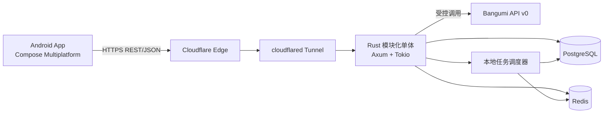
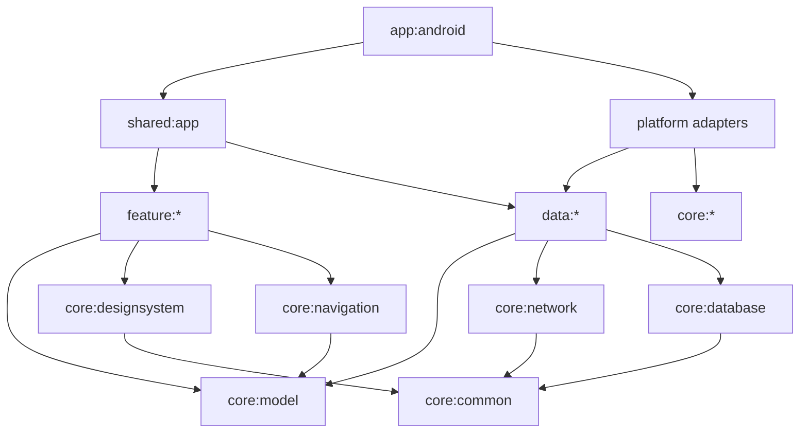
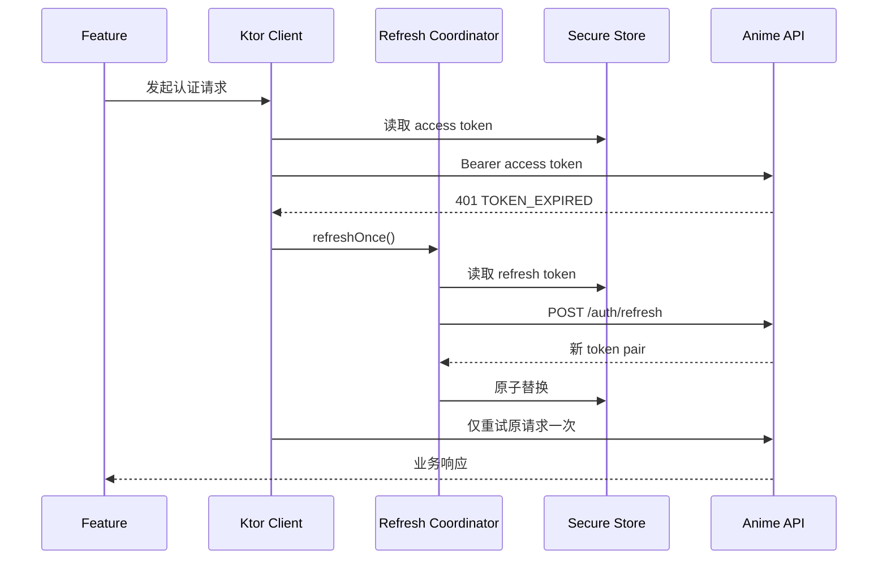
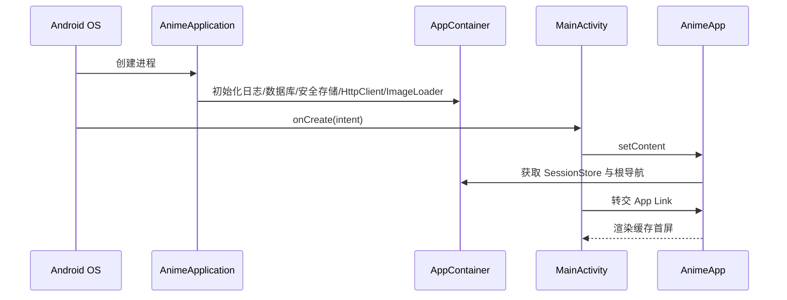
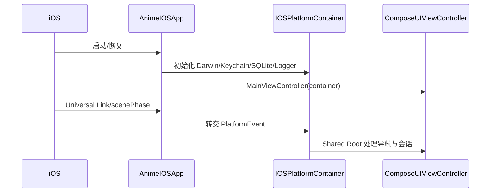
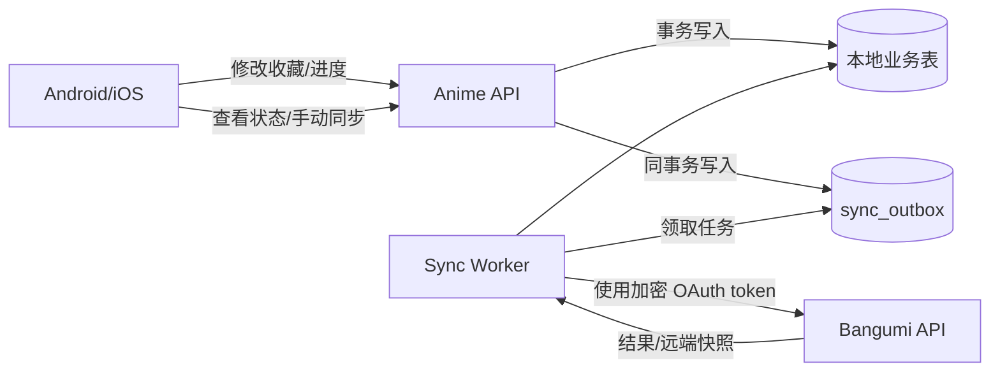
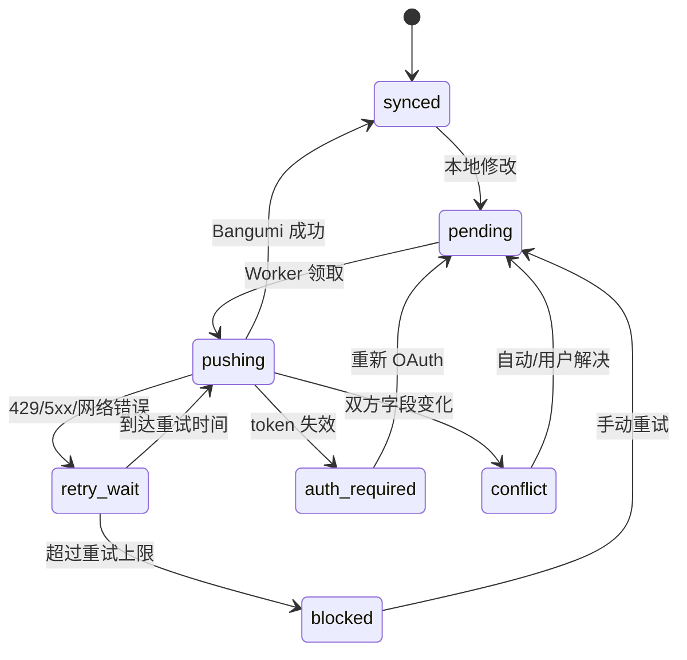
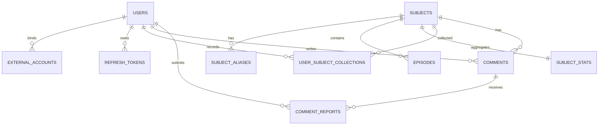
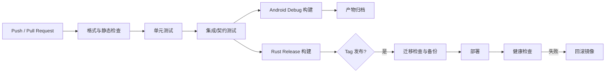

# Anime 项目完整详细设计文档

> 文档版本：V1.4（CMP 与后端可执行契约基线）<br>
> 编制日期：2026-07-21<br>
> 项目代号：Anime<br>
> 文档用途：作为个人开发者与 AI Agent 协作时的产品、架构、接口、数据和验收基线<br>
> 当前交付平台：Android 优先，Windows CMP 基线同步验证<br>
> iOS 状态：宿主与平台适配源码已实现；当前无 macOS 构建、签名与真机验证环境

---

## 0. 文档说明

### 0.1 文档定位

本文档不是多人团队使用的流程规范，也不是面向投资或市场宣传的方案。它用于回答以下问题：

1. Anime 项目具体解决什么问题，首版做到什么程度；
2. 客户端、服务端、数据库和基础设施如何分工；
3. 每个功能的输入、输出、状态、异常和验收标准是什么；
4. AI Agent 在实现功能时必须遵守哪些架构边界；
5. 哪些内容已经确定，哪些属于本设计的建议，哪些仍需后续确认。

### 0.2 决策等级

| 标记 | 含义 |
|---|---|
| 已确认 | 来自现有探讨文档中用户的明确要求，后续默认不得擅自改变 |
| 本版决定 | 为使系统形成完整闭环而在本设计中做出的决定，可以通过 ADR 修改 |
| 待确认 | 对产品或架构影响较大，当前不应隐式假设为最终结论 |

### 0.3 已确认的需求基线

| 编号 | 内容 | 状态 |
|---|---|---|
| B-01 | 产品定位为“动漫版豆瓣”，包含动漫资料、评分和社区能力 | 已确认 |
| B-02 | 移动端优先，不开发 Web 客户端 | 已确认 |
| B-03 | 当前只交付 Android，但使用 Compose Multiplatform 的规则和结构，为未来 iOS 留出迁移路径 | 已确认 |
| B-04 | 客户端主语言为 Kotlin，UI 技术为 Compose Multiplatform | 已确认 |
| B-05 | 后端使用 Rust | 已确认 |
| B-06 | 动漫元数据来自 Bangumi 官方 API，不自行爬取 HTML | 已确认 |
| B-07 | 液态玻璃使用 Kyant Backdrop，不从零实现底层效果 | 已确认 |
| B-08 | 服务部署在 4 核 4 GB VPS 上，VPS 已运行 Gitea | 已确认 |
| B-09 | 已配置 Cloudflare Tunnel；正式方案只允许通过 Cloudflare 域名访问业务服务 | 已确认 |
| B-10 | 项目由个人与 AI Agent 协作开发，设计需重视可理解性、可验证性和低运维成本 | 已确认 |
| B-11 | MVP 只展示动画条目 | 已确认 |
| B-12 | Anime 与 Bangumi 对收藏状态和观看进度进行双向同步 | 已确认 |
| B-13 | Bangumi OAuth 是唯一登录方式 | 已确认 |
| B-14 | 生产访问入口仅使用 Cloudflare Tunnel 域名，不提供公网 IP 入口 | 已确认 |
| B-15 | 短评是公开社区内容 | 已确认 |
| B-16 | Android 最低版本为 Android 8.0（API 26） | 已确认 |
| B-17 | Anime 建设独立的 1–10 分个人评分与社区聚合；Bangumi 评分仅作明确标源的只读外部参考，二者不得混算 | V2.0 已确认 |
| B-18 | MVP 不提供推送提醒 | 已确认 |
| B-19 | 项目正式名称为 Anime | 已确认 |
| B-20 | 先交付由 Fixture Repository 驱动、无需真实后端即可把玩的 CMP Android 前端，再并行接入后端 | 已确认 |
| B-21 | 初期维护完整详细文档；公共合同、交互和验收变更先更新主仓库规范，再实现并单向同步 Wiki | 已确认 |

### 0.4 本版核心架构决定

| 编号 | 决定 | 主要理由 |
|---|---|---|
| D-01 | 首版采用模块化单体，不拆微服务 | 4C4G、个人维护、业务规模未知，拆服务只会增加通信和运维成本 |
| D-02 | 客户端与服务端采用 HTTPS REST + JSON | Ktor Client 在 Android/iOS 均有官方支持；比自建跨平台 gRPC 链路更易调试和演进 |
| D-03 | 生产和远程调试流量只走 Cloudflare；本机诊断使用 localhost/SSH，不提供公网 IP 业务入口 | 防止绕过 Cloudflare 直接攻击源站 |
| D-04 | PostgreSQL 是业务数据唯一事实来源，Redis 只做可丢失缓存和限流状态 | 防止缓存与主数据职责混乱 |
| D-05 | Bangumi 数据保存在本地镜像表，并保留原始 JSON | 减少上游依赖、支持搜索、方便兼容字段变化 |
| D-06 | 收藏状态和观看进度与 Bangumi 双向同步；Anime 公开短评不与 Bangumi 评论互相映射 | 满足双向同步要求，同时避免混淆两个社区的公开内容 |
| D-07 | Bangumi OAuth 是唯一登录方式，授权成功后在本地建立对应用户记录 | 避免自建密码体系，并为双向同步取得用户授权 |
| D-08 | Kyant Backdrop 只负责视觉效果，不由后端返回所谓 `glass_level` | 视觉策略属于客户端能力、页面状态和可访问性设置，不属于动漫领域数据 |
| D-09 | iOS 设计最低版本暂定 iOS 16，实际创建 Xcode 工程时再按当时 App Store/Xcode 要求上调 | 与未来平台能力保持合理基线，不影响当前 Android 交付 |
| D-10 | 客户端采用共享 UI + 共享业务逻辑，Android/iOS 宿主保持极薄，平台能力通过接口和 `expect/actual` 隔离 | 最大化 CMP 价值，同时保留平台差异能力 |
| D-11 | MVP 的评分为 Bangumi 来源只读数据，不建设本地评分写入、聚合、加权榜单或评分同步 | 避免重复建设评分体系，并确保评分口径和来源清晰 |
| D-12 | 主仓库 `docs/` 是设计文档唯一事实源，Gitea Wiki 只接受自动单向发布 | 让设计、代码和版本处于同一审查链路，避免两套文档漂移 |
| D-13 | Android 前端采用 Fixture/Remote 可替换 Repository；首个可玩版本不依赖 Anime 后端 | 先验证产品、交互与视觉，同时保证后续接入后端不重写页面 |
| D-14 | `docs/frontend/` 是 CMP 产品、UI、状态、数据契约与验收的规范性分册 | 将总体架构细化为页面和组件可直接实施的开发约束 |
| D-15 | CMP Android 使用固定工程版本、类型化 Feature Contract、确定性 Fixture 和需求追踪矩阵 | 降低个人与多 Agent 并行实现时的歧义和不可验证偏差 |
| D-16 | 客户端依赖由显式 `AppContainer` 构造注入，不引入 DI 框架；Feature 采用 UDF + Reducer | 保持依赖图透明、跨端可测试，并避免多个 Agent 自选架构 |

### 0.5 文档维护规则

- 跨端总体架构和产品边界修改本文件；CMP 页面、组件、状态和前端契约修改 `docs/frontend/` 对应分册；
- 相关设计和代码应在同一个提交或 Pull Request 中评审；
- `scripts/sync_wiki.py` 按稳定页面映射生成 Gitea Wiki；
- Wiki 页面不得直接人工修改；发现问题时回到主仓库修订并重新发布；
- 每个 Wiki 页面记录对应源文件 SHA-256，用于核验同步结果；
- 历史探讨文件只作为研究资料，不自动进入 Wiki，也不覆盖正式基线。

---

## 1. 产品概述

### 1.1 产品愿景

Anime 是一款面向动漫爱好者的移动端资料与社区应用。用户可以查找动漫、查看详细资料与 Bangumi 来源评分、记录观看状态并参与讨论。产品不提供视频播放，而是专注于“发现—了解—记录—交流”的完整闭环。

产品差异化主要来自：

- 比综合影视社区更垂直的动漫数据组织；
- 以 Bangumi 结构化数据为基础的资料完整性；
- 轻量、流畅并具有液态玻璃视觉语言的移动体验；
- 对追番进度、季番日历和动漫关系数据的专门支持。

### 1.2 目标用户

| 用户类型 | 主要诉求 |
|---|---|
| 轻度观众 | 快速了解当前热播动漫、评分和简介 |
| 追番用户 | 查看每日放送、记录在看状态与观看进度 |
| 深度爱好者 | 搜索历史作品、查看角色/制作人员/关联作品并撰写评价 |
| 社区参与者 | 查看评分、发布短评、参与内容举报 |
| 项目维护者 | 在单台低配 VPS 上可靠部署、监控、备份和升级系统 |

### 1.3 产品原则

1. **资料优先**：没有可靠资料，社区功能没有依托。
2. **移动优先**：信息密度、交互和性能以手机使用场景为基准。
3. **内容与播放分离**：只提供元数据、记录和讨论，不提供盗版播放源。
4. **渐进增强**：低端或旧版 Android 仍可使用，只降低玻璃效果，不降低功能。
5. **上游可失效**：Bangumi 暂时不可用时，已有资料仍应可浏览。
6. **单人可维护**：优先采用清楚、稳定、可替换的组件，不为假设中的大流量提前拆分。

---

## 2. 项目范围

### 2.1 MVP 范围

首个可发布版本包含：

- 当季、每日放送和历史动漫浏览；
- 标题与别名搜索，按年份、状态、类型等条件筛选；
- 动漫详情、章节、角色、人物和关联作品的基础展示；
- Bangumi OAuth 唯一登录；
- 想看、在看、看过、搁置、抛弃状态，并与 Bangumi 双向同步；
- 观看进度记录及 Bangumi 双向同步；
- 展示 Bangumi 来源评分、投票数和评分分布，并明确标注来源；
- Anime 个人评分、标签和社区评分聚合；
- 短评、长评、片单的创建、查看、收藏和基础治理；
- 关注关系与关注动态流；
- 基础敏感词与频率控制；
- 本地缓存、离线回显和上游故障降级；
- Android 液态玻璃主题以及低版本降级样式；
- 后端部署、日志、健康检查、备份与基础监控。

### 2.2 明确不在 MVP 范围内

- Web 客户端；
- 动漫视频播放、下载、转码或播放源聚合；
- 私信、群组和实时聊天；
- 专栏系统和复杂富文本编辑器；
- OCR 截图识番；
- 个性化推荐模型；
- 商业化、会员、广告和支付；
- 多语言 UI；
- 管理后台页面；
- Meilisearch、Elasticsearch、Kafka、Kubernetes、WASM 边缘服务；
- iOS 发布和真机验收。

### 2.3 二期候选功能

- 基于评分、标签、片单和关系的个性化推荐；
- 社区榜单、协同过滤和更丰富的互动通知；
- 推送提醒与新集开播提醒；
- iOS 客户端；
- 独立运营后台；
- 搜索服务独立化。

---

## 3. 角色与权限

### 3.1 系统角色

| 角色 | 权限 |
|---|---|
| 游客 | 浏览、搜索、查看详情、评分分布和公开短评 |
| 登录用户 | 游客权限 + 收藏/进度/短评/举报/管理自己的内容 |
| 维护者 | 查看运行状态、执行同步、处理举报、隐藏违规内容、管理敏感词 |
| 系统任务 | 同步 Bangumi 数据、刷新统计、清理过期数据、执行备份 |

### 3.2 权限原则

- 所有读取公开资料的接口允许匿名访问。
- 所有改变用户数据的接口必须认证。
- 用户只能修改自己的收藏、观看进度和短评。
- 内容管理能力通过命令行或受保护的内部接口提供，MVP 不建设管理后台。
- 内部接口不得暴露给公开域名；应限制为 localhost、SSH 隧道或 Cloudflare Access。

---

## 4. 核心用户流程

### 4.1 游客发现动漫

1. 用户打开 App；
2. 客户端先展示本地缓存；
3. 后台请求首页聚合接口；
4. 服务端从 Redis 或 PostgreSQL 返回当季、今日放送和热门条目；
5. 客户端更新界面；
6. 上游 Bangumi 是否可用不影响此次浏览。

### 4.2 搜索并查看详情

1. 用户输入中文、日文、罗马字或别名；
2. 客户端在 300 ms 防抖后发起搜索；
3. 服务端对规范化标题、别名和原名执行模糊匹配；
4. 用户打开详情页；
5. 服务端返回主体资料、Bangumi 来源评分、收藏统计和关联数据摘要；
6. 章节、角色和评论采用独立分页接口延迟加载。

### 4.3 登录

1. 用户点击登录；
2. Anime 后端生成一次性 OAuth `state`；如果 Bangumi 在验证时确认支持 PKCE，同时生成对应参数；
3. App 打开 Bangumi 授权页，授权完成后先回到 Anime 的 HTTPS 回调地址，再安全唤起 App；
4. App/回调服务将授权码与一次性状态交给 Anime 后端；
5. 后端完成令牌交换并读取 `/v0/me`；
6. 后端创建或更新本地用户与外部账号绑定；
7. 后端签发 Anime 自己的短期访问令牌和轮换刷新令牌。

### 4.4 记录观看状态

1. 登录用户在详情页选择“想看/在看/看过/搁置/抛弃”；
2. 客户端立即乐观更新状态；
3. 服务端以幂等方式写入收藏记录；
4. 失败时客户端回滚并提示；
5. 若开启 Bangumi 同步，写回操作进入异步任务，不阻塞本地保存。

### 4.5 查看 Bangumi 评分

1. 用户打开条目详情；
2. 服务端从本地 Bangumi 镜像返回来源评分、投票数和评分分布；
3. 数据过期时后台刷新 Bangumi 条目，旧数据继续可见并标记更新时间；
4. 客户端明确显示“评分来源：Bangumi”，不与 Anime 社区内容混算；
5. Bangumi 暂时不可用时继续显示最近一次成功同步的评分数据。

### 4.6 发布短评

1. 用户输入纯文本短评；
2. 客户端校验长度并提交；
3. 服务端执行认证、频率限制、敏感词匹配与内容规范化；
4. 通过后保存为可见状态；命中高风险规则时保存为待审核或直接拒绝；
5. 返回创建结果，客户端插入列表顶部。

---

## 5. 功能性需求

### 5.1 资料与发现

| ID | 需求 | 优先级 | 验收标准 |
|---|---|---:|---|
| FR-001 | 展示今日放送、当季作品和近期热门 | P0 | 有本地数据时启动即可回显；联网后刷新成功 |
| FR-002 | 支持按标题、原名、别名搜索 | P0 | 输入有效关键词可返回相关作品，结果按相关度排序 |
| FR-003 | 支持年份、放送状态、媒体类型筛选 | P0 | 多条件组合后分页稳定且无重复项 |
| FR-004 | 展示动漫基础详情 | P0 | 至少包含名称、封面、简介、日期、话数、标签和来源评分 |
| FR-005 | 展示章节、角色、人物和关联作品摘要 | P1 | 子数据可独立加载；单个子接口失败不影响主详情 |
| FR-006 | 标记数据更新时间和来源 | P1 | 用户可以区分 Bangumi 数据与 Anime 社区数据 |

### 5.2 用户与登录

| ID | 需求 | 优先级 | 验收标准 |
|---|---|---:|---|
| FR-020 | 支持 Bangumi OAuth 登录 | P0 | 授权成功后可获得 Anime 会话并显示用户昵称和头像 |
| FR-021 | 支持访问令牌刷新 | P0 | 访问令牌过期时自动刷新一次，用户无感恢复请求 |
| FR-022 | 支持退出当前设备 | P0 | 本地凭据清除，服务端刷新令牌失效 |
| FR-023 | 支持注销 Anime 本地账号 | P1 | 删除或匿名化本项目数据，撤销关联凭据 |

### 5.3 收藏与进度

| ID | 需求 | 优先级 | 验收标准 |
|---|---|---:|---|
| FR-030 | 设置五种观看状态 | P0 | 重复设置同一状态结果一致，不产生重复记录 |
| FR-031 | 更新已看话数 | P0 | 进度不得小于 0；已知总话数时不得超过总话数 |
| FR-032 | 查看个人收藏列表 | P0 | 可按状态筛选并按更新时间分页 |
| FR-033 | Bangumi 收藏和观看进度双向同步 | P0 | 本地修改可靠推送；远端修改可拉取；冲突有确定规则且可查看同步状态 |

### 5.4 Anime 评分与外部评分

| ID | 需求 | 优先级 | 验收标准 |
|---|---|---:|---|
| FR-040 | 展示 Bangumi 来源评分、投票数和评分分布 | P0 | 数据与 Bangumi 最近一次成功同步结果一致，并显示来源标签 |
| FR-041 | 显示评分数据更新时间和陈旧状态 | P0 | 上游不可用时旧评分仍可见，用户能识别数据更新时间 |
| FR-042 | 提交或修改 Anime 个人评分 | P0 | 登录用户可提交 1–10 分；重复提交更新同一记录；离线写入进入 Outbox |
| FR-043 | 展示 Anime 社区评分 | P0 | 仅聚合 Anime 用户评分并显示票数；不得与 Bangumi 分数混算 |
| FR-044 | 管理个人评分标签与可见性 | P1 | 最多 10 个标签，支持公开、仅关注者、仅自己 |

### 5.5 短评与治理

| ID | 需求 | 优先级 | 验收标准 |
|---|---|---:|---|
| FR-050 | 发布 1–500 字纯文本短评 | P0 | 空文本、超长文本和非法编码被拒绝 |
| FR-051 | 分页查看短评 | P0 | 支持最新、最早排序；游标翻页无重复和遗漏 |
| FR-052 | 删除自己的短评 | P0 | 删除后公开接口不可见，但保留最小审计信息 |
| FR-053 | 举报短评 | P1 | 同一用户对同一内容只能保留一条有效举报 |
| FR-054 | 敏感词与频率控制 | P0 | 明确违规被拒绝或进入待审核；不会仅依赖客户端判断 |
| FR-055 | 维护者隐藏/恢复内容 | P1 | 操作有操作者、原因和时间记录 |

### 5.6 同步与运维

| ID | 需求 | 优先级 | 验收标准 |
|---|---|---:|---|
| FR-060 | 定时同步 Bangumi 数据 | P0 | 任务可重复执行；失败重试不会产生重复条目 |
| FR-061 | 按热度分层刷新数据 | P0 | 热门/当季数据刷新频率高于冷数据 |
| FR-062 | 支持手动触发有限范围同步 | P1 | 内部命令可按条目 ID 或日期范围同步 |
| FR-063 | 提供存活和就绪健康检查 | P0 | 数据库不可用时就绪检查失败，存活检查仍可响应 |
| FR-064 | 记录同步游标、耗时和错误摘要 | P0 | 可以判断最后一次成功同步的时间和范围 |

### 5.7 P0 实施追踪（2026-08-13）

| 范围 | 需求 | 实施状态 | 验证证据 |
|---|---|---|---|
| 资料与发现 | FR-001–004 | 已实现 | 服务端缓存首页、别名搜索、稳定筛选分页和详情聚合；客户端支持缓存回显和陈旧标记 |
| 用户与登录 | FR-020–022 | 已实现 | Bangumi OAuth 返回昵称/头像；15 分钟访问令牌、30 天旋转刷新令牌；退出撤销当前会话 |
| 收藏与进度 | FR-030–033 | 已实现 | 五状态、进度边界、服务端游标分页、双向同步/冲突解决；离线队列在启动和登录后自动重试 |
| 评分 | FR-040–043 | 已实现 | Bangumi 分数/票数/分布/新鲜度与 Anime 独立聚合；1–10 分幂等写入和持久 Outbox |
| 短评与治理 | FR-050–052、FR-054 | 已实现 | 1–500 字校验、最新/最早游标、本人软删除、服务端敏感词和 5 分钟频率限制 |
| 同步与运维 | FR-060–061、FR-063–064 | 已实现 | 幂等热/温分层任务、重试、live/ready 健康检查、游标/耗时/错误摘要持久化 |

P0 状态表表示代码与本地验证完成；生产服务只有在对应版本部署后才具备这些能力。

---

## 6. 非功能性需求

以下数值是本版工程目标，不等同于已经得到用户确认的商业 SLA。首次基准测试后允许通过 ADR 调整。

### 6.1 性能

| ID | 指标 | 目标 |
|---|---|---|
| NFR-P01 | 普通 API 延迟 | 不含上游请求时，P95 ≤ 500 ms |
| NFR-P02 | 缓存命中接口 | P95 ≤ 200 ms |
| NFR-P03 | 搜索响应 | 10 万条以内，P95 ≤ 800 ms |
| NFR-P04 | Android 列表体验 | 目标 60 Hz 设备滚动卡顿帧比例 < 5% |
| NFR-P05 | Android 冷启动 | 基准设备 P50 ≤ 1.2 s、P95 ≤ 2.0 s，缓存可用时优先回显 |
| NFR-P06 | Rust 服务常态内存 | 稳态目标 < 256 MB，容器硬上限 512 MB |

### 6.2 可用性与降级

- 单 VPS 架构不承诺高可用，目标月可用性为 99.0%，不含计划维护。
- Bangumi API 不可用时，资料读取继续使用本地数据库。
- Redis 不可用时，读取回退 PostgreSQL；收藏、进度和评论等写操作不得依赖 Redis 才能正确完成。
- Cloudflare Tunnel 不可用时，不自动向公众开放源站 IP。
- Backdrop 效果不可用时，界面自动退化为半透明 Material Surface。

### 6.3 安全

- 生产接口必须使用 HTTPS。
- OAuth `state` 和回调 URI 必须校验；只有在 Phase 0 确认 Bangumi 支持后才启用 PKCE，不能假设上游已支持。
- Bangumi 令牌仅保存在服务端，并使用应用主密钥加密。
- Android 只保存 Anime 访问/刷新凭据，使用 Keystore 支持的安全存储。
- 所有 SQL 使用参数绑定。
- 所有用户输入均有长度、字符集和业务范围限制。
- 公开写接口按用户与 IP 双维度限流。
- 日志不得输出访问令牌、刷新令牌、授权码和完整用户隐私数据。

### 6.4 可维护性

- 模块依赖只能由外向内：接口/基础设施依赖应用与领域，领域层不依赖数据库或 HTTP。
- 每个外部系统必须有适配器接口，Bangumi、Redis 和文件存储均可替换或模拟。
- 数据库变更必须使用迁移文件，不允许启动时隐式修改生产表结构。
- API 破坏性变更通过 `/api/v2` 或明确版本升级处理。
- 关键决策写入 `docs/adr/`，避免 Agent 在不同会话中反复改变架构。

### 6.5 合规与隐私

- 遵守 Bangumi API 的 User-Agent、鉴权和使用要求。
- 不抓取 Bangumi HTML，不伪造官方客户端身份。
- 封面和资料保留来源说明，不把第三方内容声明为本项目所有。
- 只收集实现功能所必需的数据。
- 支持用户删除本项目产生的数据。
- 不托管、传播或索引非法视频播放源。

---

## 7. 总体系统架构

### 7.1 架构视图



### 7.2 责任边界

| 层 | 责任 | 不负责 |
|---|---|---|
| 移动客户端 | UI、交互状态、本地缓存、离线回显、系统能力 | 敏感词最终判定、Bangumi 密钥保管、评分计算 |
| Cloudflare | TLS 边缘接入、基本 DDoS/WAF、Tunnel 路由 | 业务认证、业务限流、数据一致性 |
| Rust 应用 | API、认证、业务规则、聚合、同步编排 | 持久化细节之外的数据库管理、图片转码 |
| PostgreSQL | 业务真相、约束、事务、搜索基础能力 | 热点缓存 |
| Redis | 热点缓存、短期限流状态、可选任务锁 | 永久业务数据 |
| Bangumi | 外部动漫元数据与授权身份 | Anime 项目的社区内容 |

### 7.3 为什么不拆微服务

当前服务包含的业务量不足以抵消微服务带来的成本。API、同步器和内容治理先作为同一 Rust 工作区中的模块，由一个二进制运行。只有满足以下任一条件时才考虑拆分：

- 同步任务长期占用超过 30% CPU 并影响 API 延迟；
- 某模块需要独立发布或不同安全边界；
- 单进程故障影响已成为主要可用性问题；
- 有第二台服务器或容器编排环境可承担服务治理。

---

## 8. 客户端详细设计

### 8.1 工程目标

- 当前在 Windows/Android 环境完成开发和验证。
- 共享代码遵循 Kotlin Multiplatform 规则。
- 不宣称 iOS 当前可编译；所有平台抽象必须避免把 Android 类型泄漏到 `commonMain`。
- 获得 Mac 后，通过补齐 `iosMain` 实现和 iOS 宿主进行真实验证。

### 8.2 固定工程结构

```text
anime/
├─ app/
│  └─ android/                           # Android Application、Activity、Manifest
├─ shared/
│  └─ app/                               # AnimeApp、AppContainer、AppShell
├─ core/
│  ├─ common/                            # Result、Dispatcher、Clock、Logger、ID
│  ├─ model/                             # 纯领域模型
│  ├─ designsystem/                      # Token、Theme、Glass、公共组件
│  ├─ navigation/                        # 路由、BackStack、Deep Link、AuthGate
│  ├─ database/                          # SQLDelight
│  ├─ network/                           # Ktor、DTO、认证、错误映射
│  └─ testing/                           # Fake、FixtureLoader、测试 DSL
├─ data/catalog|collection|comment|session|settings/
├─ feature/discover|search|subject|collection|comment|profile|settings|diagnostics/
├─ benchmark/                            # Macrobenchmark、Baseline Profile
├─ fixtures/v1/                          # 确定性 Demo 数据
├─ gradle/libs.versions.toml
└─ build-logic/                          # Convention Plugins
```

上述每个叶子目录均为独立 Gradle 模块，Project Path 与目录一致。完整 Source Set、Namespace、变体和依赖规则以 `frontend/10-engineering-baseline.md` 为唯一实施合同。

### 8.2.1 Gradle 模块依赖方向



强制规则：

- `feature` 只依赖 Repository API、Model、Design System 和 Navigation，不得直接依赖 Ktor、SQLDelight 或平台 SDK；
- `data:*` 实现本模块 API 中的 Repository 接口；
- `app:*` 作为最终组合根，可依赖 `shared:app`、`core:*` 与 `data:*` 注入平台安全存储、设置、窗口和浏览器适配器，但禁止依赖 `feature:*`；
- `app` 是 Composition Root，负责把真实实现注入 Feature；
- `app:android` 不包含业务 Use Case；
- Feature 之间不得直接调用，通过导航参数或共享 Use Case 协作；
- CI 增加依赖边界检查，防止 Agent 通过“临时 import”破坏分层。

### 8.2.2 Kotlin Source Set 设计

每个 KMP 模块按实际需要建立：

```text
src/
├─ commonMain/        # Android/iOS 共用实现
├─ commonTest/        # 共用单元测试
├─ androidMain/       # Android actual 与 Android-only 实现
├─ androidUnitTest/   # Android JVM 测试
├─ iosMain/           # iosArm64 + iosSimulatorArm64 共用实现
└─ iosTest/           # 获得 Mac Runner 后启用
```

只有真正使用平台 API 的能力才允许 `expect/actual`。普通业务接口使用 Kotlin interface 和构造注入，不得滥用 `expect/actual`。

适合 `expect/actual` 或平台实现的能力包括：

- 安全凭据存储；
- 系统浏览器和外部链接；
- App/Universal Link 入口；
- 平台日志；
- 网络状态；
- 系统时区与区域设置；
- Backdrop 能力探测及原生降级；
- Android Back Handler 与 iOS 手势的少量衔接。

### 8.2.3 命名空间

正式根包固定为 `site.jokersh.anime`。逻辑命名固定为：

```text
site.jokersh.anime.core.*
site.jokersh.anime.domain.*
site.jokersh.anime.data.*
site.jokersh.anime.feature.discover.*
site.jokersh.anime.feature.subject.*
site.jokersh.anime.app.*
```

Demo 和 Dev 的 applicationId 分别追加 `.demo`、`.dev`，Prod 使用根 ID。模块、变体和完整版本基线见 `frontend/10-engineering-baseline.md`。

### 8.3 状态管理

采用轻量单向数据流：

```text
UI Event -> Presenter/ViewModel -> Use Case -> Repository
                                  <- Result <-
UiState <- StateFlow --------------------------------
```

每个页面至少定义：

- `UiState`：不可变页面状态；
- `UiEvent`：用户事件；
- `UiEffect`：一次性导航、Toast、打开浏览器等副作用；
- `Presenter/ViewModel`：协调 Use Case，不直接写 HTTP 或 SQL；
- `Repository`：组合远端与本地数据。

禁止：

- 在 Composable 内直接创建 Ktor 请求；
- 把异常堆栈作为 UI 状态；
- 通过全局可变单例共享登录状态；
- 将 Android `Context` 传入 `commonMain` 的业务层。

### 8.3.1 Feature 内部结构

每个 Feature 固定使用以下结构，Agent 不得为单个页面发明另一套架构：

```text
feature/subject/
├─ SubjectRoute.kt          # 导航入口、参数解析、DI 获取
├─ SubjectScreen.kt         # 无状态 UI，仅接收 state/callback
├─ SubjectContract.kt       # UiState、UiEvent、UiEffect
├─ SubjectPresenter.kt      # 状态机与协程生命周期
├─ SubjectUiMapper.kt       # Domain -> UI Model
├─ component/               # 页面私有组件
└─ preview/                 # Preview fixtures
```

`Screen` 必须可用 Fake State 独立 Preview；Presenter 不引用 Compose 类型，除非使用稳定的跨平台 ViewModel 基类管理生命周期。

### 8.3.2 页面状态标准

列表页面不得只用一个 `loading: Boolean`。统一表达：

```kotlin
data class ListUiState<T>(
    val items: List<T> = emptyList(),
    val initialLoad: LoadState = LoadState.Idle,
    val refresh: LoadState = LoadState.Idle,
    val append: LoadState = LoadState.Idle,
    val nextCursor: String? = null,
    val isStale: Boolean = false,
    val message: UiMessage? = null,
)
```

- 首次加载、下拉刷新和下一页加载必须独立；
- 已有内容时刷新失败不得清空列表；
- 一次性消息用 Effect/消息队列消费，不在重组时反复弹出；
- 所有状态更新使用不可变 `copy`；
- 搜索请求使用 `flatMapLatest`/取消前序任务，避免旧结果覆盖新结果。

### 8.3.3 生命周期与协程

- 每个 Presenter/ViewModel 拥有页面级 `CoroutineScope`；
- 页面销毁时取消页面任务；
- 数据库观察流可以长驻 Repository，但不得持有页面引用；
- IO 调度通过 `DispatcherProvider` 注入，测试使用 TestDispatcher；
- 不使用 `GlobalScope`；
- 同一个资源的并发刷新通过 Mutex/请求合并器去重；
- 认证刷新由网络层单飞（single-flight），多个 401 只触发一次刷新。

### 8.3.4 数据层读取策略

资料读取统一采用 stale-while-revalidate：

```text
订阅本地数据库
 -> 立即发出缓存（如有）
 -> 根据 freshness 判断是否请求服务端
 -> 服务端结果写入本地事务
 -> 数据库 Flow 自动发出新值
```

用户写入采用：

```text
UI 乐观状态
 -> Repository 写本地 pending mutation
 -> 调 Anime API
 -> 成功：确认本地版本
 -> 失败：可重试错误保留 pending；业务错误回滚并提示
```

客户端 pending mutation 只负责 App 到 Anime 服务的弱网恢复；Anime 服务到 Bangumi 的可靠同步由服务端 Outbox 负责，两者不得混成一个队列。

### 8.3.5 模型分层

同一数据在不同层使用不同模型：

| 层 | 示例 | 规则 |
|---|---|---|
| Network DTO | `SubjectResponseDto` | 与 API JSON 对齐，允许 nullable 和兼容字段 |
| Database Entity | `SubjectEntity` | 与本地 schema 对齐，包含缓存时间 |
| Domain Model | `Subject` | 表达已验证的业务语义，不携带序列化注解 |
| UI Model | `SubjectCardUiModel` | 已格式化文本、颜色语义和无障碍描述 |

DTO 不直接进入 Composable；UI Model 不写回数据库；映射函数必须有单元测试。

### 8.4 页面结构

底部主导航建议为：

1. **发现**：今日放送、当季、热门；
2. **搜索**：搜索、筛选、历史；
3. **收藏**：想看、在看、看过等；
4. **我的**：登录信息、设置、缓存管理、关于。

主要页面：

- 启动/恢复页；
- 发现页；
- 搜索页与结果页；
- 动漫详情页；
- 章节列表页；
- 角色/人物简页；
- 短评列表与发布页；
- 收藏列表；
- OAuth 登录回调页；
- 设置与诊断页。

### 8.4.1 导航架构

导航状态放在 `commonMain`，固定采用 Navigation 3 `1.1.1`。目的地必须是可序列化的类型，不使用散落字符串；完整路由和四根栈语义以 `frontend/11-runtime-architecture.md` 为准：

```kotlin
sealed interface AppRoute {
    data object Discover : AppRoute
    data class Search(val query: String? = null) : AppRoute
    data class Subject(val subjectId: Long) : AppRoute
    data class Comments(val subjectId: Long) : AppRoute
    data class Collection(val filter: CollectionStatus? = null) : AppRoute
    data object Profile : AppRoute
    data class OAuthResult(val ticket: String) : AppRoute
}
```

导航层职责：

- 保存根 Tab 各自的 back stack；
- 处理系统返回、手势返回和 Deep Link；
- 对外部传入 ID 做格式与权限校验；
- OAuth 回调只携带一次性 ticket，不把 Bangumi authorization code 或 Anime token 放入普通路由参数；
- 进程重建后恢复可序列化导航状态；
- 未登录访问收藏/评论发布时跳转登录，完成后恢复原目标。

### 8.4.2 Deep Link 路由

统一 HTTPS 路由：

| 路径 | App 行为 |
|---|---|
| `/subjects/{id}` | 打开条目详情 |
| `/auth/mobile-complete?ticket=` | 消费一次性登录 ticket |
| `/collections` | 打开个人收藏，未登录则先认证 |

Android 使用 verified App Links；iOS 使用 Universal Links。域名未最终配置前，代码通过 BuildConfig/xcconfig 注入，不硬编码到共享业务层。

### 8.5 网络层

使用 Ktor Client：

- `commonMain` 配置 Content Negotiation、JSON、超时、默认请求头和错误映射；
- Android 使用 OkHttp 引擎；
- 未来 iOS 使用 Darwin 引擎；
- 默认连接超时 10 秒、请求超时 20 秒；
- GET 请求只对网络错误、502、503、504 做最多 2 次指数退避重试；
- POST/PATCH/DELETE 只有带 `Idempotency-Key` 时才允许自动重试；
- 为每次请求生成 `X-Request-Id`；
- 认证失败只允许刷新一次，防止递归刷新。

### 8.5.1 网络组件

```text
HttpClientFactory
├─ EngineFactory              # Android OkHttp / iOS Darwin
├─ AuthTokenProvider          # 安全存储读取当前 Anime token
├─ TokenRefreshCoordinator    # single-flight 刷新与 token family 轮换
├─ RequestIdProvider
├─ NetworkMonitor
└─ ApiErrorMapper

AnimeApi
├─ CatalogApi
├─ AuthApi
├─ CollectionApi
├─ CommentApi
└─ SyncApi
```

接口 DTO 根据服务端 OpenAPI 生成或由契约测试校验；不允许客户端和服务端分别手写两个含义不同的枚举。

### 8.5.2 认证刷新时序



刷新失败时清理本地会话并发出全局 `SessionExpired`，由根导航统一处理；单个 Feature 不得自行弹出多个登录页。

### 8.5.3 弱网与分页

- 搜索输入防抖 300 ms，并取消旧请求；
- 游标分页请求携带页面当前 query/filter 快照；
- 重试 append 时复用原 cursor；
- 客户端不猜测下一页 offset；
- 网络切换后不自动重放非幂等请求；
- 服务器返回 `Retry-After` 时 UI 显示可再次尝试的时间；
- 429、维护和上游陈旧状态映射为不同用户提示。

### 8.6 本地存储

| 数据 | 存储方式 | 策略 |
|---|---|---|
| 用户设置、主题、上次同步时间 | SQLDelight `app_setting` 表 | 事务化小型键值数据，SettingsRepository 隔离存储细节 |
| 动漫列表与详情缓存 | SQLDelight 2.3.2 | 带 `fetched_at` 和过期时间 |
| 搜索历史 | 本地 SQLite | 最多 10 条，可逐项或全部清除 |
| 访问/刷新令牌 | Android Keystore 支持的安全存储 | 不进入普通数据库和日志 |
| 图片 | Coil 3 磁盘与内存缓存 | 设置总大小上限和清理入口 |

SQLDelight 官方支持 Android 与 Native/iOS，并在编译期校验 schema、查询与迁移，因此本版选定 SQLDelight 2.3.2。缓存、偏好和 Outbox 可共享事务边界，但通过不同 Repository/API 隔离；不额外引入 DataStore。

### 8.6.1 客户端本地表

客户端只缓存展示和待提交数据，不复制服务端全部业务表：

| 表 | 用途 |
|---|---|
| `cached_subject` | 条目详情和 `fetched_at` |
| `cached_subject_page` | 首页/筛选页 ID 顺序与 cursor |
| `cached_episode` | 章节列表 |
| `cached_comment_page` | 最近访问短评页，可按容量淘汰 |
| `my_collection` | 当前用户收藏的本地镜像 |
| `pending_mutation` | App 到 Anime API 尚未确认的幂等写请求 |
| `search_history` | 最多 10 条本地搜索历史，可逐项或全部清除 |

用户切换 Bangumi 账号时必须按 `anime_user_id` 隔离或清理用户表，避免两个账号看到彼此的收藏缓存。

### 8.6.2 缓存失效

| 数据 | 客户端新鲜期 | 过期行为 |
|---|---:|---|
| 首页 | 10 分钟 | 先显示旧缓存并刷新 |
| 条目详情 | 6 小时 | 先显示旧缓存并刷新 |
| 章节 | 12 小时 | 在放送中条目刷新；完结条目可延长至 7 天 |
| 我的收藏 | 5 分钟 | 登录/返回前台/手动刷新时同步 |
| 公开短评 | 2 分钟 | 仅缓存最近访问页 |

服务端的 `ETag`/版本号优先于固定 TTL；收到 304 时只更新本地校验时间。

### 8.6.3 图片加载

统一使用 Coil 3 Compose Multiplatform，不再为 Android/iOS 分别设计 Coil 与 Kingfisher 两套 API：

- `commonMain` 使用 `AsyncImage`/共享 ImageLoader；
- 网络模块使用与项目 Ktor 主版本一致的 Coil Ktor artifact；
- 限制单图最大解码尺寸，列表按实际显示尺寸采样；
- 封面使用内存 + 磁盘缓存，头像使用较短缓存；
- Preview 和截图测试注入 Fake ImageLoader，禁止依赖公网；
- 图片失败显示稳定占位符，不让卡片尺寸跳变；
- 不在 VPS 上代理和转码 Bangumi 图片，除非后续有明确版权与性能需求。

### 8.7 液态玻璃设计

Kyant Backdrop 官方说明其用于复制背景并对前景应用效果，库本身不提供业务级高层组件，因此项目必须封装自己的设计系统组件：

- `AnimeGlassSurface`
- `AnimeGlassTopBar`
- `AnimeGlassBottomBar`
- `AnimeGlassDialog`
- `AnimeTranslucentCard`

能力分级：

| 设备/状态 | 效果策略 |
|---|---|
| Android < 12 | 半透明颜色、渐变、边框和阴影，无实时背景模糊 |
| Android 12 | 允许有限 Blur，不启用 RuntimeShader Lens |
| Android 13+ | 详情页和静态浮层可启用 Blur + Lens；列表仍限制实时效果数量 |
| 省电模式/减少动态效果 | 强制使用轻量半透明样式 |
| Lazy 列表正在滚动 | 暂停复杂 Lens/色散，只保留静态 Surface 或单一共享 Backdrop |

强制约束：

- 不给列表中每个卡片创建独立全套 Backdrop；
- 不在服务端或 Bangumi DTO 中定义视觉强度；
- 玻璃后必须有清晰、明确的背景层；
- 文本对比度不因玻璃效果低于可读标准；
- 玻璃关闭后功能与信息层级保持完整；
- 每次升级 Backdrop 都执行截图和滚动性能回归。

### 8.7.1 Glass 能力模型

```kotlin
enum class GlassTier { None, Translucent, Blur, Liquid }

data class GlassCapabilities(
    val maxTier: GlassTier,
    val supportsRuntimeLens: Boolean,
    val reduceMotion: Boolean,
    val powerSaveMode: Boolean,
)

interface GlassCapabilityProvider {
    fun observe(): StateFlow<GlassCapabilities>
}
```

`AnimeGlassSurface` 接收语义角色而不是任意半径：

```kotlin
enum class GlassRole { TopBar, BottomBar, FloatingPanel, Dialog, StaticHero }
```

Design System 根据角色、设备能力、滚动状态和用户设置决定 Android/Desktop/Web 的实际 Backdrop pipeline。iOS 26+ 根导航由 SwiftUI 官方 Liquid Glass 宿主负责；业务 Feature 不允许直接调用 `blur(radius)` 或 `lens(...)`，从而避免全项目出现无法统一调优的魔法参数。

### 8.7.2 平台实现

- Android API 26–30：`Translucent`；
- Android API 31–32：最高 `Blur`；
- Android API 33+：允许 `Liquid`，但只用于白名单组件；
- iOS 26+：SwiftUI 宿主使用官方 `GlassEffectContainer` 与 `.buttonStyle(.glass(.regular))` 渲染根导航；Compose 页面不创建 Kyant Backdrop pipeline，页面表面按半透明策略降级；
- 所有平台都必须支持用户主动关闭玻璃和减少动态效果。

### 8.7.3 性能预算

- 同屏复杂 Liquid 区域最多 2 个；
- Lazy 列表 item 禁止使用独立 Lens；
- Android/Desktop/Web 背景层尽量共享 `LayerBackdrop`；
- 滚动时将复杂效果降为 Blur/Translucent，滚动停止 150 ms 后再恢复；
- 动画不同时改变大面积模糊半径、尺寸和位置；
- Android 使用 Macrobenchmark/JankStats 或等价工具记录真实帧数据；
- iOS 获得构建环境后用 Instruments Core Animation/Metal 工具建立单独基线。

### 8.8 客户端错误模型

统一映射为：

```kotlin
sealed interface AppError {
    data object Offline : AppError
    data object Timeout : AppError
    data object Unauthorized : AppError
    data class Validation(val fields: Map<String, String>) : AppError
    data class RateLimited(val retryAfterSeconds: Long?) : AppError
    data class Server(val code: String, val requestId: String?) : AppError
    data class Unknown(val requestId: String?) : AppError
}
```

界面原则：有旧数据时显示旧数据和非阻断提示；完全无数据时才显示全页错误。

### 8.9 Android 平台详细设计

#### 8.9.1 平台基线

| 项目 | 设计 |
|---|---|
| minSdk | 26（Android 8.0，已确认） |
| targetSdk / compileSdk | 37 / 37；变更必须走依赖升级决策 |
| UI | 单 Activity + Compose Multiplatform |
| 语言 | Kotlin |
| 架构入口 | `AnimeApplication` + `MainActivity` |
| 网络引擎 | Ktor OkHttp |
| 本地数据库 | SQLDelight Android driver |
| 安全存储 | Android Keystore 加密的 token store |
| Deep Link | Verified Android App Links |
| 后台工作 | MVP 不做周期推送/拉取；只使用必要的短任务和服务端同步 |

#### 8.9.2 Android 启动链路



启动约束：

- `Application.onCreate` 不执行网络请求和数据库全表扫描；
- 数据库迁移必须可测并有超时诊断，但不在主线程执行重型工作；
- 首屏先构建 Theme、Session 快照和本地首页缓存；
- 同步和远端刷新在首帧之后启动；
- 启动失败必须进入可诊断错误页，而不是白屏。

#### 8.9.3 MainActivity 职责

`MainActivity` 只负责：

- 设置 Compose 内容；
- edge-to-edge 与系统栏；
- 把初始及后续 Intent 交给 `DeepLinkDispatcher`；
- 连接 Android lifecycle、返回手势与共享 App 根节点；
- 注入 Android 平台对象。

禁止在 Activity 中实现登录、请求、收藏、进度或导航业务。

#### 8.9.4 Android App Links

- Manifest 只声明 HTTPS App Link；
- Cloudflare 域名提供 `/.well-known/assetlinks.json`；
- 校验 host、path、ticket 长度和字符集；
- OAuth 完成地址只携带 60 秒内有效且单次使用的 Anime login ticket；
- 自定义 Scheme 仅可作为开发构建兜底，不进入 release 默认配置；
- debug/staging/release 使用不同域名和签名指纹。

#### 8.9.5 Android 安全存储

定义共享 `CredentialStore` 接口，Android actual 使用 Keystore 保护主密钥，再加密存储 token pair：

- 禁止写入普通 SQL 表、SharedPreferences 明文或日志；
- token 更新使用临时文件/事务式替换，避免进程崩溃留下半组凭据；
- 设备锁屏策略变化、密钥失效或备份恢复导致解密失败时，清除会话并重新登录；
- release 禁止 Android backup 导出认证凭据。

#### 8.9.6 Android 生命周期与进程恢复

- App 进入前台时检查会话时间和收藏同步状态；
- 进程被杀后从安全存储、SQLDelight 与可序列化导航恢复；
- 不依赖内存单例保存尚未提交的评论；编辑文本使用 `rememberSaveable`/SavedState；
- 配置变化不重建业务请求；
- 多窗口和屏幕尺寸变化使用自适应布局，不假设固定竖屏宽度。

#### 8.9.7 Android 构建变体

| Variant | API 域名 | 日志 | 调试能力 |
|---|---|---|---|
| debug | 本地/开发 Tunnel 域名 | verbose，仍脱敏 | Network Inspector、测试菜单 |
| staging | 预发布 CF 域名 | info | 诊断页、测试账号 |
| release | 生产 CF 域名 | warn/info 采样 | 无内部入口、无明文流量 |

所有域名通过 Gradle 配置生成，不在 Feature 中分支判断。

#### 8.9.8 Android 兼容与性能测试矩阵

至少覆盖：

- API 26：功能最低基线、无 Blur 降级；
- API 31：Blur 能力；
- API 33：RuntimeShader/Lens；
- 当前最新稳定 API：target 行为和边到边适配；
- 小内存设备、中端 60 Hz 设备和至少一台高刷设备；
- 深色/浅色、字体放大、减少动态效果、省电模式和横屏。

发布前生成 Baseline Profile，并用 Macrobenchmark 覆盖冷启动、首页滚动、搜索和详情打开。

### 8.10 iOS 平台详细设计

#### 8.10.1 当前边界

iOS 宿主、`iosMain` 平台适配、Darwin 网络引擎、Keychain 会话存储和内置 `ASWebAuthenticationSession` 授权窗口已经实现。当前 Windows 环境可验证依赖解析与 metadata 编译，但不能替代 macOS + Xcode 的 framework 链接、Swift 编译、签名、模拟器和真机测试；发布就绪状态必须等这些门禁通过后才能成立。

#### 8.10.2 iOS 宿主结构

```text
app/iosApp/
├─ iosApp.xcodeproj
├─ iosApp/
│  ├─ AnimeIOSApp.swift          # SwiftUI App 入口
│  ├─ ContentView.swift          # 承载 ComposeUIViewController
│  ├─ AppDelegate.swift          # 必要生命周期/URL 衔接
│  ├─ Info.plist
│  ├─ iosApp.entitlements        # Associated Domains、Keychain Group
│  └─ Assets.xcassets
└─ Configuration/
   ├─ Debug.xcconfig
   ├─ Staging.xcconfig
   └─ Release.xcconfig
```

Swift 宿主保持最小化：创建共享 `AppContainer`、承载 `ComposeUIViewController`、转交 Universal Link 和平台生命周期。业务页面与导航保留在共享 Compose UI。

#### 8.10.3 iOS 入口链路



#### 8.10.4 iOS 平台适配器

| 共享接口 | iOS 实现 |
|---|---|
| `HttpEngineFactory` | Ktor Darwin/NSURLSession |
| `DatabaseDriverFactory` | SQLDelight Native SQLite driver |
| `CredentialStore` | Keychain Services |
| `ExternalBrowser` | `ASWebAuthenticationSession` 优先，必要时系统浏览器 |
| `DeepLinkSource` | Universal Link `NSUserActivity` |
| `PlatformLogger` | OSLog，隐私字段使用 private 标记 |
| `NetworkMonitor` | Network framework/path monitor |
| `GlassCapabilityProvider` | Backdrop iOS 能力验证或 UIVisualEffectView fallback |
| `LocaleProvider` | Foundation Locale/TimeZone |

#### 8.10.5 Universal Links 与 OAuth

- 使用与 Android 相同的 HTTPS 完成路径；
- 域名发布 `apple-app-site-association`；
- Xcode 启用 Associated Domains；
- 收到 `NSUserActivityTypeBrowsingWeb` 后把 URL 交给共享 `DeepLinkDispatcher`；
- 校验 scheme、host、path 和一次性 ticket；
- ticket 消费成功或失败后从导航栈移除，避免返回时再次消费；
- 如果 App 未安装，HTTPS 页面提供安全说明，不展示 authorization code 或 token。

#### 8.10.6 iOS 生命周期

- `scenePhase.active`：检查会话与本地数据新鲜度；
- `inactive/background`：停止非必要动画、提交本地数据库事务、取消页面请求；
- 不依赖 iOS 后台常驻执行 Bangumi 同步，双向同步由 Anime 服务端完成；
- 内存警告时清理图片内存缓存和非必要页面缓存；
- Keychain 与 SQLite 操作不得阻塞主线程。

#### 8.10.7 iOS UI 与交互差异

共享 UI 保持信息架构一致，但允许平台适配：

- Safe Area、键盘避让和状态栏由平台窗口信息驱动；
- 返回手势必须与共享导航栈同步；
- 触觉反馈通过 `HapticFeedback` 平台接口；
- 文本选择、输入法、VoiceOver 和 Dynamic Type 必须真机验证；
- iOS 不强求与 Android 像素完全一致，目标是语义、功能和视觉语言一致；
- 玻璃效果优先符合平台性能与可读性，不为“一模一样”牺牲交互。

#### 8.10.8 iOS 构建与发布

获得 Mac 后补充：

- `iosSimulatorArm64` 单元/UI 冒烟测试；
- `iosArm64` 真机构建；
- 签名、Bundle ID、Associated Domains 和 Keychain entitlement；
- Release framework 静态/动态链接方式验证；
- App Store 隐私清单与网络权限说明；
- Xcode Instruments 性能基线；
- 独立 macOS Gitea Runner，不能在 Linux/Windows Runner 伪造 iOS 产物。

### 8.11 Android/iOS 共享与差异矩阵

| 能力 | commonMain | Android | iOS |
|---|---:|---|---|
| 页面 UI/主题/设计系统 | 是 | 系统栏适配 | Safe Area/平台交互适配 |
| 导航状态与 Deep Link 解析 | 是 | Intent/App Links 输入 | NSUserActivity/Universal Links 输入 |
| ViewModel/Presenter/Use Case | 是 | 生命周期桥 | 生命周期桥 |
| REST API、DTO、错误映射 | 是 | OkHttp engine | Darwin engine |
| SQL 与 DAO | 是 | Android driver | Native driver |
| Repository 与同步 UI 状态 | 是 | — | — |
| 图片组件 | 是 | Coil Android backend | Coil Skiko backend |
| 安全凭据接口 | 契约 | Keystore | Keychain |
| 液态玻璃语义组件 | 是 | Backdrop 分级 | Backdrop 验证/原生 fallback |
| OAuth 流程状态 | 是 | App Link/浏览器 | Universal Link/ASWebAuthenticationSession |
| 推送 | MVP 无 | 不实现 | 不实现 |

共享率是结果而不是 KPI。平台实现代码只要边界清晰，即使共享率低于任意预设百分比也不视为架构失败。

### 8.12 依赖注入与 AppContainer

MVP 使用显式构造注入和平台 `AppContainer`，暂不引入 DI 框架：

```kotlin
class AppContainer(
    val sessionRepository: SessionRepository,
    val catalogRepository: CatalogRepository,
    val collectionRepository: CollectionRepository,
    val commentRepository: CommentRepository,
    val syncRepository: SyncRepository,
    val platformServices: PlatformServices,
)
```

- Android 在 `AnimeApplication` 创建容器；
- iOS 在 Swift 入口调用共享工厂创建容器；
- Preview/Test 使用 Fake Container；
- Feature 只接收所需接口，不接收完整 Service Locator；
- 若构造装配显著膨胀，再通过 ADR 评估 Koin 等 KMP DI 框架。

---

## 9. 服务端详细设计

### 9.1 技术组件

| 类别 | 选择 |
|---|---|
| 语言 | Rust stable，版本由 `rust-toolchain.toml` 锁定 |
| 异步运行时 | Tokio |
| HTTP | Axum + Tower 中间件 |
| 序列化 | Serde + JSON |
| 数据库 | PostgreSQL + SQLx |
| 缓存 | Redis，可降级 |
| HTTP 客户端 | Reqwest + rustls |
| 日志与追踪 | tracing + JSON subscriber |
| 配置 | 环境变量 + 非敏感配置文件 |
| 数据迁移 | SQLx migrations |
| 敏感词 | aho-corasick，规则可热加载或定期刷新 |

不在文档中锁死具体依赖版本；项目创建时选择彼此兼容的稳定版本，写入 lockfile，并由自动化依赖更新 PR 控制升级。

### 9.2 工作区结构

```text
server/
├─ Cargo.toml
├─ rust-toolchain.toml
├─ crates/
│  ├─ api/                 # 启动、路由、中间件、DTO
│  ├─ domain/              # 实体、值对象、领域规则、端口接口
│  ├─ application/         # Use Case、事务边界、授权判断
│  ├─ infrastructure/      # PostgreSQL、Redis、Bangumi、加密实现
│  └─ jobs/                # 同步、聚合、清理任务
├─ migrations/
├─ tests/
│  ├─ contract/
│  └─ integration/
└─ Dockerfile
```

如果多 crate 给初期开发造成明显负担，可保留同样目录边界但先使用单 crate；领域层禁止依赖 Axum、SQLx 和 Redis 是必须维持的边界。

### 9.2.1 服务端业务模块

| 模块 | 责任 | 主要入口 |
|---|---|---|
| `catalog` | 动画条目、章节、角色、人物、搜索和首页聚合 | 查询 API、Bangumi 元数据同步 |
| `identity` | Bangumi OAuth、本地用户、Anime 会话和令牌轮换 | `/auth/*`、`/me` |
| `library` | 收藏状态与观看进度 | `/me/collections` |
| `community` | 公开短评、举报和治理 | `/comments`、维护 CLI |
| `sync` | Bangumi 收藏与进度双向同步、Outbox、冲突 | `/me/sync/*`、Worker |
| `operations` | 健康、指标、配置诊断、备份协作 | `/health/*`、内部命令 |

模块只能通过公开 Application Service/Port 协作，不允许跨模块直接操作对方表。例如 `community` 更新短评后调用 `SubjectStatsPort`，不能直接在 Handler 中拼接 `UPDATE subject_stats`。

### 9.2.2 领域端口

```rust
// 仅表示设计形态，最终签名以实现为准。
trait CatalogRepository { /* query/upsert subject */ }
trait UserRepository { /* user/external account */ }
trait LibraryRepository { /* collection/progress transaction */ }
trait CommentRepository { /* public comment/moderation */ }
trait SyncOutboxRepository { /* enqueue/lease/complete/retry */ }
trait CatalogSource { /* Bangumi metadata adapter */ }
trait UserLibrarySource { /* Bangumi user collection adapter */ }
trait TokenCipher { /* encrypt/decrypt external token */ }
trait Clock { /* deterministic time for tests */ }
```

领域与应用测试使用内存 Fake；SQLx、Reqwest、Redis 和实际加密实现只位于 infrastructure。

### 9.2.3 Handler 与 Use Case 映射

```text
Axum Handler
 -> 解析 Path/Query/Body
 -> 调用 Validator
 -> 从 AuthContext 获取 Actor
 -> 构造 Command/Query
 -> Application Service 执行业务与事务
 -> Domain Result
 -> Response Mapper 转 API DTO
```

Handler 不得包含 SQL、Bangumi URL 或同步冲突策略。Application Service 不得返回 Axum `Response`。

### 9.3 请求处理管线

```text
Request ID
 -> Real IP/Proxy Header 校验
 -> Trace
 -> Body Size Limit
 -> CORS（移动端默认无需开放任意 Origin）
 -> Authentication
 -> Rate Limit
 -> Validation
 -> Handler
 -> Application Use Case
 -> Repository Transaction
 -> Response/Error Mapping
```

### 9.4 配置项

所有必需配置均在启动时验证：

- `APP_ENV`
- `APP_BIND_ADDR`
- `PUBLIC_BASE_URL`
- `DATABASE_URL`
- `REDIS_URL`（允许为空以禁用缓存）
- `BANGUMI_API_BASE_URL`
- `BANGUMI_CLIENT_ID`
- `BANGUMI_CLIENT_SECRET`
- `BANGUMI_REDIRECT_URI`
- `TOKEN_SIGNING_KEY`
- `EXTERNAL_TOKEN_ENCRYPTION_KEY`
- `TRUSTED_PROXY_CIDRS`
- `RUST_LOG`

生产环境缺少密钥或使用默认值时必须拒绝启动。

### 9.5 事务边界

- 修改收藏：收藏状态与进度在同一事务中提交。
- 删除用户：先撤销会话，再执行数据删除/匿名化任务。
- Bangumi 同步：单条目事务，避免大批量事务锁住表；批次结果单独记录。

### 9.5.1 并发与幂等

- 收藏记录使用 `(user_id, subject_id)` 唯一约束；
- 更新携带 `version`，旧版本返回 409，客户端刷新后重试；
- `Idempotency-Key` 记录用户、路由、请求摘要、结果和过期时间；同一键不同正文返回冲突；
- Outbox 与业务修改同事务写入，避免“本地已改但没有同步任务”；
- Worker 使用租约而非永久 processing 标志，崩溃后任务可以重新领取；
- 同一外部账号的 Bangumi 写请求按用户串行或低并发，避免乱序覆盖。

### 9.5.2 认证上下文

认证中间件只负责验证 Anime token 并产生：

```text
AuthContext
├─ user_id
├─ role
├─ session_id
├─ token_family_id
└─ authenticated_at
```

Bangumi access token 不进入请求上下文；需要同步时由 `identity` 模块按 user ID 解密取得。权限判断在 Application Service 内完成，不能仅依赖路由是否挂载认证中间件。

### 9.6 后台任务

MVP 采用进程内 Tokio 调度器，并使用 PostgreSQL advisory lock 防止重复执行：

| 任务 | 建议频率 | 内容 |
|---|---|---|
| `sync_calendar` | 每 2 小时 | 刷新每日放送与相关条目 |
| `sync_hot_subjects` | 每 6 小时 | 刷新当季、近期活跃和用户正在查看的条目 |
| `sync_cold_subjects` | 每日低峰 | 小批量补全历史条目 |
| `sync_active_users` | 配置化分批执行 | 拉取活跃用户的 Bangumi 收藏和进度变化 |
| `dispatch_sync_outbox` | 持续低并发 | 将本地用户修改可靠推送到 Bangumi |
| `cleanup_sessions` | 每日 | 清理过期刷新令牌和 OAuth state |
| `cleanup_audit` | 每周 | 按保留策略清理低价值审计数据 |

所有周期都应配置化，并根据 Bangumi 实际响应头和官方规则动态调整，不把“60 次/分钟”等未经确认数字写死为业务常量。

---

## 10. Bangumi 集成设计

### 10.1 使用范围

使用官方文档已提供的能力：

- `/calendar`：每日放送；
- `/v0/search/subjects`：条目搜索/发现；
- `/v0/subjects`：浏览条目；
- `/v0/subjects/{subject_id}`：条目详情；
- `/v0/episodes`：章节；
- 条目角色、人物、关联条目接口；
- `/v0/me` 与用户收藏接口：仅在用户授权功能中使用。

### 10.2 适配器边界

领域层只依赖 `CatalogSource` 接口：

```text
CatalogSource
├─ browse_subjects(query)
├─ get_subject(id)
├─ get_episodes(id)
├─ get_characters(id)
├─ get_persons(id)
└─ get_calendar(date)
```

Bangumi DTO 只能存在于基础设施适配器中，必须转换为内部模型，防止上游字段变化扩散到整个项目。

### 10.3 请求策略

- 使用项目可识别的 User-Agent，并提供项目或维护者联系方式；
- 对所有请求设置连接和总超时；
- 读取限流相关响应头并记录为指标；
- 收到 429 时尊重 `Retry-After` 或重置时间，停止当前批次；
- 5xx 使用带抖动的指数退避，最多重试 3 次；
- 4xx 除 408/429 外不自动重试；
- 为相同条目请求做短时间合并，避免缓存击穿；
- 不通过多个 IP、代理池或伪造 User-Agent 绕过限制。

### 10.4 数据新鲜度分层

| 数据 | 目标新鲜度 |
|---|---|
| 今日放送 | 2 小时以内 |
| 当季热门详情 | 6 小时以内 |
| 普通详情 | 1–7 天，根据访问热度 |
| 历史冷数据 | 30 天或访问时按需刷新 |
| 章节状态 | 6–24 小时 |
| 角色/人物 | 30 天 |

### 10.5 上游故障处理

- 读取请求返回已有本地数据，并附带 `stale=true` 与 `source_updated_at`；
- 若本地无数据，返回统一 `UPSTREAM_UNAVAILABLE`；
- 同步任务失败不会删除已有数据；
- 上游字段解析失败时保存原始 JSON 和错误摘要，跳过有问题的字段而不是清空整条记录；
- API 适配器必须有基于固定样本的契约测试。

### 10.6 Bangumi 用户数据双向同步

#### 10.6.1 同步字段边界

| Anime 字段 | Bangumi 对应 | 同步方向 | 说明 |
|---|---|---|---|
| 收藏状态 | collection type | 双向 | 状态枚举通过集中 Mapper 转换 |
| 已看话数/章节状态 | episode collection | 双向 | 以可识别章节 ID 映射 |
| Anime 公开短评 | 无 | 不同步 | 保持 Anime 社区内容独立 |
| Bangumi 收藏备注/标签 | 可选只读快照 | MVP 不双向 | 防止与 Anime 公开短评语义混淆 |
| Anime 社区加权分 | 无 | 不同步 | 只属于 Anime 社区统计 |

#### 10.6.2 总体模式

Anime 服务端是同步协调者。移动端永远只调用 Anime API，不直接携带 Bangumi token 调用 Bangumi：



本地写入成功不等待 Bangumi 请求完成。API 返回 `sync_state=pending`，保证上游慢或暂时不可用时用户的 Anime 数据不会丢失。

#### 10.6.3 推送到 Bangumi

1. 客户端提交带 `Idempotency-Key` 和本地 `base_version` 的修改；
2. Anime 在 PostgreSQL 事务中更新业务表、递增版本、写入 Outbox；
3. Worker 使用 `FOR UPDATE SKIP LOCKED` 或等价机制领取任务；
4. 相同用户/条目/字段的多个未执行任务合并为最新目标状态；
5. 调用 Bangumi 写接口；
6. 成功后保存远端快照哈希、同步时间和成功版本；
7. 429 按响应头延迟，5xx 指数退避，认证失败暂停账号同步并要求重新授权；
8. 达到最大重试次数后进入 `blocked`，客户端显示可诊断状态，不静默丢弃。

#### 10.6.4 从 Bangumi 拉取

触发条件：

- 首次登录；
- 用户手动刷新；
- App 返回前台且距离上次成功同步超过配置阈值；
- 服务端定时同步活跃用户；
- 本地 Push 成功后按需读取远端确认。

拉取采用分页和断点游标。单次同步有请求预算，避免大量老用户收藏把 Bangumi 配额耗尽。首次全量导入分批执行，并向客户端报告进度。

#### 10.6.5 冲突检测

Bangumi 数据不一定为每个字段提供可靠的修改时间，因此不能简单依赖跨系统时间戳。每个用户条目保存：

- `local_version`；
- `last_synced_local_version`；
- `remote_snapshot_hash`；
- `dirty_fields`；
- `last_sync_at`；
- `sync_status`。

冲突规则：

1. 本地字段存在未成功 Push 的修改时，拉取不得覆盖该字段；
2. 没有本地 dirty 字段时，远端变化覆盖本地镜像；
3. Push 收到远端前置条件冲突或拉取发现双方均变化时，进入 `conflict`；
4. 收藏状态默认“用户最后一次在 Anime 明确提交的值优先”，随后重新 Push；
5. 观看进度默认取较大值，除非用户在 Anime 明确执行“回退进度”，该操作带 `force=true`；
6. 删除与远端新增冲突时不做永久删除，先进入冲突状态；
7. 所有自动解决规则记录 `resolution_reason`，供诊断页展示。

#### 10.6.6 同步状态机



#### 10.6.7 客户端同步体验

收藏和详情页显示非干扰式状态：

- 已同步；
- 等待同步；
- 正在同步；
- 需要重新登录；
- 同步冲突；
- 同步失败，可重试。

用户本地操作成功后立即更新 UI。只有 Anime API 本地事务失败才回滚；Bangumi 异步失败不回滚 Anime 本地数据。

### 10.7 OAuth 令牌与同步授权

- Bangumi OAuth 是唯一登录方式，也是双向同步凭据来源；
- 登录时请求最小必要 scope；
- 如果用户撤销 Bangumi 授权，Anime 会话可以在短期内用于导出/注销，但所有社区写入在重新验证身份前暂停，具体宽限时间由安全策略配置；
- Bangumi access/refresh token 只在服务端解密使用；
- 每次使用令牌更新 `last_used_at`，不记录令牌值；
- 解密失败、401 或 scope 不足均转为 `auth_required`，禁止无限重试；
- 用户注销时撤销 Anime 会话、删除外部令牌并停止 Outbox。

---

## 11. API 设计

> 后端实现入口为 `docs/backend/00-backend-specification-index.md`。逐字段请求、响应、枚举、安全要求和状态码以 `contracts/openapi/anime-v1.yaml` 为机器可读事实源；本章保留产品级接口边界。

### 11.1 通用约定

- Base URL：`https://<anime-api-domain>/api/v1`
- 内容类型：`application/json; charset=utf-8`
- 时间：RFC 3339 UTC
- ID：API 中作为字符串传输，避免未来跨语言整数范围问题
- 列表：优先游标分页，默认 20，最大 100
- 写请求：支持 `Idempotency-Key`
- 请求追踪：客户端可传 `X-Request-Id`，服务端验证格式后沿用或重新生成

成功响应：

```json
{
  "data": {},
  "meta": {
    "request_id": "01J...",
    "next_cursor": null
  }
}
```

错误响应：

```json
{
  "error": {
    "code": "VALIDATION_ERROR",
    "message": "请求参数不合法",
    "fields": {
      "score": "必须是 1 到 10 的整数"
    },
    "request_id": "01J..."
  }
}
```

### 11.2 公开资料接口

| 方法 | 路径 | 说明 |
|---|---|---|
| GET | `/home` | 首页聚合；今日放送、当季、热门 |
| GET | `/calendar?date=` | 指定日期放送表 |
| GET | `/subjects` | 浏览与筛选条目 |
| GET | `/subjects/{id}` | 条目详情 |
| GET | `/subjects/{id}/episodes` | 章节分页 |
| GET | `/subjects/{id}/characters` | 角色分页 |
| GET | `/subjects/{id}/persons` | 人物分页 |
| GET | `/subjects/{id}/relations` | 关联作品 |
| GET | `/subjects/{id}/comments` | 公开短评 |
| GET | `/search/subjects?q=` | 标题和别名搜索 |

### 11.3 认证接口

| 方法 | 路径 | 说明 |
|---|---|---|
| POST | `/auth/bangumi/start` | 创建 OAuth state/PKCE 流程并返回授权 URL |
| POST | `/auth/bangumi/callback` | 交换授权码并创建 Anime 会话 |
| POST | `/auth/refresh` | 轮换刷新令牌 |
| POST | `/auth/logout` | 撤销当前刷新令牌 |
| GET | `/me` | 当前用户信息 |
| DELETE | `/me` | 注销本地账号 |

### 11.4 用户数据接口

| 方法 | 路径 | 说明 |
|---|---|---|
| GET | `/me/collections` | 当前用户收藏列表 |
| PUT | `/me/collections/{subject_id}` | 幂等设置状态与进度 |
| DELETE | `/me/collections/{subject_id}` | 删除本地收藏 |
| GET | `/me/sync/status` | 最近同步、待处理数、授权和冲突摘要 |
| POST | `/me/sync` | 手动触发受限的拉取/推送同步 |
| GET | `/me/sync/conflicts` | 查看需要处理的字段冲突 |
| POST | `/me/sync/conflicts/{id}/resolve` | 选择本地/远端值或提交合并结果 |
| POST | `/subjects/{id}/comments` | 发布短评 |
| DELETE | `/comments/{id}` | 删除自己的短评 |
| POST | `/comments/{id}/reports` | 举报短评 |

### 11.5 内部接口/命令

优先使用 CLI，必要时才提供受保护 HTTP：

- `anime-server sync subject <bgm_id>`
- `anime-server sync calendar <date>`
- `anime-server moderation hide-comment <id> --reason <text>`
- `anime-server maintenance rebuild-scores`
- `GET /internal/health/details`
- `POST /internal/jobs/{name}/run`

内部 HTTP 必须只监听 localhost 或受 Cloudflare Access 保护。

### 11.6 主要错误码

| HTTP | 业务码 | 场景 |
|---:|---|---|
| 400 | `VALIDATION_ERROR` | 参数或正文不合法 |
| 401 | `UNAUTHORIZED` | 未登录、令牌无效 |
| 403 | `FORBIDDEN` | 无权限或内容策略拒绝 |
| 404 | `NOT_FOUND` | 资源不存在 |
| 409 | `CONFLICT` | 并发版本冲突或幂等键冲突 |
| 413 | `PAYLOAD_TOO_LARGE` | 请求体过大 |
| 422 | `CONTENT_REJECTED` | 内容未通过规则 |
| 429 | `RATE_LIMITED` | 请求过于频繁 |
| 502 | `UPSTREAM_ERROR` | Bangumi 返回异常且无本地结果 |
| 503 | `SERVICE_UNAVAILABLE` | 核心依赖不可用 |

---

## 12. 数据库设计

> PostgreSQL 初始结构以 `contracts/database/migrations/0001_initial.sql` 为可执行事实源，以 `docs/backend/02-database-contract.md` 为事务与迁移规则；本章保留逻辑数据模型。

### 12.1 设计原则

- 使用内部主键，Bangumi ID 作为唯一外部键；
- 关键可查询字段规范化为列，完整上游响应保存在 `raw_data JSONB`；
- 所有用户写入表记录创建和更新时间；
- 软删除只用于需要审计或恢复的社区内容；
- 唯一约束负责最终幂等，不只依赖应用代码；
- 数据库保存 UTC 时间。

### 12.2 ER 关系



### 12.3 核心表

#### `users`

| 字段 | 类型 | 说明 |
|---|---|---|
| `id` | UUID PK | 内部用户 ID |
| `display_name` | VARCHAR(80) | 展示名快照 |
| `avatar_url` | TEXT NULL | 头像 URL |
| `role` | VARCHAR(20) | user/maintainer |
| `status` | VARCHAR(20) | active/suspended/deleted |
| `created_at` | TIMESTAMPTZ | 创建时间 |
| `updated_at` | TIMESTAMPTZ | 更新时间 |
| `deleted_at` | TIMESTAMPTZ NULL | 注销时间 |

#### `external_accounts`

| 字段 | 类型 | 说明 |
|---|---|---|
| `id` | UUID PK | 绑定记录 |
| `user_id` | UUID FK | 本地用户 |
| `provider` | VARCHAR(30) | bangumi |
| `provider_user_id` | VARCHAR(100) | 外部稳定 ID |
| `provider_username` | VARCHAR(100) | 用户名快照 |
| `access_token_encrypted` | BYTEA | 加密访问令牌 |
| `refresh_token_encrypted` | BYTEA NULL | 若提供则加密保存 |
| `expires_at` | TIMESTAMPTZ NULL | 到期时间 |
| `scopes` | TEXT[] | 已授权范围 |
| `updated_at` | TIMESTAMPTZ | 更新时间 |

约束：`UNIQUE(provider, provider_user_id)`。

#### `subjects`

| 字段 | 类型 | 说明 |
|---|---|---|
| `id` | BIGSERIAL PK | 内部条目 ID |
| `bgm_id` | BIGINT UNIQUE | Bangumi 条目 ID |
| `subject_type` | SMALLINT | 动画等类型 |
| `name` | TEXT | 原始名称 |
| `name_cn` | TEXT NULL | 中文名称 |
| `summary` | TEXT | 简介 |
| `air_date` | DATE NULL | 开始日期 |
| `air_status` | VARCHAR(20) | upcoming/airing/finished/unknown |
| `episode_count` | INT NULL | 总话数 |
| `image_url` | TEXT NULL | 图片地址 |
| `source_score` | NUMERIC(4,2) NULL | Bangumi 来源评分快照 |
| `source_votes` | INT NULL | 来源投票数 |
| `source_rating_distribution` | JSONB NULL | Bangumi 各分值投票分布快照 |
| `raw_data` | JSONB | 原始响应 |
| `source_updated_at` | TIMESTAMPTZ NULL | 上游数据时间 |
| `synced_at` | TIMESTAMPTZ | 本地同步时间 |
| `created_at` | TIMESTAMPTZ | 创建时间 |
| `updated_at` | TIMESTAMPTZ | 更新时间 |

索引：`bgm_id` 唯一索引、`air_date`、`air_status`、`subject_type`、名称 trigram GIN 索引。

#### `subject_aliases`

| 字段 | 类型 | 说明 |
|---|---|---|
| `subject_id` | BIGINT FK | 条目 |
| `alias` | TEXT | 别名 |
| `normalized_alias` | TEXT | 规范化搜索值 |
| `alias_type` | VARCHAR(20) | cn/jp/romanized/other |

约束：`UNIQUE(subject_id, normalized_alias)`；为 `normalized_alias` 建 trigram 索引。

#### `episodes`

| 字段 | 类型 | 说明 |
|---|---|---|
| `id` | BIGSERIAL PK | 内部章节 ID |
| `bgm_id` | BIGINT UNIQUE | Bangumi 章节 ID |
| `subject_id` | BIGINT FK | 所属条目 |
| `episode_type` | SMALLINT | 本篇/SP/OP/ED 等 |
| `sort_number` | NUMERIC(8,2) | 排序编号 |
| `name` / `name_cn` | TEXT | 名称 |
| `air_date` | DATE NULL | 放送日期 |
| `duration_seconds` | INT NULL | 时长 |
| `raw_data` | JSONB | 原始响应 |
| `synced_at` | TIMESTAMPTZ | 同步时间 |

#### `user_subject_collections`

| 字段 | 类型 | 说明 |
|---|---|---|
| `user_id` | UUID FK | 用户 |
| `subject_id` | BIGINT FK | 条目 |
| `status` | VARCHAR(20) | wish/watching/completed/on_hold/dropped |
| `watched_episodes` | INT | 已看话数 |
| `private` | BOOLEAN | 是否仅自己可见 |
| `source` | VARCHAR(20) | anime/bangumi_import |
| `version` | INT | 乐观锁版本 |
| `created_at` / `updated_at` | TIMESTAMPTZ | 时间 |

主键：`(user_id, subject_id)`。

#### `subject_stats`

| 字段 | 类型 | 说明 |
|---|---|---|
| `subject_id` | BIGINT PK/FK | 条目 |
| `collection_count` | INT | 收藏数 |
| `comment_count` | INT | 可见短评数 |
| `updated_at` | TIMESTAMPTZ | 更新时间 |

#### `comments`

| 字段 | 类型 | 说明 |
|---|---|---|
| `id` | UUID PK | 短评 ID |
| `subject_id` | BIGINT FK | 条目 |
| `user_id` | UUID FK | 作者 |
| `content` | VARCHAR(500) | 规范化后的纯文本 |
| `status` | VARCHAR(20) | visible/pending/hidden/deleted |
| `moderation_reason` | VARCHAR(100) NULL | 管理原因 |
| `created_at` / `updated_at` | TIMESTAMPTZ | 时间 |
| `deleted_at` | TIMESTAMPTZ NULL | 删除时间 |

索引：`(subject_id, status, created_at DESC, id DESC)`、`(user_id, created_at DESC)`。

#### `comment_reports`

包含：`id`、`comment_id`、`reporter_user_id`、`reason_code`、`details`、`status`、`created_at`、`resolved_at`。唯一约束：同一举报者与短评只能有一条未撤销举报。

#### `sync_runs`

包含：任务名、批次 ID、状态、开始/结束时间、游标、请求数、成功数、失败数、429 次数、错误摘要。用于追踪同步质量，不保存访问令牌。

#### `refresh_tokens`

只保存刷新令牌的哈希、token family、设备说明、签发与过期时间、撤销时间和替换关系。刷新令牌轮换时，旧令牌立即失效；检测到复用时撤销整个 family。

#### `user_subject_sync_state`

| 字段 | 类型 | 说明 |
|---|---|---|
| `user_id` / `subject_id` | FK/联合主键 | 同步对象 |
| `local_version` | BIGINT | 每次本地修改递增 |
| `last_synced_local_version` | BIGINT | 已成功推送版本 |
| `remote_snapshot_hash` | VARCHAR(64) NULL | 上次远端字段快照摘要 |
| `dirty_fields` | TEXT[] | 尚未同步字段 |
| `sync_status` | VARCHAR(20) | synced/pending/pushing/retry_wait/auth_required/conflict/blocked |
| `next_retry_at` | TIMESTAMPTZ NULL | 下次重试 |
| `last_sync_at` | TIMESTAMPTZ NULL | 最近成功同步 |
| `last_error_code` | VARCHAR(50) NULL | 脱敏错误码 |

#### `sync_outbox`

| 字段 | 类型 | 说明 |
|---|---|---|
| `id` | UUID PK | 任务 ID |
| `user_id` / `subject_id` | FK | 同步对象 |
| `operation` | VARCHAR(30) | collection/progress/delete |
| `target_version` | BIGINT | 对应本地版本 |
| `payload` | JSONB | 规范化目标值，不含 OAuth token |
| `status` | VARCHAR(20) | pending/processing/retry_wait/done/blocked |
| `attempt_count` | INT | 已尝试次数 |
| `available_at` | TIMESTAMPTZ | 可领取时间 |
| `locked_at` / `locked_by` | nullable | Worker 租约 |
| `created_at` / `updated_at` | TIMESTAMPTZ | 时间 |

索引：`(status, available_at)`、`(user_id, subject_id, operation, status)`。Worker 处理必须幂等；完成任务保留有限时间用于诊断后清理。

#### `sync_conflicts`

记录用户、条目、字段、本地值摘要、远端值摘要、检测时间、解决策略、解决时间和解决者。敏感或长文本只保留必要摘要；MVP 主要用于收藏与进度冲突。

### 12.4 搜索设计

MVP 使用 PostgreSQL：

1. Unicode 规范化、大小写折叠、空白与标点归一；
2. 标题前缀和精确命中优先；
3. 中文名、原名、罗马字和别名统一进入别名表；
4. 使用 `pg_trgm` 提供模糊匹配，不假设服务器已安装 `zhparser`；
5. 简介全文检索不是 MVP 重点；
6. 对空查询、单字符高频查询和超长查询做限制。

建议排序权重：精确中文名 > 精确原名 > 前缀 > 别名 > trigram 相似度 > 热度修正。

引入独立搜索服务的触发条件：数据超过 PostgreSQL 可接受规模、P95 持续超过目标、需要复杂分词/拼写纠错或搜索运维已成为独立问题。

### 12.5 双评分模型

评分分为互不混用的两条数据链：

- `source_score`、`source_votes` 和 `source_rating_distribution` 由 Bangumi 条目同步写入；
- API 原样表达评分语义，并附带 `source="bangumi"`、`source_updated_at` 与 `stale`；
- 客户端不得根据 Bangumi 分布重新计算或展示为 Anime 评分；
- 上游暂时不可用时继续返回最近一次成功同步的快照；
- 字段缺失时返回 `null`，不得用 `0` 冒充真实评分；
- Anime 评分写入 `user_ratings`，每个用户与作品只有一条当前评分；聚合写入独立快照并记录票数与更新时间；
- API 使用 `anime_rating` 与 `bangumi_rating` 两个不同对象，禁止通用 `rating` 字段造成来源歧义；
- 删除个人评分后重新计算或异步刷新 Anime 聚合，不能影响 Bangumi 镜像。

---

## 13. 缓存设计

### 13.1 原则

- 缓存可以全部清空而不丢失业务数据；
- 先保证数据库查询正确，再增加缓存；
- Key 必须包含版本前缀；
- 更新数据后主动删除相关 Key，读取时再回填；
- TTL 添加随机抖动，避免同时过期。

### 13.2 Key 建议

| Key | TTL | 内容 |
|---|---:|---|
| `v1:subject:{id}` | 6–24 h | 条目详情 |
| `v1:home:{date}` | 10 min | 首页聚合 |
| `v1:calendar:{date}` | 30 min | 放送表 |
| `v1:search:{hash}` | 5 min | 热门搜索结果 |
| `v1:stats:{subject_id}` | 10 min | Anime 统计 |
| `v1:ratelimit:{scope}:{key}` | 窗口期 | 限流计数 |

### 13.3 容量与故障

- `maxmemory` 初始建议 128 MB；
- 淘汰策略使用适合纯缓存的 LRU/LFU 策略，部署时实测选择；
- 禁止把 Redis 当作唯一会话或任务队列事实来源；
- Redis 故障时 API 记录降级指标并直接访问 PostgreSQL。

---

## 14. 内容治理设计

### 14.1 处理流水线

```text
长度/编码校验
 -> Unicode 与空白规范化
 -> 用户/IP 频率限制
 -> AC 自动机词典匹配
 -> 规则分级
 -> 允许 / 待审核 / 拒绝
 -> 记录最小审计数据
```

### 14.2 规则分级

- 低风险粗口：可提示用户修改，不建议无提示地替换原文；
- 广告和联系方式：按重复度、链接和账号年龄综合判断；
- 明确违法或攻击性内容：拒绝并记录规则编号；
- 不确定内容：进入待审核，不对外显示；
- 敏感词只是辅助，不能被描述为完整内容安全方案。

### 14.3 防滥用

- 新用户发布频率更严格；
- 单用户和单 IP 双限流；
- 相同内容短时间重复提交按幂等或垃圾内容处理；
- 举报达到阈值只触发待复核，不自动永久删除；
- 维护者操作必须可追踪。

---

## 15. 安全设计

### 15.1 信任边界

```text
不可信移动网络
 -> Cloudflare
 -> cloudflared 本机连接
 -> Rust API
 -> PostgreSQL/Redis 私有容器网络
 -> Bangumi 外部 API
```

### 15.2 Cloudflare 与源站

- `cloudflared` 通过出站连接建立 Tunnel；
- Rust 服务优先仅监听 `127.0.0.1` 或 Docker 私有网络；
- 防火墙默认拒绝业务端口的公网入站；
- 不提供公网 IP 调试模式；远程诊断通过 SSH 端口转发、Cloudflare Access 或本机 CLI 完成；
- 不把 `noTLSVerify=true` 当作生产默认值；若 Tunnel 到源站使用 HTTPS，应配置正确证书或 CA；
- 只有来自可信代理网段时才接受 `CF-Connecting-IP`、`X-Forwarded-For` 等头；
- Cloudflare WAF 是补充，服务端仍必须认证、校验和限流。

### 15.3 会话

- Anime 访问令牌短期有效，建议 15 分钟；
- 刷新令牌建议 30 天并轮换；
- 服务端保存刷新令牌哈希，不保存明文；
- 发现已轮换令牌被重复使用时撤销整组设备会话；
- 维护者可通过 CLI 撤销用户全部会话。

### 15.4 密钥

- 密钥不进入 Git、不写入 Docker 镜像；
- 生产密钥通过 VPS 环境文件或受控 secret 文件注入，权限设为仅服务用户可读；
- 外部令牌使用带认证的加密算法加密，密钥与数据库分离；
- 建立密钥版本字段，为后续轮换留出空间；
- 备份数据也必须加密并与备份密钥分离。

---

## 16. 部署设计

### 16.1 生产拓扑

```text
4C4G VPS
├─ Gitea（现有）
├─ anime-api（Rust 单体）
├─ PostgreSQL
├─ Redis
├─ cloudflared
└─ backup/monitor scripts
```

Nginx 不是必需组件：Cloudflare Tunnel 可以直接把公开域名映射到本地 HTTP 服务。只有在需要统一多个本地服务、独立 IP 调试 TLS 或已有稳定 Nginx 配置时才保留它。

### 16.2 初始资源预算

| 组件 | 内存硬上限建议 | CPU 建议 | 说明 |
|---|---:|---:|---|
| OS 与文件缓存预留 | 700 MB | — | 不应压缩到过低 |
| Gitea | 700 MB | 1 core 上限 | 以实际现有占用校准 |
| Rust API + Jobs | 512 MB | 2 cores 上限 | 同进程低并发任务 |
| PostgreSQL | 1,200 MB | 1.5 cores | 最大连接数保持较小 |
| Redis | 160 MB | 0.5 core | `maxmemory` 128 MB，额外留开销 |
| cloudflared | 128 MB | 0.25 core | 连接守护 |
| Buffer | 约 600 MB | — | Docker、突发和系统需要 |

上述是上限预算而非预期常驻占用。CPU 配额不应相加理解为静态独占。部署后以一周数据重新校准。

### 16.3 数据库连接

- Rust 连接池初始最大连接数 10–15；
- 后台同步与在线请求共用总连接预算；
- 设置连接获取超时和慢查询日志；
- 不为每个请求创建连接；
- PostgreSQL `max_connections` 不盲目提高。

### 16.4 构建与发布

- Android 构建优先在开发机或独立 Runner 执行，不与生产 PostgreSQL 抢内存；
- Rust 可在 Gitea Runner 构建，但生产高峰期禁止并行重型构建；
- 生成带不可变版本标签的镜像；
- 部署前执行数据库备份和迁移 dry-run/检查；
- 部署后检查 `/health/ready`；
- 失败时恢复上一个镜像，数据库迁移必须具备向前兼容策略；
- 单 VPS 不伪装成滚动发布，接受短时间维护窗口。

### 16.5 CI/CD 流程



---

## 17. 可观测性与运维

### 17.1 日志

服务端输出结构化 JSON，至少包含：

- timestamp；
- level；
- service/version/environment；
- request_id；
- route、method、status、latency_ms；
- user_id 的不可逆短标识（仅必要场景）；
- upstream、retry_count；
- error_code。

禁止记录 Token、OAuth code、完整 Authorization、评论正文和数据库连接串。

### 17.2 指标

首版至少采集：

- HTTP 请求量、错误率和延迟分布；
- PostgreSQL 连接池使用率和等待时间；
- Redis 命中率、内存与错误；
- Bangumi 请求量、状态码、延迟、429 和剩余配额头；
- 同步任务成功/失败/处理条数；
- 收藏、进度和评论写入失败率；
- 进程 CPU、RSS 和重启次数。

### 17.3 健康检查

- `/health/live`：进程事件循环正常即可返回 200；
- `/health/ready`：配置已加载、数据库可访问、迁移版本正确才返回 200；
- Redis 和 Bangumi 不作为就绪的硬依赖，但在详细诊断中标为 degraded；
- 健康接口不返回密钥、内部地址和堆栈。

### 17.4 告警

初始告警条件：

- 5 分钟内 API 5xx > 5%；
- 就绪检查连续 3 次失败；
- PostgreSQL 磁盘使用率 > 80%；
- 备份连续 2 次失败；
- 同步任务超过 24 小时没有成功；
- 容器连续重启；
- Bangumi 429 数量异常增加。

个人项目优先选择简单通知渠道，避免为了监控再部署高资源平台。可先使用健康检查脚本、日志轮转和轻量指标采集，确有需要后再引入 Prometheus/Grafana。

---

## 18. 备份与恢复

### 18.1 备份策略

- PostgreSQL 每日逻辑备份；
- 保留 7 个日备份、4 个周备份；
- 备份加密后复制到 VPS 之外的位置；
- 每月执行一次恢复演练；
- Redis 不备份业务数据；
- Gitea 仓库备份沿用现有策略，但数据库和项目仓库不能只位于同一磁盘。

### 18.2 恢复目标

- RPO 目标：24 小时；
- RTO 目标：4 小时；
- 恢复顺序：基础系统 → PostgreSQL → 应用迁移检查 → Rust API → Redis → cloudflared → 健康验证。

### 18.3 恢复验证

恢复完成后验证：

- 用户、条目、收藏和短评计数；
- 最近同步时间；
- OAuth 外部令牌能否解密；
- Bangumi 来源评分快照是否保留来源时间和分布；
- 登录、浏览、收藏、进度和评论核心链路。

---

## 19. 测试设计

### 19.1 测试金字塔

| 层级 | 内容 |
|---|---|
| 领域单元测试 | 收藏/进度状态转换、权限、内容规则、搜索规范化 |
| 应用层测试 | Use Case、事务、错误映射、幂等逻辑 |
| 基础设施集成测试 | PostgreSQL 迁移、SQLx Repository、Redis 降级、Bangumi 模拟服务 |
| API 契约测试 | 路由、状态码、JSON Schema、分页、认证 |
| 客户端单元测试 | Presenter/ViewModel、Repository、错误恢复、缓存策略 |
| Compose UI 测试 | 页面状态、导航、输入校验、无障碍标签 |
| 端到端测试 | 登录、浏览、Bangumi 评分展示、收藏、进度、短评、退出 |
| 性能测试 | API 延迟、搜索、首页、列表滚动、玻璃降级 |

### 19.2 必测故障场景

- 无网络启动；
- Bangumi 超时、429、5xx 和返回未知字段；
- Redis 断开；
- PostgreSQL 连接池耗尽；
- OAuth state 不匹配、回调重复、授权取消；
- 访问令牌过期和刷新令牌复用；
- 同一收藏或进度并发更新；
- 评论重复提交和超长字符；
- Android 低版本无 RenderEffect；
- 滚动期间多个玻璃组件；
- Cloudflare 头被客户端伪造。

### 19.3 质量门禁

- Rust：`fmt`、`clippy`、单元和集成测试通过；
- Kotlin：格式化、静态检查、单元测试、Android Debug 构建通过；
- 数据库：空库能完整迁移，生产前一版本能升级到当前版本；
- API：OpenAPI 或等价契约与实现一致；
- 安全：仓库 secret 扫描无高危结果；
- 发布：核心端到端冒烟测试通过。

iOS 测试在获得 macOS Runner 后才进入门禁；此前不得以“预留了 iosMain”代替真实兼容性结论。

---

## 20. 开发阶段与交付物

客户端当前以 `docs/frontend/09-development-roadmap.md` 的 F0–F10 作为细化执行顺序：先完成 Fixture 驱动的 Android 可玩前端，再以相同 Repository 契约接入后端。下列 Phase 仍表示全项目交付阶段，两者冲突时，产品与架构边界以本文为准，前端施工顺序以前端路线图为准。

### Phase 0：技术验证

目标：先消除高风险不确定性。

交付物：

- CMP Android 工程可构建；
- Backdrop 在 Android 12/13+ 真机或模拟器验证；
- 低版本降级组件验证；
- Ktor 调用最小 Rust Axum 接口；
- Rust 调用 Bangumi 并保存一个条目；
- Bangumi OAuth 登录、读取收藏并完成一次收藏/进度写回；
- Bangumi 评分、投票数和分布完成一次同步、缓存与离线回显；
- Outbox 在模拟 Bangumi 429/5xx 后能够重试并最终收敛；
- PostgreSQL、Redis、Cloudflare Tunnel 最小部署；
- Android verified App Link OAuth 回调验证；
- `commonMain` 不引用 Android API 的依赖边界检查。

退出条件：所有核心依赖均用最小代码跑通，不接受只依据文档推断。

### Phase 1：只读资料闭环

- 首页、搜索、详情、章节；
- 数据同步和本地镜像；
- Android 本地缓存；
- 错误、空状态、离线回显；
- 基础玻璃设计系统。

退出条件：未登录用户可以稳定完成发现、搜索和查看详情。

### Phase 2：用户数据闭环

- Bangumi OAuth；
- Anime 会话；
- 收藏和进度；
- 个人收藏页；
- Bangumi 评分来源标识和陈旧状态展示。

退出条件：登录用户的数据在重启和重新登录后保持一致。

### Phase 3：社区闭环

- 短评、删除、举报；
- 敏感词和限流；
- 维护 CLI；
- 内容审计。

退出条件：社区写入链路具备基本防滥用和可恢复能力。

### Phase 4：发布准备

- 性能与兼容性测试；
- 隐私说明和数据删除；
- 生产备份与恢复演练；
- 签名 AAB；
- 监控、告警和回滚验证。

---

## 21. 风险登记

| 风险 | 概率 | 影响 | 应对 |
|---|---:|---:|---|
| Bangumi API 字段或规则变化 | 中 | 高 | 适配器隔离、原始 JSON、契约测试、缓存降级 |
| OAuth 申请或移动回调受阻 | 中 | 高 | Phase 0 优先验证；匿名只读能力独立可用 |
| Backdrop 在部分设备崩溃或掉帧 | 中 | 高 | 能力探测、低版本降级、减少实时层、版本锁定 |
| 无 Mac 导致 iOS 假兼容 | 高 | 中 | 只承诺结构可演进，不承诺当前 iOS 可用；获得 Mac 后单独验收 |
| 4 GB 内存被 Gitea 构建耗尽 | 中 | 高 | 重构建移出生产机、限制并发、资源上限和 Swap 兜底 |
| 微服务/中间件过度设计 | 中 | 中 | 维持模块化单体，按量化触发条件演进 |
| 社区内容带来治理压力 | 中 | 高 | MVP 限制内容类型、限流、举报、维护 CLI、必要时关闭发布 |
| Cloudflare Tunnel 故障 | 低/中 | 中 | 自动重启、健康检查；不自动暴露源站 |
| 单 VPS 磁盘或主机故障 | 中 | 高 | 异地加密备份、定期恢复演练 |
| Agent 生成代码偏离架构 | 高 | 中 | 文档、ADR、自动化门禁、模块依赖测试和小步提交 |

---

## 22. Agent 开发约束

后续 AI Agent 实现代码时必须遵守：

1. 先引用本文件中的需求 ID 和目标模块，再修改代码；
2. 不得擅自把模块化单体拆成微服务；
3. 不得新增 Elasticsearch、Kafka、Kubernetes 等基础设施，除非有 ADR；
4. 不得把 Bangumi DTO 直接暴露给客户端或领域层；
5. 不得把 Redis 当作唯一数据来源；
6. 不得在 Composable 中直接发网络请求；
7. 不得让 Android 专用类型进入 `commonMain`；
8. 不得声称 iOS 已兼容，除非在 macOS/iOS 环境实际构建和测试；
9. 数据库变更必须包含迁移、回滚/兼容说明和测试；
10. 新增接口必须同步错误码、契约和测试；
11. 所有外部输入必须校验；
12. 日志和测试夹具不得包含真实密钥；
13. 性能优化必须先有测量结果；
14. 每项功能完成后提供可复现的验证命令或步骤。
15. 设计变更必须先更新主仓库文档；不得直接修改 Wiki 形成第二事实源。

---

## 23. 已确认事项

以下事项已经从待确认状态转为正式需求，后续实现不得退回旧的默认方案：

| 编号 | 问题 | 正式结论 |
|---|---|---|
| Q-01 | MVP 内容范围 | 只展示动画；数据模型保留类型字段但 UI 不暴露其他类型 |
| Q-02 | Bangumi 同步 | 收藏状态和观看进度双向同步 |
| Q-03 | 登录方式 | Bangumi OAuth 唯一登录方式 |
| Q-04 | 访问入口 | 仅 Cloudflare Tunnel 域名，无公网 IP 业务入口 |
| Q-05 | 短评模式 | 公开社区短评，支持删除、举报和治理 |
| Q-06 | Android 最低版本 | Android 8.0（API 26）；玻璃效果按系统能力降级 |
| Q-07 | 评分策略 | 建设 Anime 独立评分；Bangumi 评分为只读外部参考；字段、来源标签和聚合严格隔离 |
| Q-08 | 推送提醒 | MVP 不实现 |
| Q-09 | 项目正式名称 | Anime |

包名、Bundle ID、Cloudflare 域名和仓库 URL 属于部署标识，在创建环境时填写配置值，不改变上述产品与架构结论。

---

## 24. 架构决策记录清单

建议建立以下 ADR：

- ADR-001：模块化单体而非微服务；
- ADR-002：REST + JSON 而非 gRPC；
- ADR-003：PostgreSQL + `pg_trgm` 的 MVP 搜索；
- ADR-004：Bangumi OAuth 与本地用户映射；
- ADR-005：Cloudflare Tunnel 为唯一生产入口；
- ADR-006：Backdrop 能力分级与降级标准；
- ADR-007：本地 KMP 数据库选择；
- ADR-008：Anime 数据与 Bangumi 用户数据的同步边界。

ADR 至少包含：背景、决定、候选方案、取舍、后果、验证方式和日期。

---

## 25. 官方资料与核验依据

1. Bangumi API 官方文档：<https://bangumi.github.io/api/><br>
   当前官方 OpenAPI 页面提供 `/calendar`、`/v0/search/subjects`、`/v0/subjects`、章节、人物、角色、用户及收藏等接口，并提供 Access Token 入口。
2. Kyant Backdrop 官方文档：<https://kyant.gitbook.io/backdrop><br>
   官方说明该库通过复制背景并在前景应用效果实现 Liquid Glass，依赖坐标为 `io.github.kyant0:backdrop:<version>`。
3. Kyant Backdrop effects：<https://kyant.gitbook.io/backdrop/api/backdrop-effects><br>
   官方说明效果基于 RenderEffect，主要效果要求 Android 12+，部分 RuntimeShader/Lens 能力要求 Android 13+。
4. Kyant GitHub：<https://github.com/Kyant0/AndroidLiquidGlass><br>
   仓库明确说明库不提供高层业务组件，需要项目自行封装。
5. Ktor Client 支持平台：<https://ktor.io/docs/client-supported-platforms.html><br>
   官方列出 Android 与 iOS/Kotlin Native 等 Multiplatform 目标。
6. Ktor Client engines：<https://ktor.io/docs/client-engines.html><br>
   官方说明各平台引擎能力不同；Android 可使用 OkHttp，iOS 使用 Darwin。
7. Compose Multiplatform 1.11.0：<https://blog.jetbrains.com/kotlin/2026/05/compose-multiplatform-1-11-0/><br>
   JetBrains 说明当前 iOS 渲染、文本输入和跨平台 UI 测试的最新演进情况。
8. Cloudflare Tunnel：<https://developers.cloudflare.com/cloudflare-one/networks/connectors/cloudflare-tunnel/><br>
   官方说明 `cloudflared` 使用出站连接建立 Tunnel，可在不公开源站入站端口的情况下发布服务。
9. Cloudflare Published applications：<https://developers.cloudflare.com/cloudflare-one/networks/connectors/cloudflare-tunnel/routing-to-tunnel/><br>
   官方说明公共主机名到本地应用的路由方式。
10. Cloudflare Origin parameters：<https://developers.cloudflare.com/cloudflare-one/networks/connectors/cloudflare-tunnel/configure-tunnels/origin-parameters/><br>
    官方说明源站 TLS、Host header、连接与 Keep-Alive 等参数；`noTLSVerify` 不应作为生产首选。
11. SQLDelight 官方文档：<https://cashapp.github.io/sqldelight/><br>
    官方说明 SQLDelight 从 SQL 生成类型安全 Kotlin API，并支持 Android、Native/iOS 和 Multiplatform。
12. Coil Compose Multiplatform：<https://coil-kt.github.io/coil/compose/><br>
    官方提供 Compose Multiplatform 图片组件；Coil 3 支持 Android、iOS 等主要目标并可使用 Ktor 网络模块。
13. Compose Multiplatform Navigation 3：<https://blog.jetbrains.com/kotlin/2026/01/compose-multiplatform-1-10-0/><br>
    JetBrains 说明 Navigation 3 在 Compose Multiplatform 中的导航栈支持。
14. Apple Universal Links：<https://developer.apple.com/documentation/xcode/supporting-universal-links-in-your-app><br>
    Apple 要求应用与网站建立关联，并强调验证所有 Universal Link 参数。

---

## 26. 文档完成定义

本文档与 `docs/frontend/`、`docs/backend/` 分册已经满足需求、总体设计、CMP 和后端可执行契约基线条件：原待确认事项已全部确认；工程版本、模块边界、运行时架构、领域接口、逐 Feature 状态机、视觉 Token、确定性 Fixture、OpenAPI、PostgreSQL 初始迁移、异常状态、测试标签、需求追踪和决策流程均已定义。

进入编码时仍必须执行 Phase 0/F0，对 OAuth、Backdrop、Ktor、SQLDelight、Bangumi 和 Cloudflare 链路进行最小原型验证。Fixture 前端不需要等待全部服务端验证完成；验证的目的是确认已冻结基线，而不是由实现者自行选型。若结果要求改变架构，必须通过 ADR、需求追踪和文档修订升级 **V1.4**。

---

## 27. CMP 前端规范索引

以下文件与本文共同构成规范性事实源。冲突处理严格遵循 `frontend/00-specification-index.md` 的优先级：产品范围不得被实现细节暗改，已批准的前端实施合同也不得被本文件中的旧示例覆盖。

| 分册 | 主要回答的问题 |
|---|---|
| [`frontend/01-product-and-navigation.md`](frontend/01-product-and-navigation.md) | 前端先做什么、四根导航和路由如何工作 |
| [`frontend/02-design-system.md`](frontend/02-design-system.md) | 精确颜色、排版、间距、形状、图像与响应式 Token |
| [`frontend/03-glass-motion-and-accessibility.md`](frontend/03-glass-motion-and-accessibility.md) | 玻璃等级、动效、性能降级和无障碍标准 |
| [`frontend/04-component-specifications.md`](frontend/04-component-specifications.md) | 公共组件 API、结构、状态和验收 |
| [`frontend/05-screen-specifications.md`](frontend/05-screen-specifications.md) | 发现、搜索、详情、收藏、短评、我的和设置页面 |
| [`frontend/06-ui-state-matrix.md`](frontend/06-ui-state-matrix.md) | Loading、Empty、Offline、Stale、错误、同步与冲突转换 |
| [`frontend/07-demo-fixtures-and-contracts.md`](frontend/07-demo-fixtures-and-contracts.md) | Fixture、领域模型、Repository 和 Remote 替换边界 |
| [`frontend/08-testing-and-acceptance.md`](frontend/08-testing-and-acceptance.md) | 截图、UI、无障碍、性能预算和 Definition of Done |
| [`frontend/09-development-roadmap.md`](frontend/09-development-roadmap.md) | F0–F10、依赖关系、多 Agent 所有权与合并顺序 |
| [`frontend/00-specification-index.md`](frontend/00-specification-index.md) | 文档优先级、术语、完成定义和无歧义实施规则 |
| [`frontend/10-engineering-baseline.md`](frontend/10-engineering-baseline.md) | 固定工具链、依赖版本、模块、变体和构建门禁 |
| [`frontend/11-runtime-architecture.md`](frontend/11-runtime-architecture.md) | AppContainer、UDF、导航、登录门禁、错误和同步运行时 |
| [`frontend/12-domain-repository-contracts.md`](frontend/12-domain-repository-contracts.md) | 完整领域模型、Repository、缓存和写入语义 |
| [`frontend/13-fixture-specification.md`](frontend/13-fixture-specification.md) | 固定数据目录、12 个条目、12 个故障场景和校验规则 |
| [`frontend/14-compose-implementation-spec.md`](frontend/14-compose-implementation-spec.md) | Compose API、精确 Token、响应式、Glass、无障碍和性能 |
| [`frontend/15-requirements-traceability.md`](frontend/15-requirements-traceability.md) | `FE-*` 需求到 Fixture、测试与合并门禁的追踪矩阵 |
| [`frontend/16-decision-register.md`](frontend/16-decision-register.md) | 已批准、延后和否决的前端决策 |
| [`frontend/features/`](frontend/features/) | Shell、发现、搜索、详情、收藏、评论、个人/设置/诊断逐 Feature 契约 |
