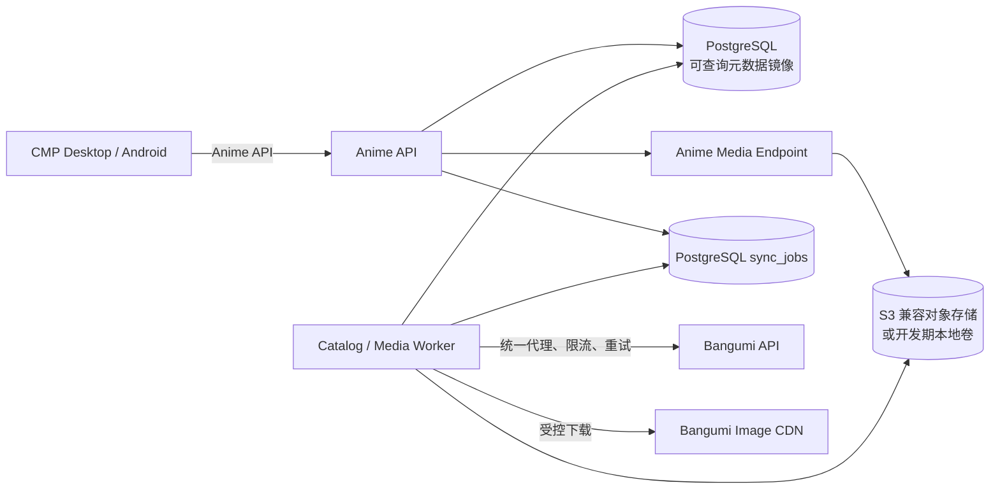

# 目录镜像、媒体缓存与真实数据迁移方案

> 编号：`BES-2.1`<br>
> 状态：Approved<br>
> 适用范围：Anime API、Bangumi 适配器、PostgreSQL、媒体存储与 CMP Remote Repository<br>
> 核心决策：客户端只访问 Anime 服务；Bangumi API 与 `lain.bgm.tv` 只允许由服务端适配器访问。

## 1. 当前问题与根因

当前应用处于半远程化状态：

- OAuth、个人资料和收藏列表来自 Anime 后端；
- 收藏 DTO 中的 `subject_id` 是 Bangumi ID，`poster_url` 仍是 Bangumi CDN 原始地址；
- Desktop 使用 Coil 直接请求原始海报，因此在 Bangumi/CDN 不可达的网络中显示占位色；
- 点击收藏条目后，真实 Bangumi ID 被交给 `FixtureCatalogRepository`，而该仓库只包含 Demo ID，详情页因此返回“无法显示作品”；
- 发现、搜索和作品详情尚未接入后端目录接口，仍由 Fixture 驱动。

这不是 UI 或单张图片问题，必须统一 ID、目录事实源和媒体访问链路。

## 2. 目标架构



必须满足以下边界：

1. Desktop、Android 和未来 Web 不直接请求 Bangumi API 或图片 CDN；
2. PostgreSQL 是 Anime 读取侧事实源，Bangumi 是外部目录和用户收藏的上游事实源；
3. 上游短时不可达时返回本地旧快照，并标记 `data_freshness=stale`；
4. 没有任何本地快照且上游失败时，才返回 `UPSTREAM_ERROR`；
5. Fixture 仅保留给 Preview、测试和显式 Demo profile，Dev/Release 不得混用 Fixture 与 Remote。

Bangumi 官方 API 已提供主题搜索、主题详情、主题图片、人物、角色、关联与剧集接口；Anime 服务通过官方 API 构建镜像，不抓取 HTML。参考 [Bangumi API 文档](https://bangumi.github.io/api/) 与 [官方 API 仓库](https://github.com/bangumi/api)。

## 3. 标识、所有权与来源

### 3.1 Subject ID

- Anime API 的公开 `Subject.id` 固定为 Bangumi subject ID；
- `subjects.id` 是 PostgreSQL 内部主键，永不出现在客户端 DTO 或路由中；
- 所有查询先以 `subjects.bangumi_id` 定位内部行；
- 收藏、发现、搜索、详情和深链全部传递同一个公开 ID，禁止按页面切换 ID 语义。

当前后端 `/subjects/{id}` 按内部主键查询，属于实现偏差，迁移时必须改为按 `bangumi_id` 查询。

### 3.2 数据所有权

| 数据 | 事实源 | Anime 保存方式 |
|---|---|---|
| 主题、别名、标签、剧集、人物关系 | Bangumi | 规范化表 + 有限 `raw_data` 快照 |
| Bangumi 评分 | Bangumi | 只读快照，保留来源和抓取时间 |
| 用户 Bangumi 收藏/进度 | Bangumi + Anime 同步状态 | 用户关系表、版本与同步状态 |
| Anime 评分、评价、片单、动态 | Anime | 本地主数据 |
| 海报、头像、背景图 | 外部来源 | 有期限、可清理的媒体缓存，不作为权利归属声明 |

## 4. PostgreSQL 模型

在现有 `subjects`、`user_subject_collections` 和 `sync_outbox` 基础上向前追加 migration。

### 4.1 扩展 `subjects`

建议增加：

```text
air_date                 DATE NULL
end_date                 DATE NULL
total_episodes           INTEGER NULL
aliases                  TEXT[] NOT NULL DEFAULT '{}'
tags                     JSONB NOT NULL DEFAULT '[]'
raw_data                 JSONB NULL
source_etag              TEXT NULL
source_last_modified     TEXT NULL
source_fetched_at        TIMESTAMPTZ NULL
source_expires_at        TIMESTAMPTZ NULL
source_sync_status       VARCHAR(24) NOT NULL DEFAULT 'partial'
poster_asset_id          UUID NULL
backdrop_asset_id        UUID NULL
```

`source_sync_status` 固定为 `partial | ready | stale | failed`。收藏列表同步只能创建或更新 `partial` 主题；只有主题详情校验并落库完成后才进入 `ready`。

### 4.2 新增 `media_assets`

```text
id                       UUID PRIMARY KEY
kind                     VARCHAR(24)       -- poster/avatar/backdrop
source_provider          VARCHAR(24)       -- bangumi
source_url               TEXT
source_url_hash          CHAR(64) UNIQUE
object_key               TEXT UNIQUE
content_sha256           CHAR(64)
content_type             VARCHAR(96)
byte_size                BIGINT
width                    INTEGER NULL
height                   INTEGER NULL
source_etag              TEXT NULL
source_last_modified     TEXT NULL
status                   VARCHAR(24)       -- pending/ready/failed/quarantined
failure_count            INTEGER
retry_at                 TIMESTAMPTZ NULL
fetched_at               TIMESTAMPTZ NULL
last_accessed_at         TIMESTAMPTZ NULL
created_at / updated_at  TIMESTAMPTZ
```

业务表只引用 `media_assets.id`。`source_url` 仅供 Worker 使用；公开 DTO 返回 Anime 自己的媒体 URL。

### 4.3 新增 `sync_jobs`

`sync_outbox` 继续承担用户写操作；另建 `sync_jobs` 承担可丢弃、可重建的读取侧任务：

- `hydrate_subject`
- `hydrate_episodes`
- `fetch_media`
- `refresh_calendar`
- `refresh_discovery`
- `refresh_search_seed`

任务以 `(kind, dedupe_key)` 唯一去重，使用 `FOR UPDATE SKIP LOCKED` 领取，包含 `priority`、`attempt_count`、`available_at`、`lease_until` 和脱敏错误码。收藏同步产生的主题详情和海报任务优先级高于发现页预热。

## 5. 读取与同步流程

### 5.1 登录与收藏同步

1. `/me` 首先从本地数据库返回用户与最近一次收藏快照；
2. 新登录、用户手动刷新或快照过期时创建一次收藏同步任务；
3. Worker 通过配置的出站代理分页拉取收藏；
4. 单事务 upsert 收藏关系与浅层主题，主题标记为 `partial`；
5. 对缺少完整详情或海报缓存的主题批量入队；
6. UI 立即显示标题和状态，主题详情与海报随后渐进补齐；
7. 刷新完成后通过再次请求、轮询同步状态或未来的推送机制更新页面。

`GET /me` 不应在每次页面打开时串行等待 Bangumi 全量分页，否则登录体验永久受上游延迟支配。

### 5.2 作品详情

1. `GET /subjects/{bangumi_id}` 查询本地镜像；
2. `ready/fresh`：立即返回；
3. `ready/stale`：立即返回旧数据并入队刷新；
4. `partial`：返回已有摘要并标记 `refresh_pending=true`，同时高优先级补齐；
5. 本地不存在：允许一次受全局并发和短超时约束的 request coalescing；成功落库后返回，失败才返回 `UPSTREAM_ERROR`。

同一 subject 的并发 miss 必须合并为一次上游请求，禁止每个客户端请求各自穿透。

### 5.3 发现与搜索

- 发现页、日历和高分榜只查询本地镜像，由定时任务预热；
- 搜索优先使用 PostgreSQL FTS + `pg_trgm` 查询本地数据；
- 本地结果不足时，服务端可调用 Bangumi 搜索并把结果回填后再返回；
- 搜索查询缓存只保存规范化 query/hash、结果 ID 和过期时间，不保存用户身份；
- UI 不再加载任何硬编码作品，Fixture 仅在 `BuildProfile.Demo` 注入。

## 6. 图片缓存与分发

### 6.1 URL 规则

客户端收到：

```text
https://<anime-public-host>/api/v1/media/subjects/{subject_id}/poster
```

客户端不得收到 `lain.bgm.tv` 原始地址。Bangumi 旧接口文档展示的封面 URL 由 `lain.bgm.tv/pic/cover/...` 提供，因此直接热链会把可用性重新暴露给客户端网络。参考 [Bangumi Subject API 图像字段](https://github.com/bangumi/api/wiki/Subject-API)。

### 6.2 下载策略

- 仅允许由数据库中受信记录触发下载，媒体接口不得接受任意 URL，防止 SSRF；
- 上游 host 使用允许列表，至少限制为 Bangumi 官方 API/CDN 域名；
- 限制重定向次数、Content-Type、单文件大小、像素尺寸和总下载时长；
- 下载到临时对象，校验成功后原子发布；失败保留旧对象；
- `object_key` 使用内容哈希或稳定资产 ID，响应带 `ETag`；
- 成功资产使用长浏览器缓存：`Cache-Control: public, max-age=604800, stale-while-revalidate=86400`；
- 未命中时返回稳定占位图或 `404`，同时入队抓取，禁止请求线程无限等待；
- 原图更新时创建新对象，旧对象在宽限期后由清理任务回收。

### 6.3 存储选择

- 开发环境：受版本管理排除的本地持久卷，实现同一 `MediaStore` 接口；
- 单机生产起步：S3 兼容对象存储或云对象存储，数据库只保存 key 和元数据；
- 不把图片 BYTEA 写入 PostgreSQL；
- Redis 首期不是必需依赖。任务租约、去重和新鲜度先由 PostgreSQL 完成；出现多实例热点后再引入 Redis 做短锁和热点缓存。

## 7. 缓存新鲜度

| 数据 | 建议 fresh TTL | stale 可用期 | 触发刷新 |
|---|---:|---:|---|
| 放送中主题详情 | 6 小时 | 30 天 | 访问、收藏同步、定时任务 |
| 已完结主题详情 | 30 天 | 180 天 | 访问、人工刷新 |
| 剧集（放送中） | 1 小时 | 7 天 | 访问、定时任务 |
| 日历/发现分区 | 30 分钟 | 24 小时 | 定时任务 |
| 搜索结果 ID 列表 | 10 分钟 | 1 小时 | query miss |
| 用户收藏 | 5 分钟 | 30 天 | 登录、前台恢复、手动刷新 |
| 成功媒体对象 | 30 天复验 | 可持续使用旧对象 | 原 URL/ETag 变化 |
| 媒体失败负缓存 | 6 小时 | 不适用 | 到期重试 |

TTL 是默认值，必须配置化。返回旧数据时保留 `data_updated_at`、`data_freshness=stale` 和 `refresh_pending`，UI 不用错误页覆盖已有内容。

## 8. API 调整

现有 OpenAPI 已定义 `/subjects`、`/search/subjects`、`/subjects/{subject_id}`、`data_updated_at` 和 `data_freshness`，实施时补齐以下行为：

- `GET /api/v1/subjects/{subject_id}`：`subject_id` 按 Bangumi ID 查询；
- `GET /api/v1/media/subjects/{subject_id}/poster`：P0 按主题提供已登记海报，并在服务端持久缓存；迁移对象存储后仍保持客户端 URL 稳定；
- `GET /api/v1/me`：只读本地快照，不阻塞全量上游同步；
- `POST /api/v1/me/sync`：幂等触发同步，返回 `sync_run_id/status`；
- `GET /api/v1/me/sync/{sync_run_id}`：返回进度、成功数和失败数；
- 所有 Subject/Collection DTO 的 `poster_url` 改为 Anime 媒体 URL；
- 列表 `meta` 增加 `data_updated_at/data_freshness/refresh_pending`，或引入统一 `freshness` 对象；
- 详情不存在与尚未补齐不得混为同一个 `404`。

Machine contract、后端 Handler、Remote Repository 与合同测试必须在同一实施阶段更新。

## 9. 上游治理与降级

- 所有 Bangumi 请求只由统一 client 发出，使用项目可识别的 User-Agent；
- 代理地址只由服务端环境变量配置，不能由客户端或 API 参数覆盖；
- 设置全局并发、每用户并发、连接/响应超时、令牌桶和熔断器；
- 429 尊重 `Retry-After`，网络错误和 5xx 使用带抖动指数退避；
- 记录 endpoint class、耗时、状态码、缓存命中、队列年龄，不记录 Token、Cookie 或完整私人内容；
- 关键指标：元数据命中率、媒体命中率、上游错误率、P95、任务积压、最老任务年龄、失败资产数和 stale 响应比例。

## 10. 权利、隐私与安全

技术上可以缓存图片，但官方 API 文档并不等同于对图片永久再分发的授权。上线前需确认 Bangumi 条款及图片权利边界。默认采取较保守的缓存策略：

- 保留来源、抓取时间和删除能力；
- 缓存有 TTL，不把外部图片声明为 Anime 自有资产；
- 只服务 Anime 产品所需尺寸，不提供公开原图镜像或目录遍历；
- 支持按 source URL、subject 或 provider 批量清理；
- 用户私有收藏、OAuth Token 和媒体缓存的访问日志严格隔离；
- 头像与用户相关媒体遵循账号删除及隐私保留策略。

## 11. 分阶段迁移

### P0：修复当前断链

1. 后端 Subject 路由改为按 Bangumi ID 查询；
2. 收藏同步将缺失详情的主题加入 `hydrate_subject`；
3. 新增受控媒体端点，`/me` 返回 Anime 海报 URL；
4. 实现 `RemoteCatalogRepository`，Desktop Dev/Release 不再注入 Fixture Catalog；
5. 收藏条目可以打开真实详情；已有缓存时断网仍能打开。

### P1：真实目录闭环

1. 接入真实发现、搜索、列表和详情；
2. 完成主题详情、剧集与媒体后台补齐；
3. 引入新鲜度与 stale-while-revalidate UI；
4. 为 Remote 与 Fixture 运行同一套 Repository contract tests。

实施进度（2026-08-10）：P1-A 已完成真实 `/home`、服务端代理搜索、本地搜索降级、Desktop Remote Search 注入，以及收藏同步后的限批后台主题补齐。剧集/人物/关联补齐、完整新鲜度 UI 和 Remote 传输合同测试保留在 P1-B。

### P2：生产化缓存

1. 媒体迁移到对象存储并配置 HTTPS/CDN；
2. 完成任务监控、清理、配额和失败重放；
3. 压测收藏首次同步、132+ 海报预热、详情并发 miss；
4. 验证代理不可用、Bangumi 429/5xx 和对象存储故障的降级行为。

## 12. 验收标准

- 登录后收藏列表不包含任何 Bangumi/CDN 直链；
- 132 个收藏允许渐进加载，已缓存海报的二次打开不访问 Bangumi；
- 任意收藏条目都以同一公开 ID 打开对应真实详情；
- 发现、搜索、收藏和详情展示同一主题时标题、海报与 ID 一致；
- 上游被阻断但本地有缓存时，页面显示 stale 内容而不是全屏错误；
- 上游恢复后只触发去重后的后台刷新；
- Demo profile 完全离线且确定性，Dev/Release 不含 Fixture 数据旁路；
- 媒体端点通过 SSRF、类型、大小、重定向和缓存头测试；
- API、migration、后端、CMP Remote 映射和测试完成后，相关页面才能标记为“真实数据完成”。
