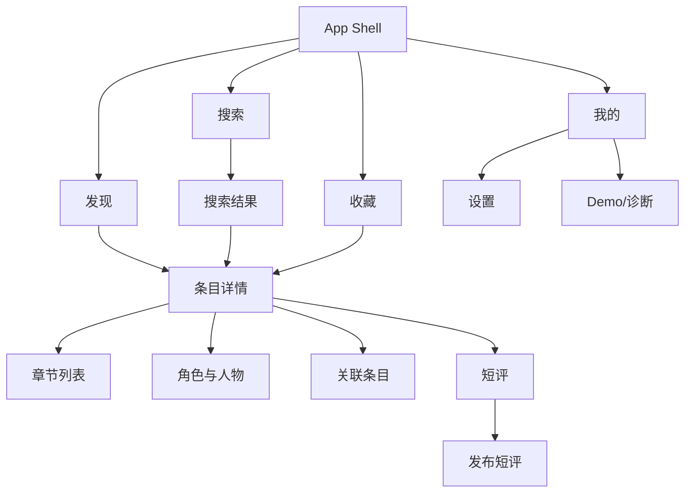

# CMP 前端产品范围与导航规范

> 状态：V1.2 规范性文档 
> 适用范围：Android 优先的 Compose Multiplatform 客户端；iOS 后续复用 
> 目标：先交付可安装、可浏览、可交互的 Fixture Demo，再接入真实后端

## 1. 本阶段交付边界

前端首个可玩版本必须在没有 Anime 后端的情况下完整运行。列表、搜索、详情、收藏进度、短评和登录状态均由可切换 Fixture Repository 驱动；Repository 接口稳定后再替换为 Remote 实现，页面不得感知数据来源。

| 能力 | Fixture Demo | 接入后端后 |
|---|---|---|
| 发现、搜索、条目详情 | 本地确定性数据 | Anime API / Bangumi 镜像 |
| Bangumi 评分 | 只读样例数据，明确来源 | 只读展示 Bangumi 数据 |
| 收藏与观看进度 | 写入本地 Demo 数据库，可重置 | 本地优先并同步服务端 |
| 短评 | 本地发布、删除自己的短评 | 服务端发布与治理 |
| 登录 | 场景开关模拟 | OAuth / Anime 会话 |
| 弱网、离线、冲突 | Demo 控制台一键复现 | 由真实网络与同步状态触发 |

本阶段不出现自有打分入口、自有评分聚合或自有榜单。所有评分组件必须标注“Bangumi 评分”，且只读。

## 2. 信息架构

根导航固定为四项，避免把低频功能提升到一级入口：

1. **发现**：推荐分区、热门与最近更新。
2. **搜索**：关键词、历史、筛选与结果。
3. **收藏**：想看、在看、看过、搁置、抛弃及进度。
4. **我的**：账号、同步、外观、无障碍、缓存和关于。

## 3. 路由表

| Route | 参数 | 登录要求 | 入口 | 返回行为 |
|---|---|---:|---|---|
| `splash` | 无 | 否 | 冷启动 | 自动进入目标根页 |
| `discover` | 无 | 否 | 根导航 | 再次点击回顶 |
| `search` | `query?` | 否 | 根导航/Deep Link | 保留查询与筛选 |
| `search/results` | `query`, `filters?` | 否 | 搜索页 | 回到编辑态搜索页 |
| `subject/{id}` | `id` | 否 | 任意条目卡/Deep Link | 回到来源页及原滚动位置 |
| `subject/{id}/episodes` | `id` | 否 | 详情 | 回详情 |
| `subject/{id}/characters` | `id` | 否 | 详情 | 回详情 |
| `subject/{id}/relations` | `id` | 否 | 详情 | 回详情 |
| `subject/{id}/comments` | `id`, `sort?` | 否 | 详情 | 回详情 |
| `subject/{id}/comment/new` | `id` | 是 | 短评页 | 成功后回短评并定位新项 |
| `collection` | `status?` | 是* | 根导航 | 游客显示登录引导，不强跳 |
| `profile` | 无 | 否 | 根导航 | 游客显示访客版 |
| `login` | `returnTo` | 否 | 受保护操作 | 成功后回到原操作位置 |
| `settings` | 无 | 否 | 我的 | 回我的 |
| `diagnostics` | 无 | 否 | Demo/Debug 构建 | 回设置 |

`collection` 页面本身可由游客访问，以解释价值；具体收藏写操作才触发登录。登录取消时必须返回原页面，且不得丢失输入、滚动位置和待执行意图。

## 4. 导航行为

- 四个根页各自保留独立返回栈与滚动位置；切换 Tab 不重建页面状态。
- Android 系统返回键先关闭弹层/键盘，再弹出子路由，最后在根页退出应用。
- Deep Link `anime://subject/{id}` 和正式 HTTPS Link 解析为同一类型安全路由；非法或缺失 ID 进入可恢复错误页。
- 页面进程恢复只保存轻量参数、筛选和草稿，不序列化大对象；内容从 Repository 恢复。
- 底部导航在详情等沉浸式子页隐藏；返回根页后恢复。大屏可替换为 Navigation Rail，但路由不变。
- 受保护操作通过 `AuthGate` 包装，不在各页面复制登录判断。

## 5. 内容与交互原则

- 首屏先呈现内容，不用宣传横幅挤占主要信息；英雄区最多一个。
- 标题优先显示中文名，原名作为次要信息；缺失中文名时回退原名。
- 所有来源数据在详情页可追溯；Bangumi 评分不可伪装为本站评分。
- 核心操作在单手拇指热区：收藏、进度、搜索、Tab；破坏性操作需二次确认。
- 长标题最多两行，列表布局不因日文假名、拉丁别名或 200% 字体缩放而遮挡操作。
- 空状态必须告诉用户原因和下一步；错误状态保留已成功加载的内容。

## 6. 首个可玩版本验收

安装 APK 后，测试者可以在不联网的情况下完成：浏览发现页 → 搜索条目 → 查看完整详情和 Bangumi 评分 → 收藏为“在看” → 修改观看进度 → 发布一条本地短评 → 切换离线/空数据/错误场景 → 重启应用后保留本地操作。全部路径必须可用系统返回键闭环。
