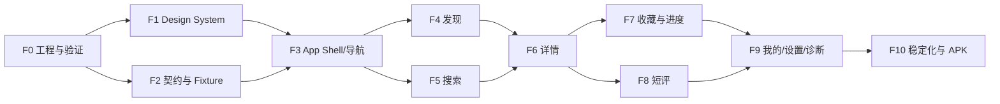

# CMP Android 前端开发路线图与 Agent 协作边界

## 1. 总体策略

先完成 Android 可玩 Demo，但从第一天使用 `commonMain` 的领域、Repository、状态管理和 UI；`androidMain` 只承载 Activity、平台能力和 Backdrop 适配。后端接入通过新增 Remote Repository 完成，不重写页面。



## 2. 阶段与退出条件

| 阶段 | 主要交付 | 退出条件 |
|---|---|---|
| F0 工程与 Spike | 按 `10-engineering-baseline.md` 创建 CMP 模块、版本目录和 CI；验证 Backdrop/Ktor/SQLDelight | `demoDebug` 在 API 26+ 可运行，固定版本验证通过，Glass 自动降级可测 |
| F1 Design System | Token、主题、基础组件、Glass Adapter、Preview Catalog | 深浅色/200% 字体/四级 Glass 可演示 |
| F2 契约与 Fixture | 按 `12`/`13` 实现领域模型、Repository、Fixture DB、12 个 Demo 场景 | `fixtureCheck` 和 Fake 合同测试稳定，无真实网络 |
| F3 Shell 与导航 | 根导航、类型安全路由、状态恢复、AuthGate | 四根页切换与 Deep Link/返回测试通过 |
| F4 发现 | Hero、分区、刷新、区块错误 | 正常/空/离线/局部错误可切换 |
| F5 搜索 | 10 条历史、建议、类型/年份/状态筛选、游标分页 | generation 取消旧结果、无结果和分页失败通过 |
| F6 详情 | Hero、评分、简介、章节、人物、关联 | Bangumi 评分只读，Section 独立降级 |
| F7 收藏与进度 | 五状态、本地写、Pending/失败/冲突 | 重启保留、冲突处理闭环 |
| F8 短评 | 列表、一层回复、剧透、草稿、发布/删除 | 1–300 字、登录回跳、失败恢复通过 |
| F9 我的/设置/诊断 | 会话概览、主题/Glass/动效、场景面板 | Release 不含诊断入口，系统偏好优先 |
| F10 稳定化 | 全路径、截图、无障碍、性能、Demo APK | DoD 全绿，低端机自动降级达标 |

首个“可把玩”里程碑为 F0–F6：可浏览、搜索和查看详情。第二个里程碑 F0–F9：可完成收藏、进度和短评的本地闭环。

### 当前实施状态（2026-07-22）

| 阶段 | 状态 | 已落地 | 退出前仍需完成 |
|---|---|---|---|
| F0 | 已完成 | 模块边界、固定版本、AppContainer、Demo/Dev/Prod 变体、资源打包守卫、真机冷启动 | 无 |
| F1 | 进行中 | 语义 Token、基础按钮/标题/作品卡/评分/状态面板、四级 Glass 决策与组件目录 | Android Backdrop 实际模糊适配、200% 字体和四级截图基线、完整组件目录 |
| F2 | 进行中 | 领域模型、六组 Repository 接口、`anime.fixture/v1` 数据、固定时钟/种子、12 场景、哈希与引用校验、FixtureLoader 场景状态、六组可复用 CT 测试基类 | 完整 Fixture DTO→Domain 映射、SQLDelight 持久化、Demo 数据源接入，以及离线/SingleFlight/重启恢复等完整 CT 语义 |

状态表只记录实现事实，不改变各阶段原有退出条件。阶段只有在“退出前仍需完成”清空且对应门禁全绿后才能标记完成。

## 3. 推荐模块边界

```text
app/android/                 Android 壳、构建变体
shared/
  core/model                 纯领域模型
  core/common                Result、时钟、调度器
  core/designsystem          Token、主题、公共组件
  core/navigation            类型安全路由
  core/database              SQLDelight、迁移
  core/network               Ktor、DTO
  data/catalog|collection|comment|session
  feature/discover|search|subject|collection|comment|profile|settings|diagnostics
  app                        AppContainer、Shell、组合根
fixtures/v1/                 确定性 Demo 数据（实现 F2 时创建）
```

依赖方向固定为 `app/feature → domain/repository interface → data implementation → platform adapter`。Feature 之间不直接依赖；共享展示模型若不足以进入 Design System，则置于独立 UI model 模块而非复制。

## 4. 多 Agent 并行规则

| Lane | 建议所有权 | 可并行阶段 | 不得修改 |
|---|---|---|---|
| Foundation | Gradle、CI、AppContainer、平台适配 | F0–F3 | 业务页面内部 |
| Design System | Token、组件、Preview、截图基线 | F1–F10 | Repository/DTO |
| Data/Fixture | 模型、接口、Fake、SQLDelight、场景 | F2–F10 | 页面布局 |
| Feature | 单个 `feature/*` 目录及对应测试 | F4–F9 | 公共 Token、其他 Feature |
| Quality | 契约测试、导航测试、性能基准、无障碍审计 | 全程 | 未经所有者确认的生产实现 |

- 一项公共接口由一个 Agent 所有；其他 Agent 通过提案或独立提交修改，避免同时编辑。
- Feature 开工前冻结对应 Repository 接口与 UI State 示例；需要改变时先更新契约测试和文档。
- 每个提交只跨越一个清晰边界；机械格式化不得夹带在功能提交中。
- 并行分支先合并 F1/F2 的公共骨架，再合并 Feature；禁止复制临时组件规避依赖。
- Agent 交付说明必须包含：改动边界、运行命令、截图/状态覆盖、已知降级、后续依赖。

## 5. 合并顺序与集成节奏

1. F0 的模块空壳、版本锁定和 CI 先进入 `dev`。
2. F1、F2 可并行，按小提交持续合并；公共 API 通过契约测试守护。
3. F3 在两者稳定后合并，提供 Feature 插槽和测试导航器。
4. F4/F5 并行；F6 复用两者的条目入口。
5. F7/F8 并行但共享 AuthGate/Outbox 契约；F9 汇总全局状态。
6. F10 期间冻结新功能，只处理质量、性能和一致性问题。

主干每天至少集成一次，失败构建优先修复。大型视觉改动先进入 Preview Catalog 评审，不能在多个 Feature 中分别试验。

## 6. 后端接入点

前端 F6 后即可并行启动后端。接入顺序建议：公开条目/搜索 → 会话 → 收藏/进度 → 短评 → 同步冲突。每接入一个 Remote Repository，先运行 Fake/Remote 契约测试，再只切换 `DataMode` 验证同一页面；不得同时重写页面和传输层。

## 7. 开工清单

- 先按 `10-engineering-baseline.md` 执行 F0 验证；版本和 DI 已由 `FED-002`、`FED-005` 固定，不重新选型。
- 创建模块与依赖守卫，建立 `demoDebug` 安装包。
- 导入本规范 Token 和 Preview Catalog，再做业务页面。
- 按 `13-fixture-specification.md` 完成固定 Fixture 与 12 个 Demo 场景，确保开发和截图不依赖外网。
- 以发现 → 搜索 → 详情为第一条纵向闭环，验收后再增加写操作。
- 每个任务必须携带 `15-requirements-traceability.md` 中的需求 ID、场景和测试 ID。
