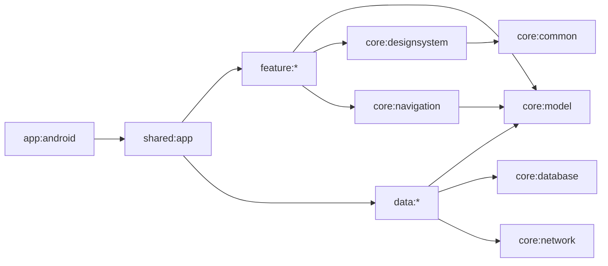

# CMP Android 工程技术基线

> 基线编号：FEB-2026-07-21<br>
> 状态：V1.3 规范性、阻断性<br>
> 规则：除非 ADR 明确替换，本文件中的版本、模块、构建配置和命令不得由实现 Agent 自行改变。

## 1. 已锁定工具链

| 项目 | 锁定值 | 决策说明 |
|---|---:|---|
| Android Studio | Quail 2 `2026.1.2` 或更新的兼容稳定版 | 必须支持 AGP 9.3；IDE 版本不进入产物 |
| JDK | Temurin/OpenJDK `17` | Gradle Toolchain 与 CI 均固定 17 |
| Gradle Wrapper | `9.5.0` | 只允许 Wrapper，禁止依赖本机 Gradle |
| Android Gradle Plugin | `9.3.0` | 使用新 DSL 与内置 Kotlin，不设置兼容回退开关 |
| Kotlin | `2.4.10` | `languageVersion/apiVersion = 2.4` |
| Compose Multiplatform | `1.11.1` | Android 与未来 iOS 共享 UI |
| compileSdk / targetSdk / minSdk | `37 / 37 / 26` | Android 8.0 起；API 26–30 必须走 Glass 降级 |
| SDK Build Tools | `36.0.0` | 采用 AGP 9.3 默认兼容版本 |
| JVM bytecode target | `17` | Kotlin 和 Java 统一 |

禁止 `+`、`latest.release`、动态版本、未锁定 Snapshot、Alpha 或 RC。依赖升级必须单独提交，更新版本目录、依赖验证元数据、ADR、截图和性能基准。

## 2. 已锁定运行时依赖

| 能力 | 坐标/插件 | 版本 | 允许模块 |
|---|---|---:|---|
| Compose | `org.jetbrains.compose` | `1.11.1` | UI 模块 |
| Compose Compiler | `org.jetbrains.kotlin.plugin.compose` | `2.4.10` | 含 Composable 的模块 |
| Lifecycle/ViewModel | `org.jetbrains.androidx.lifecycle:lifecycle-*` | `2.11.0` | `shared:app`、Feature |
| Navigation 3 | `org.jetbrains.androidx.navigation3:navigation3-*` | `1.1.1` | `core:navigation`、`shared:app` |
| Saved State | `org.jetbrains.androidx.savedstate:savedstate-*` | `1.4.0` | `core:navigation` |
| Coroutines | `org.jetbrains.kotlinx:kotlinx-coroutines-*` | `1.11.0` | common/data/feature |
| Serialization | `org.jetbrains.kotlinx:kotlinx-serialization-json` | `1.11.0` | network/fixture/navigation |
| Date/time | `org.jetbrains.kotlinx:kotlinx-datetime` | `0.8.0` | model/data |
| HTTP | `io.ktor:ktor-client-*` | `3.5.0` | `core:network` |
| 本地数据库 | `app.cash.sqldelight:*` | `2.3.2` | `core:database`、data |
| 图片 | `io.coil-kt.coil3:coil-compose`、`coil-network-ktor3` | `3.5.0` | `core:designsystem` |
| Glass | `io.github.kyant0:backdrop` | `2.0.0` | `core:designsystem` 的平台适配层 |
| Android Activity | `androidx.activity:activity-compose` | `1.13.0` | `app:android` |
| Android Core | `androidx.core:core-ktx` | `1.19.0` | `app:android` |

不使用 DI 框架、Paging 3、Room、Retrofit、Moshi、Decompose、Voyager 或 MVI 第三方框架。分页、Store、AppContainer 均按本文档集的项目契约实现；需要增加依赖时先提交 `FED` 决策记录。

## 3. 测试与质量依赖

| 能力 | 工具 | 版本/规则 |
|---|---|---|
| Common 单元测试 | `kotlin-test` + `kotlinx-coroutines-test` | 与 Kotlin/Coroutines 同版 |
| Compose UI 测试 | Compose UI Test v2 | 随 CMP 1.11.1 |
| Android 截图 | Roborazzi | `1.70.0`，Robolectric 渲染 |
| Android Lint | AGP Lint | 随 AGP 9.3.0，警告视为错误 |
| 格式化 | ktlint CLI | `1.8.0`，通过仓库内 Gradle Task 调用 |
| 性能 | `androidx.benchmark:benchmark-macro-junit4` + Baseline Profile Plugin | `1.4.1` |

不采用 Detekt 2 Alpha；在其 2.x 稳定且验证 Kotlin 2.4/AGP 9.3 后再通过 ADR 引入。复杂度和架构边界当前由编译依赖、模块测试、ktlint、Android Lint 与代码审查控制。

## 4. 仓库与模块结构

```text
anime/
├─ app/
│  └─ android/                 # Android Application、Manifest、Activity、构建变体
├─ shared/
│  └─ app/                     # AnimeApp、AppContainer、AppShell、组合根
├─ core/
│  ├─ common/                  # Result、Dispatcher、Clock、Logger、ID
│  ├─ model/                   # 纯领域模型，不含框架注解
│  ├─ designsystem/            # Token、主题、公共组件、Glass、图片
│  ├─ navigation/              # AppRoute、BackStack、Deep Link、AuthGate
│  ├─ database/                # SQLDelight schema/driver/transaction
│  ├─ network/                 # Ktor、DTO、认证、错误解析
│  └─ testing/                 # FakeClock、FixtureLoader、测试 DSL
├─ data/
│  ├─ catalog/
│  ├─ collection/
│  ├─ comment/
│  ├─ session/
│  └─ settings/
├─ feature/
│  ├─ discover/
│  ├─ search/
│  ├─ subject/
│  ├─ collection/
│  ├─ comment/
│  ├─ profile/
│  ├─ settings/
│  └─ diagnostics/
├─ benchmark/                  # Macrobenchmark/Baseline Profile
├─ fixtures/v1/               # 可执行确定性数据
├─ gradle/libs.versions.toml
└─ build-logic/               # Convention Plugins；不含业务逻辑
```

Gradle Project Path 使用上表路径，例如 `:core:model`。根包名为 `site.jokersh.anime`；模块 Namespace 为根包名加模块路径，例如 `site.jokersh.anime.feature.search`。Android `applicationId` 固定为 `site.jokersh.anime`；Demo 和 Dev 分别追加 `.demo`、`.dev`。

## 5. 依赖方向



- Feature 之间禁止依赖；跨 Feature 行为通过路由或领域接口完成。
- Feature 只能依赖 Repository 接口，接口放在对应 `data:*` 的 `api` Source Set；不得依赖 DTO、SQLDelight 生成类型或 Ktor。
- `core:model` 不依赖 Compose、Android、Ktor、SQLDelight 或 Serialization 注解。
- `core:designsystem` 不依赖任何 Feature/Data；图片 URL 使用 `ImageRef`。
- `shared:app` 是唯一装配根；`app:android` 不包含业务条件判断。
- Convention Plugin 只表达构建规则，不引用生产模块代码。

每条依赖约束都要由 `build-logic` 的允许列表和 `checkModuleGraph` 测试执行，不能只靠评审。

## 6. Source Set 规则

KMP 模块至少使用 `commonMain/commonTest/androidMain/androidUnitTest`。未来增加 iOS 时启用 `iosMain/iosTest`，当前 Windows 开发环境不得伪造 iOS 构建成功。

| Source Set | 允许内容 |
|---|---|
| `commonMain` | 领域、状态、Repository 契约、共享 Compose UI、导航、SQL |
| `androidMain` | Activity 适配、Keystore、分享、触感、Connectivity、Backdrop 能力 |
| `commonTest` | Reducer、Use Case、Repository 契约、Fixture 解析 |
| `androidUnitTest` | Robolectric/Roborazzi、Android Adapter |
| `androidDeviceTest` | 真机导航、无障碍、SQL Driver、Glass 冒烟 |

只有 `PlatformServices` 端口及其实现可以使用 `expect/actual`；普通 Repository 使用 interface 和构造注入。

## 7. 构建配置

维度 `environment` 固定三个 Flavor：

| Variant | 数据模式 | 诊断面板 | 日志 | 可发布 |
|---|---|---:|---|---:|
| `demoDebug` | Fixture only | 是 | Debug，不含秘密 | 否 |
| `devDebug` | Remote 默认，可切 Fixture | 是 | Debug，脱敏 | 否 |
| `prodRelease` | Remote only | 否 | 仅错误码/诊断 ID | 是 |

禁用 `demoRelease`、`devRelease`、`prodDebug`。`BuildProfile` 由 `app:android` 构造并传给 `createAppContainer(profile)`；commonMain 不读取 Android `BuildConfig`。

```kotlin
enum class Environment { Demo, Dev, Prod }
enum class DataModePolicy { FixtureOnly, RemoteWithFixtureSwitch, RemoteOnly }

data class BuildProfile(
    val environment: Environment,
    val dataModePolicy: DataModePolicy,
    val apiBaseUrl: String?, // null 仅允许 Demo；Data 层验证 HTTPS 后使用
    val diagnosticsEnabled: Boolean,
    val searchPageSize: Int, // Demo=5；Dev/Prod=20
)
```

构造值固定：Demo=`FixtureOnly,true,5`；Dev=`RemoteWithFixtureSwitch,true,20`；Prod=`RemoteOnly,false,20`。除 `apiBaseUrl` 外不得从远端或运行时覆盖 BuildProfile。

API URL、OAuth Client ID 和 Deep Link Host 通过未入库的本机属性/CI Secret 注入；任何 Token、Client Secret、真实用户数据不得进入 APK、Fixture、日志或 Wiki。

## 8. 编译与代码规则

- `jvmToolchain(17)`；Java/Kotlin target 17；UTF-8；LF 由 `.gitattributes` 约束。
- `allWarningsAsErrors = true`；实验 API 必须在最小作用域 `@OptIn`，禁止全局静默。
- `core:model`、所有 Repository API 和公共 Design System 开启 Explicit API。
- `@Immutable` 只标注真正不可变 UI Model；不得为压制 Compose 警告虚假标注。
- 公共 API 使用 KDoc 说明不变量、线程和错误；内部实现默认 `internal`。
- 禁止 `GlobalScope`、裸 `CoroutineScope()`、`Dispatchers.IO` 直接散落、阻塞主线程和吞掉 `CancellationException`。
- 禁止 Composable 内创建 Repository、执行网络/数据库调用或直接导航；只发送 Intent。
- 所有 Lazy 项提供稳定 `key` 与 `contentType`。

## 9. 版本目录与依赖验证

所有版本集中在 `gradle/libs.versions.toml`；Build Logic 通过 Alias 使用。开启 Gradle Dependency Verification，校验和文件提交到 `gradle/verification-metadata.xml`。仓库只允许 `google()`、`mavenCentral()`、`gradlePluginPortal()`；新增 Maven 源必须 ADR，并使用 Content Filter。

依赖升级流程：建立 `FED` → 修改单个依赖族 → `dependencies`/`dependencyInsight` 检查 → 全部单元/截图/设备测试 → 性能对比 → 更新基线与锁文件 → 独立合并。

## 10. 固定命令与 CI 门禁

工程建立后必须提供以下稳定聚合任务；Agent 不得在交付说明中发明模块私有命令替代它们：

```powershell
./gradlew.bat animeFormat
./gradlew.bat animeCheck
./gradlew.bat animeScreenshot
./gradlew.bat animeUiTest
./gradlew.bat animeBenchmark
./gradlew.bat :app:android:assembleDemoDebug
./gradlew.bat :app:android:assembleDevDebug
./gradlew.bat :app:android:assembleProdRelease
```

`animeCheck` 必须包含：ktlint、Kotlin/common tests、Android unit tests、Lint、SQLDelight migration verification、模块依赖检查、Fixture schema/引用完整性、Release 诊断入口缺失检查。

CI 分为：

1. `docs-check`：文档链接、Wiki 生成、决策状态；
2. `fast-check`：format/check、Demo APK、截图验证；
3. `device-check`：API 26/31/37 设备测试；
4. `performance-check`：基准设备上的启动、滚动和 Glass；
5. `release-check`：签名前 prodRelease、R8、SBOM、secret scan。

## 11. 基线改变条件

以下任一变化必须更新本文、`libs.versions.toml` 和 ADR：主版本升级；稳定版改预览版；最低系统变化；导航/状态/数据库/网络/图片/Glass 库替换；模块合并拆分；新增代码生成或 DI 框架；改变构建变体；关闭 warnings-as-errors 或依赖验证。

## 12. 官方核验来源

- Kotlin Releases：<https://kotlinlang.org/docs/releases.html>
- Compose Multiplatform Releases：<https://github.com/JetBrains/compose-multiplatform/releases>
- Android Gradle Plugin 9.3：<https://developer.android.com/build/releases/agp-9-3-0-release-notes>
- Ktor Releases：<https://ktor.io/docs/releases.html>
- SQLDelight Releases：<https://github.com/sqldelight/sqldelight/releases>
- Coil Changelog：<https://coil-kt.github.io/coil/changelog/>
- Backdrop Releases：<https://github.com/Kyant0/AndroidLiquidGlass/releases>
- AndroidX Benchmark Releases：<https://developer.android.com/jetpack/androidx/releases/benchmark>
- kotlinx.coroutines Releases：<https://github.com/Kotlin/kotlinx.coroutines/releases>
- kotlinx.serialization Releases：<https://github.com/Kotlin/kotlinx.serialization/releases>
- kotlinx-datetime Releases：<https://github.com/Kotlin/kotlinx-datetime/releases>
- Roborazzi Releases：<https://github.com/takahirom/roborazzi/releases>
