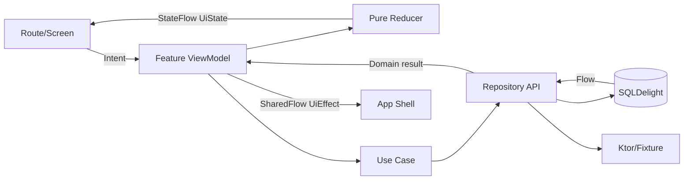
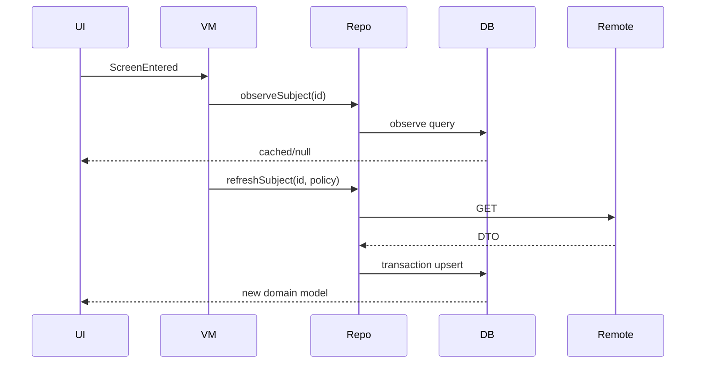

# CMP 前端运行时与状态架构

> 状态：V1.3 规范性、阻断性<br>
> 目标：一个 Feature 只有一种状态流、一种依赖取得方式和一种副作用处理方式。

## 1. 运行时总览



单向数据流固定为：UI 产生 `Intent`；ViewModel 调用纯 Reducer 或 Use Case；Repository 更新数据库/返回结果；ViewModel 发布新 State；一次性行为通过 Effect。Composable 不读 DTO、不持有 Job、不直接调用 Repository。

## 2. AppContainer

MVP 使用显式构造注入，不使用 Service Locator 或 DI 框架。

```kotlin
class AppContainer private constructor(
    val repositories: Repositories,
    val platform: PlatformServices,
    val runtime: RuntimeServices,
    val viewModelFactory: AnimeViewModelFactory,
) {
    companion object {
        fun create(profile: BuildProfile, platform: PlatformServices): AppContainer
        fun preview(scenarioId: String = "happy"): AppContainer
    }
}

data class Repositories(
    val catalog: CatalogRepository,
    val search: SearchRepository,
    val collection: CollectionRepository,
    val comments: CommentRepository,
    val session: SessionRepository,
    val settings: SettingsRepository,
)

data class RuntimeServices(
    val dispatchers: AppDispatchers,
    val clock: AppClock,
    val idGenerator: IdGenerator,
    val logger: AppLogger,
    val networkMonitor: NetworkMonitor,
    val searchPageSize: Int,
)
```

`AppContainer` 仅在应用组合根可见。Feature Route 从 `AnimeViewModelFactory` 创建所需 ViewModel；ViewModel 构造函数只接收自身依赖，禁止保存整个 Container。

## 3. Feature 固定文件结构

```text
feature/<name>/src/commonMain/kotlin/site/jokersh/anime/feature/<name>/
├─ <Name>Route.kt          # ViewModel 取得、State/Effect 收集、导航适配
├─ <Name>Screen.kt         # 纯 State + callbacks，Preview 入口
├─ <Name>Contract.kt       # UiState、Intent、Effect
├─ <Name>ViewModel.kt      # 编排与协程，不写复杂映射
├─ <Name>Reducer.kt        # 纯函数状态转换
├─ <Name>UiMapper.kt       # Domain → UI Model
├─ <Name>Components.kt     # Feature 私有组件
└─ <Name>TestTags.kt       # 稳定测试标识
```

Feature 私有类型默认 `internal`。只有 Route、导航契约和跨模块需要的结果类型可公开。

## 4. 通用 Contract

```kotlin
interface UiIntent
interface UiEffect

interface Reducer<S : Any, I : UiIntent> {
    fun reduce(state: S, intent: I): ReduceResult<S>
}

data class ReduceResult<S : Any>(
    val state: S,
    val commands: List<UiCommand> = emptyList(),
)

sealed interface UiCommand {
    data class Load(val key: String) : UiCommand
    data class Refresh(val key: String) : UiCommand
    data class Retry(val operation: OperationId) : UiCommand
}
```

Reducer 必须是确定性纯函数，不调用时间、随机数、Repository 或 Logger。需要时间和 ID 时由 ViewModel 从端口取得并作为 Intent/事件数据传入。

## 5. ViewModel 基线

```kotlin
abstract class AnimeViewModel<S : Any, I : UiIntent, E : UiEffect>(
    initialState: S,
) : ViewModel() {
    private val mutableState = MutableStateFlow(initialState)
    val state: StateFlow<S> = mutableState.asStateFlow()

    private val mutableEffects = MutableSharedFlow<E>(extraBufferCapacity = 1)
    val effects: SharedFlow<E> = mutableEffects.asSharedFlow()

    abstract fun accept(intent: I)

    protected fun update(transform: (S) -> S) = mutableState.update(transform)
    protected suspend fun emit(effect: E) = mutableEffects.emit(effect)
}
```

- 所有启动任务进入 `viewModelScope`；不创建未托管 Scope。
- 同一种 Load 通过 `JobRegistry` 以 key 单飞；新搜索取消旧搜索。
- `CancellationException` 原样抛出；其他异常先映射为 `AppError`。
- UI Intent 必须表达用户/生命周期事件，如 `RetryClicked`，不得命名为 `CallApi`。
- Effect 只用于导航、Snackbar、平台分享、请求键盘/焦点；内容状态不得只存在 Effect。
- Effect 不重放；重要结果先写 State/数据库，避免旋转丢失。

## 6. Dispatcher、Clock 与 ID

```kotlin
interface AppDispatchers {
    val default: CoroutineDispatcher
    val io: CoroutineDispatcher
}

interface AppClock { fun now(): Instant }
interface IdGenerator { fun next(): String }
```

网络和数据库实现决定线程切换，Use Case 不重复 `withContext(IO)`。测试使用 `StandardTestDispatcher`、固定 `FixtureClock(2026-07-19T08:00:00Z)` 和递增 ID；禁止在业务代码直接调用系统时钟、UUID 或随机数。

## 7. 导航架构

Navigation 3 的 BackStack 是唯一导航事实源。路由均为 `@Serializable sealed interface AppRoute` 的 data object/data class：

```kotlin
@Serializable
sealed interface AppRoute {
    @Serializable data object Discover : AppRoute
    @Serializable data class Search(val query: String? = null) : AppRoute
    @Serializable data class SearchResults(val request: SearchRouteRequest) : AppRoute
    @Serializable data class Subject(val subjectId: Long, val origin: RouteOrigin = RouteOrigin.Unknown) : AppRoute
    @Serializable data class Episodes(val subjectId: Long) : AppRoute
    @Serializable data class Characters(val subjectId: Long) : AppRoute
    @Serializable data class Relations(val subjectId: Long) : AppRoute
    @Serializable data class Comments(val subjectId: Long, val sort: CommentSort = CommentSort.Newest) : AppRoute
    @Serializable data class Login(val requestId: String) : AppRoute
    @Serializable data class OAuthResult(val ticket: String) : AppRoute
    @Serializable data class Collection(val filter: CollectionStatus? = null) : AppRoute
    @Serializable data object Profile : AppRoute
    @Serializable data object Settings : AppRoute
    @Serializable data object Diagnostics : AppRoute
}
```

`RouteOrigin` 固定为 `Discover`、`Search`、`Collection`、`Related`、`DeepLink`、`Unknown`；它只用于返回体验和诊断，不改变详情数据。评论编辑器是 Comments 内的 Bottom Sheet，不是独立路由。

导航操作只通过 `Navigator`：`push`、`replaceTop`、`pop`、`popToRoot`、`selectRoot`。Route 不能直接取得可变 BackStack。

四个 Root 各有独立 BackStack 与 `ScrollRestorationKey`。应用保存 root ID、每栈可序列化路由、搜索条件和草稿 ID；不保存领域对象。恢复遇到未知路由版本时回对应 Root，并记录 `navigation_restore_failed`。

## 8. AuthGate 与返回意图

```kotlin
data class PendingAuthAction(
    val id: String,
    val route: AppRoute,
    val action: ProtectedAction,
    val payloadRef: String?,
    val createdAt: Instant,
)
```

受保护操作交给 `AuthCoordinator.requireSession(action)`：已登录立即执行；未登录将 PendingAction 持久化并导航 Login；成功后消费一次；取消则回原 Route，保留编辑内容；过期 30 分钟自动作废。禁止把评论正文等隐私数据放进 Route，使用本地草稿 ID 引用。

## 9. 页面状态与内容保留

所有 Feature 的 UiState 必须组合而不是继承一个巨大状态类：

```kotlin
data class AsyncContent<T>(
    val value: T? = null,
    val phase: LoadPhase = LoadPhase.Idle,
    val freshness: Freshness? = null,
    val error: UiError? = null,
)

enum class LoadPhase { Idle, InitialLoading, Refreshing, Appending }
```

- `value != null` 时加载/错误不得替换内容。
- 初次无值且加载才显示 Skeleton；成功空集是 Empty；失败无值才是 FullPageError。
- 每个独立 Section 有独立 `AsyncContent`。
- 用户输入、选中筛选、滚动位置和草稿不放在网络 Result 内。
- `UiError` 保存稳定 code、可恢复性和 retry operation，不保存 Throwable 或服务端原文。

## 10. Repository 数据流

读取策略固定为 `observe local → decide refresh → write local → observe emits`。UI 不直接消费网络返回作为长期状态。



Fixture Repository 也遵循同一序列，使用 Fixture Store 模拟 Remote 并写入 Demo DB。禁止为 Demo 建立只返回硬编码 State 的页面旁路。

## 11. 写入、Outbox 与同步

收藏和进度采用乐观本地写：验证 → 单事务写业务表和 `pending_mutation` → UI 立即观察新值 → Worker/前台协调器提交 → 成功清除/失败标记。只有服务端明确拒绝且不可重试时才提示用户修正；网络错误不回滚。

同一实体字段的未发送 Mutation 合并：收藏状态取最后一次；进度取最后一次。每条 Mutation 有稳定 `clientMutationId` 保证幂等。评论首发不进入 Outbox、不显示未被服务端确认的公开评论；离线/失败时只保留本地草稿，用户显式重试。

## 12. 错误映射

```kotlin
sealed interface AppError {
    data object Offline : AppError
    data object Timeout : AppError
    data class Unauthorized(val recoverable: Boolean) : AppError
    data class NotFound(val resource: ResourceKind) : AppError
    data class RateLimited(val retryAt: Instant?) : AppError
    data class Validation(val field: FieldId, val reason: ValidationReason) : AppError
    data class Upstream(val provider: Provider, val traceId: String?) : AppError
    data class Server(val traceId: String?) : AppError
    data class Data(val diagnosticId: String) : AppError
    data class Unknown(val diagnosticId: String) : AppError
}
```

`Throwable → AppError` 只在 data/core 边界执行。Feature 通过 `UiErrorMapper` 得到本地化资源 ID、展示位置和 retry；禁止根据异常消息字符串分支。

## 13. 平台端口

`PlatformServices` 固定包含：`SecureStorage`、`ExternalBrowser`、`SharePort`、`HapticPort`、`SystemAppearance`、`AccessibilityPreferences`、`ConnectivityPort`、`AppLifecyclePort`、`GlassCapabilityProvider`。端口返回领域中立值，不能向 commonMain 泄漏 `Context`、`Intent`、`Uri`、`UIViewController`。

## 14. 日志与诊断

日志事件结构为 `eventName/level/feature/operationId/diagnosticId/fields`。字段采用允许列表；禁止 Token、OAuth code、评论正文、搜索全文、用户 ID、完整 URL Query。Release 不输出网络 Body、SQL 参数或堆栈到用户可见界面。

诊断面板只在 Demo/Dev 显示：BuildProfile、DataMode、Scenario、网络状态、数据库版本、缓存计数、Pending 数、实际 Glass Tier。导出诊断前再次脱敏。

## 15. 运行时验收

- 任意 Screen 可以仅用 State + callbacks Preview。
- ViewModel 测试使用虚拟时间，无真实线程等待。
- 旋转、窗口变化、进程恢复不会重复写操作。
- 连续点击刷新/搜索不会产生并行重复请求。
- 登录完成准确恢复一个 PendingAction；重复回调不重复执行。
- Fixture 与 Remote Repository 通过相同契约测试。
- Offline/Timeout/Unauthorized/Conflict 不依赖异常文本显示。
- Release APK 无 Diagnostics Route、Fixture 文件和 Debug Logger。
