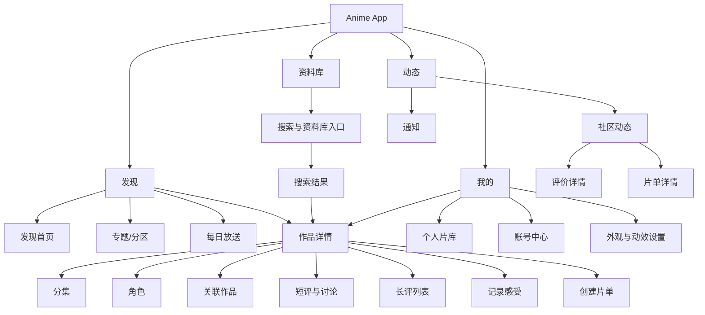
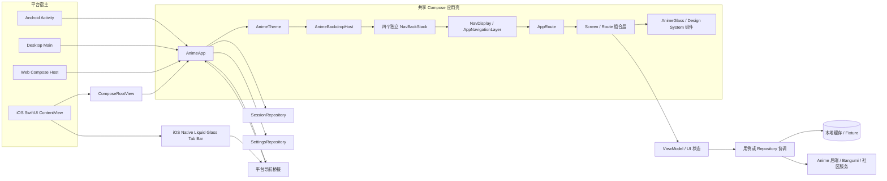
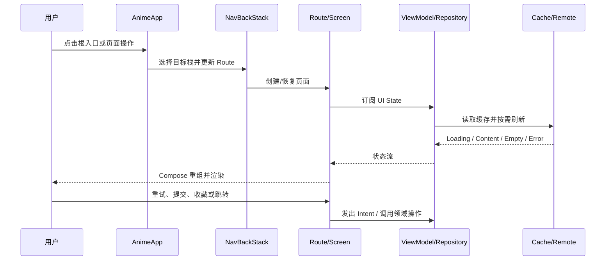
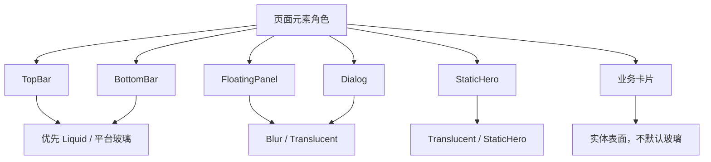
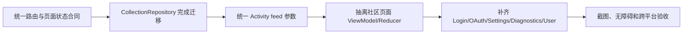

# 当前 UI 页面、功能与设计开发文档

> 文档编号：`FUI-2026-09`  
> 版本：`1.0`  
> 事实快照：`2026-09-11`  
> 适用范围：Compose Multiplatform 共享 UI、Android/Desktop/Web 宿主、iOS SwiftUI 宿主  
> 文档性质：当前代码实现的页面地图、UI 设计合同、渲染框架与验收基线

## 1. 文档目的

本文档根据当前仓库代码整理，不把产品设想、旧页面规范和已经落地的实现混在一起。后续 UI 开发应先确认本文件中的页面状态：

| 标记 | 含义 |
|---|---|
| ✅ | 当前已有可运行实现 |
| ◐ | 已有实现，但入口嵌入其他页面、参数未完全接入或仍处于迁移中 |
| ⚠️ | 路由或协议已注册，但当前 `AnimeApp` 没有对应页面入口 |
| 🧭 | 建议的后续重构方向，不代表当前已经完成 |

当前产品是以动画条目（Subject）为中心的内容发现、个人片库和社区互动客户端。四个一级入口为：发现、资料库、动态、我的。

## 2. 当前产品信息架构



### 2.1 一级入口的实现事实

| 一级入口 | 当前显示名称 | 当前页面实现 | 说明 |
|---|---|---|---|
| `AppRoot.Discover` | 发现 | `DiscoverRoute` | 内容发现、专题和每日放送 |
| `AppRoot.Library` | 资料库 | `SearchRoute` / `SearchScreen` | 当前实际是搜索页，尚未单独实现“收藏库首页” |
| `AppRoot.Activity` | 动态 | `ActivityScreen` | 社区动态、通知、讨论和片单 |
| `AppRoot.Profile` | 我的 | `ProfileScreen` | 账号、同步、片库入口、外观设置 |

“资料库”这个命名与当前页面行为存在语义偏差：入口图标和文案表达的是个人资料库，但当前实现主要承担搜索与发现功能。后续可以保留入口名称并补充片库总览，也可以将入口重命名为“搜索”；这需要产品决策，不应在 UI 中悄悄改变。

## 3. 渲染框架与运行时架构

### 3.1 总体渲染框架图



### 3.2 页面渲染生命周期



### 3.3 根导航与子页面导航规则

1. 四个根页面各自保存独立的 `rememberNavBackStack`，切换一级入口时不应销毁其他根栈。
2. 根入口切换不使用滑动动画；子页面使用统一的轻量滑入/淡入策略，避免页面切换闪烁。
3. iOS 的原生 Liquid Glass 底栏只负责根入口选择，Compose 状态是唯一业务真相源；原生栏不能自行维护第二份选中状态。
4. 页面返回优先弹出当前根栈；当前根栈为空时才交给平台处理返回。
5. 深链、快捷方式和外部 OAuth 回调应先进入 `AnimeApp`，再由路由状态决定最终页面。

### 3.4 平台责任边界

| 能力 | Compose Multiplatform | iOS SwiftUI 原生壳 |
|---|---|---|
| 作品、搜索、社区、片库业务页面 | ✅ | 不重复实现 |
| 页面状态、数据加载、错误处理 | ✅ | 不重复实现 |
| 根导航选中状态 | ✅ 主状态 | 只渲染并转发点击 |
| iOS 根底栏 Liquid Glass | 通过桥接接收状态 | ✅ 原生 `GlassEffectContainer` |
| Android/Desktop/Web 根导航 | ✅ | 不适用 |
| OAuth/系统链接打开 | 接收回调并更新状态 | 调用平台能力并回传结果 |
| 安全存储、窗口、返回键 | 通过平台接口 | 通过 iOS 宿主适配 |

当前 iOS 不需要兼容低版本系统，因此 iOS 根底栏可以按目标系统的官方 Liquid Glass 能力设计，不需要长期维护旧系统降级视觉。共享 Compose 的 `AnimeGlass` 仍应保留无玻璃、半透明和模糊层级，以便 Android/Desktop/Web 和低性能状态正常运行。

## 4. 视觉与组件设计基线

### 4.1 设计 Token

当前 Token 位于 `core/designsystem/.../AnimeTokens.kt`，页面不得自行创建第二套间距和圆角体系。

| 类别 | 当前基线 |
|---|---|
| 间距 | `2 / 4 / 8 / 12 / 16 / 20 / 24 / 32 / 40 / 48 / 64 dp` |
| 圆角 | 控件 `14`、卡片 `18`、面板 `24`、胶囊 `999` |
| 最小触控 | `48 dp` |
| 图标 | `18 / 24 / 32 dp` |
| 海报 | 紧凑 `80×112`、标准 `132×198` |
| 内容宽度 | 主内容最大 `1320 dp`、阅读内容最大 `720 dp` |
| 动画 | 快速 `120 ms`、标准 `220 ms`、强调 `360 ms` |
| 搜索防抖 | `300 ms` |
| 页面偏移 | `24 dp` |
| 主要字体层级 | 34/41、28/34、20/28、17/24、16/24、14/20、12/16 |

### 4.2 玻璃层级策略



玻璃效果只用于导航、悬浮操作、对话框和英雄区域；作品卡片、列表卡片、正文容器使用实体表面，保证内容可读性和滚动稳定性。减少透明、低电量、低内存或帧率下降时，统一由 `resolveGlassTier` 降级，不允许页面各自判断。

### 4.3 基础组件对应关系

| 组件 | 用途 | 典型页面 |
|---|---|---|
| `AnimeGlassPanel` | 玻璃容器、浮层、对话框 | 根壳、账号中心、悬浮操作 |
| `AnimePrimaryButton` | 主要提交操作 | 登录、保存、创建、同步 |
| `AnimeSecondaryButton` | 次要操作 | 查看作品、关注、取消 |
| `AnimeSectionHeader` | 模块标题和更多入口 | 发现、主体详情 |
| `AnimePosterCard` | 横向/网格作品卡 | 发现、推荐、片库 |
| `AnimeCompactSubjectCard` | 搜索结果紧凑卡片 | 搜索 |
| `AnimeRatingBadge` | 评分与来源展示 | 作品详情、片库 |
| `AnimeStatePane` | Loading/Empty/Error/Offline | 所有数据页面 |
| `AnimeBackdropHost` | 全局背景、主题层 | 应用根壳 |

## 5. 页面与路由总表

| 路由 | 实际页面 | 主要功能 | 当前状态 |
|---|---|---|---|
| `Discover` | `DiscoverScreen` | 推荐、轮播、内容分区、刷新 | ✅ |
| `DiscoverSection(sectionId)` | `DiscoverSectionScreen` | 查看某个分区的完整列表 | ✅ |
| `Calendar` | `CalendarScreen` | 按日期查看放送内容 | ✅ |
| `Library(query?)` | `SearchScreen` | 资料库入口、搜索输入、历史和推荐 | ◐ 当前与搜索复用 |
| `SearchResults(request)` | `SearchScreen` | 筛选、分页、结果列表 | ✅ |
| `Activity(feed)` | `ActivityScreen` | 动态、通知、讨论、片单 | ◐ `feed` 参数未完全反映到页面控件 |
| `Collection(filter?)` | `CollectionScreen` | 收藏状态、进度、评分、移除 | ◐ 从“我的”进入；仍使用 `SessionRepository` |
| `Profile` | `ProfileScreen` | 账号、同步、片库摘要、外观设置 | ✅ |
| `Subject(subjectId)` | `SubjectScreen` | 作品详情、收藏、社区摘要 | ✅ |
| `Episodes(subjectId)` | `EpisodesScreen` | 分集信息和放送状态 | ✅ |
| `Characters(subjectId)` | `CharactersScreen` | 角色、关系、声优/演员 | ✅ |
| `Relations(subjectId)` | `RelationsScreen` | 关联作品 | ✅ |
| `Comments(subjectId)` | `CommentsScreen` | 短评、讨论、回复、举报 | ✅ |
| `SubjectReviews(subjectId)` | `SubjectReviewsScreen` | 长评列表、排序、删除、剧透展开 | ✅ |
| `RatingEditor(subjectId)` | `RatingEditorScreen` | 评分、标签、短评/长评/讨论提交 | ✅ |
| `Review(reviewId)` | `ReviewDetailScreen` | 阅读评价全文、跳转作品 | ✅ |
| `CuratedList(listId)` | `CuratedListScreen` | 查看片单、关注、作品列表 | ✅ |
| `CuratedList("new")` | `CreateListScreen` | 创建片单 | ✅ |
| `User(userId)` | 无页面入口 | 用户详情 | ⚠️ |
| `Login(requestId)` | `AnimeAccountCenter` 对话框 | 登录/注册 | ◐ 路由未实现，弹窗已实现 |
| `OAuthResult(ticket)` | 平台回调桥接 | OAuth 结果回传 | ◐ 依赖宿主回调，未作为独立页面渲染 |
| `Settings` | `ProfileScreen` 内嵌设置区 | 主题、玻璃效果、减少动效 | ⚠️ 独立路由未实现 |
| `Diagnostics` | 无页面入口 | 诊断信息 | ⚠️ 路由已注册但未实现 |

## 6. 页面详细设计与低保真线框图

下面的线框图表达信息层级、主要操作和页面边界，不约束具体颜色。具体颜色、圆角、玻璃层级由第 4 节 Token 和设计系统组件决定。

### 6.1 应用壳与根导航

```text
┌──────────────────────────────────────────────────────────┐
│ 状态栏 / 安全区                                           │
├──────────────────────────────────────────────────────────┤
│                                                          │
│                  当前根页面内容                          │
│              Compose NavDisplay                           │
│                                                          │
│                                                          │
├──────────────────────────────────────────────────────────┤
│ 发现          资料库          动态          我的           │
│ sparkles      books           bubble        person        │
└──────────────────────────────────────────────────────────┘
```

**功能合同**

- 根栏只显示四个一级入口，每个入口必须有图标、可访问名称和选中状态。
- iOS 使用原生 Liquid Glass 底栏；Android/Desktop/Web 使用共享 Compose 根导航。
- 根切换不做大幅位移动画，避免滚动页面和玻璃栏同时重排导致闪烁。
- 当前页面正在加载时仍允许切换根入口；异步请求不可阻塞根导航。
- 当深层页面需要展示原生底栏时，必须由 Compose 明确上报 `nativeRootNavigationVisible`。

### 6.2 发现首页 `DiscoverScreen`

```text
┌──────────────────────────────────────────────┐
│ Anime                         ↻  日历         │
│ 发现今日值得看的作品                           │
├──────────────────────────────────────────────┤
│ [离线/上次更新提示]                            │
├──────────────────────────────────────────────┤
│ ┌──────────────────────────────────────────┐ │
│ │             Hero 作品轮播                 │ │
│ │ 海报  标题 / 简介 / 查看详情              │ │
│ │                 ● ○ ○                    │ │
│ └──────────────────────────────────────────┘ │
├──────────────────────────────────────────────┤
│ 正在播出                              查看全部 │
│ [海报卡] [海报卡] [海报卡] [海报卡] →         │
├──────────────────────────────────────────────┤
│ 高分推荐                              查看全部 │
│ [海报卡] [海报卡] [海报卡] [海报卡] →         │
└──────────────────────────────────────────────┘
```

功能：刷新、打开日历、Hero 自动轮播（约 6 秒）、左右切换、分页点、打开作品、打开分区完整页。

状态：首次加载、正常内容、空内容、请求失败、离线缓存、后台刷新。Hero 没有数据时不得显示空白大块区域，应退化为普通状态面板。

验收：

- 轮播切换不重建整个根页面；图片失败时保留标题和操作。
- 横向列表可用键盘、触控板和无障碍滚动。
- 560 dp 以下采用单列紧凑布局，以上允许更宽的 Hero 与分区容器。

### 6.3 分区页与日历页

```text
┌──────────────────────────────────────────────┐
│ ‹ 返回    分区标题 / 放送日                   │
│ 描述或日期说明                                │
├──────────────────────────────────────────────┤
│ [日期/筛选]                                   │
├──────────────────────────────────────────────┤
│ [作品卡] [作品卡] [作品卡]                    │
│ [作品卡] [作品卡] [作品卡]                    │
│                                               │
│ 加载更多 / 空状态 / 重试                       │
└──────────────────────────────────────────────┘
```

分区页复用作品卡和状态面板；日历页按日期组织内容。日期切换、重试和作品点击是主要交互。日历入口从发现首页标题区进入，返回时恢复原发现栈。

### 6.4 资料库/搜索页 `SearchScreen`

```text
┌──────────────────────────────────────────────┐
│ 搜索 Anime                                     │
│ [输入作品名..........................] 清除/搜索 │
├──────────────────────────────────────────────┤
│ [近几年] [在播] [TV] [Web] [电影] [评分排序]   │
├──────────────────────────────────────────────┤
│ 空闲态：                                       │
│ 最近搜索                         清空全部       │
│   · 进击的巨人                    ×             │
│ 热门搜索：标签/关键词                           │
│ 不妨试试：[推荐作品卡]                           │
├──────────────────────────────────────────────┤
│ 结果态：为“关键词”找到 N 个结果                 │
│ [紧凑作品卡]                                    │
│ [紧凑作品卡]                                    │
│                 加载更多 / 重试                 │
└──────────────────────────────────────────────┘
```

功能：输入、防抖建议、提交、历史搜索、删除单条历史、清空历史、类型筛选、年份筛选、放送状态筛选、排序、分页、打开作品。

状态：`Idle`、`Suggesting`、`Loading`、`Results`、`Empty`、`BlockingError`。搜索结果加载更多失败不能清空已显示结果，应在列表底部提供局部重试。

当前实现注意：`Library` 与 `SearchResults` 复用同一页面；后续如果增加真正的片库总览，应先增加独立 Route 和状态合同，避免继续把“搜索”和“收藏”混成一个页面。

### 6.5 社区动态 `ActivityScreen`

```text
┌──────────────────────────────────────────────┐
│ 社区                                           │
│ 动态                                           │
│ 来自 Anime 社区的评分、评价、片单与讨论         │
│ [动态] [通知]       [全站] [讨论]              │
├──────────────────────────────────────────────┤
│ ┌────────────────────────────┐ ┌────────────┐ │
│ │ 用户头像  用户  · 发生时间  │ │ 讨论面板    │ │
│ │ 进行了评分/评价/讨论         │ │ 热门讨论    │ │
│ │ [海报] 内容摘要              │ ├────────────┤ │
│ │ [查看作品] [阅读评价]        │ │ 推荐片单    │ │
│ └────────────────────────────┘ └────────────┘ │
└──────────────────────────────────────────────┘
```

功能：动态与通知切换、全站/讨论筛选、关注用户、标记通知已读、打开作品/评价/片单。宽屏两列，窄屏单列。

当前实现注意：路由中的 `ActivityFeedRoute` 支持 `Following/Popular`，而页面内部实际使用“全站/讨论”和“动态/通知”。这两组概念应在后续统一，否则深链参数与页面筛选会出现不一致。

### 6.6 我的 `ProfileScreen` 与账号中心

```text
┌──────────────────────────────────────────────┐
│ 我的                                           │
│ ┌──────────────────────────────────────────┐ │
│ │ 头像  用户名 / 登录提示                   │ │
│ │       登录 / 管理账号                     │ │
│ └──────────────────────────────────────────┘ │
│ [评分数] [评价数] [片单数]                     │
├──────────────────────────────────────────────┤
│ Bangumi 同步                                  │
│ 同步状态 / 最近同步时间     [立即同步]        │
│ 冲突：保留本地 / 采用 Bangumi                 │
├──────────────────────────────────────────────┤
│ 个人片库                       [查看片库]       │
│ 在看 N  / 看过 N / 全部 N                      │
├──────────────────────────────────────────────┤
│ 外观与动效                                    │
│ 主题：跟随系统 / 浅色 / 深色                   │
│ 玻璃：节能 / 平衡 / 通透                       │
│ 减少动效：开关                                 │
└──────────────────────────────────────────────┘

账号中心（弹窗）
┌──────────────────────────────────────────────┐
│ 登录 | 注册                                    │
│ 用户名                                         │
│ 昵称（注册）                                   │
│ 密码                                           │
│ [登录/注册]                                    │
│ Bangumi 连接状态       [打开授权]              │
│ [导出我的数据] [退出登录] [删除账号]            │
└──────────────────────────────────────────────┘
```

功能：游客身份展示、登录/注册、Bangumi 授权、同步、冲突处理、个人片库入口、主题、玻璃效果、减少动效、导出数据、退出登录、删除账号确认。

认证要求：未登录用户可以浏览发现和作品详情；收藏、评分、评论、关注、同步、导出和删除账号必须触发账号门禁，并保留用户原操作意图。

### 6.7 个人片库 `CollectionScreen`

```text
┌──────────────────────────────────────────────┐
│ ‹ 返回    个人片库 / 收藏                       │
│ [全部] [在看] [想看] [看过] [搁置]              │
├──────────────────────────────────────────────┤
│ 片库概览                                       │
│ 在看 N        看过 N        全部 N              │
│ 同步状态 / 最近更新时间                         │
├──────────────────────────────────────────────┤
│ [海报] 标题                    在看             │
│        年份 · Bangumi 评分 · 我的评分          │
│        观看进度 ━━━━━━━                       │
│        [移除]                                  │
├──────────────────────────────────────────────┤
│ [海报] 标题                    看过             │
│ …                                              │
└──────────────────────────────────────────────┘
```

功能：按收藏状态过滤、展示进度和评分、移除收藏、加载更多、空库时返回发现、离线缓存提示。

当前实现注意：页面从“我的”进入，主要读取 `SessionRepository`；新的收藏写入路径已经存在 `CollectionRepository`，但 UI 尚未完全迁移。迁移完成前不得让两个 Repository 对同一状态产生不同显示结果。

### 6.8 作品详情 `SubjectScreen`

```text
┌──────────────────────────────────────────────┐
│ ‹ 返回                                         │
│ [大海报] 作品标题                               │
│          原标题 · 年份 · 类型 · 状态             │
│          [收藏/更新收藏状态]                     │
│          Bangumi 评分  8.8 / 10                 │
│          [标签] [标签] [标签]                    │
├──────────────────────────────────────────────┤
│ 简介                                           │
│ 多行作品简介……                                 │
├──────────────────────────────────────────────┤
│ 信息                                           │
│ 集数 / 状态 / 原作                             │
│ [分集] [角色] [关联]                            │
├──────────────────────────────────────────────┤
│ 社区                                           │
│ 最新评价/短评摘要                               │
│ [全部短评] [写评价] [参与讨论]                  │
├──────────────────────────────────────────────┤
│ 片单                                           │
│ 相关片单摘要                     [查看全部]       │
│                              [创建片单]          │
└──────────────────────────────────────────────┘
```

功能：返回、打开收藏操作、展示 Bangumi 只读评分、标签、简介、信息、分集/角色/关联页、社区内容、评价编辑、评论页、片单页。

评分展示必须明确区分“Bangumi 评分”和“Anime 用户评分”；没有评分时显示明确的无数据状态，不显示伪造的 `0.0`。

### 6.9 作品子页面：分集、角色、关联

```text
分集页                         角色页                    关联页
┌─────────────────┐           ┌─────────────────┐        ┌─────────────────┐
│ ‹ 返回  分集     │           │ ‹ 返回  角色     │        │ ‹ 返回  关联     │
├─────────────────┤           ├─────────────────┤        ├─────────────────┤
│ EP 01 标题       │           │ 角色名           │        │ [海报] 标题      │
│ 日期 · 放送状态  │           │ 关系 · 声优      │        │ 关系类型         │
│ EP 02 标题       │           │ 角色名           │        │ [海报] 标题      │
│ …               │           │ …               │        │ …               │
└─────────────────┘           └─────────────────┘        └─────────────────┘
```

三类页面共享返回、加载、空数据、错误和重试状态。关联作品卡点击后继续进入 `Subject`，来源标记为 `Related`，返回时应回到关联页而不是重置根栈。

### 6.10 短评与讨论 `CommentsScreen`

```text
┌──────────────────────────────────────────────┐
│ ‹ 返回    评价与讨论                 最新/最早 │
├──────────────────────────────────────────────┤
│ 回复某人：…（可选）                             │
│ [输入评论，最多 300 字.....................]     │
│ 剧透内容 [开关]                         [发布] │
├──────────────────────────────────────────────┤
│ 用户 · 时间                                    │
│ 评论内容……                                     │
│ [回复] [举报] [删除自己的评论]                  │
├──────────────────────────────────────────────┤
│ …                                              │
│ 加载更多 / 空状态 / 重试                         │
└──────────────────────────────────────────────┘
```

功能：排序、草稿自动保存、发布评论、回复、删除自己的评论、举报、剧透折叠、加载更多。举报弹窗提供垃圾信息、骚扰、剧透、违法和其他原因，并允许填写最多 300 字的补充说明。

输入框草稿保存属于恢复性状态，发布成功后应清除草稿并回到列表顶部或保持当前滚动位置；失败时不能丢失正文。

### 6.11 长评列表 `SubjectReviewsScreen`

```text
┌──────────────────────────────────────────────┐
│ ‹ 返回    长评                         最新/最早 │
├──────────────────────────────────────────────┤
│ 评价标题                                        │
│ 用户 · 时间 · 评分                               │
│ 正文摘要……             [展开剧透] [查看全文]     │
├──────────────────────────────────────────────┤
│ 评价标题                                        │
│ …                                              │
│ 加载更多 / 空状态 / 重试                         │
└──────────────────────────────────────────────┘
```

功能：排序、剧透隐藏/展开、打开评价详情、删除自己的评价、加载更多。列表中的“查看全文”进入 `ReviewDetailScreen`，不可在列表页直接展开过长正文导致布局跳动。

### 6.12 记录感受 `RatingEditorScreen`

```text
┌──────────────────────────────────────────────┐
│ ‹ 返回    记录感受                              │
├──────────────────────────────────────────────┤
│ 评分： [1] [2] [3] ... [10]                    │
│ 标签： [值得重看] [作画出色] [氛围感] [慢热]      │
│ 内容： [短评] [长评] [讨论]                      │
│ 标题（长评）                                    │
│ [正文......................................]      │
│ 可见范围：[公开] [关注者] [仅自己]               │
│                          [取消] [保存]           │
└──────────────────────────────────────────────┘
```

功能：1–10 分、标签、短评/长评/讨论类型、长评标题、正文、可见范围、保存和取消。保存后按内容类型写入评分及对应社区内容；保存期间按钮应防止重复提交，失败保留表单。

### 6.13 评价详情 `ReviewDetailScreen`

```text
┌──────────────────────────────────────────────┐
│ ‹ 返回                                         │
├──────────────────────────────────────────────┤
│ 评价标题                                        │
│ Anime 用户 · 创建时间                           │
│ 正文全文……                                     │
│                                               │
│ [查看作品]                         N 人喜欢      │
└──────────────────────────────────────────────┘
```

功能：加载评价详情、显示标题/作者/时间/正文/喜欢数、跳转对应作品。加载失败显示可读错误，不显示原始 JSON 或 HTTP 文本。

### 6.14 片单详情与创建片单

```text
片单详情                                       创建片单
┌────────────────────────────┐                 ┌──────────────────────────┐
│ ‹ 返回  精选片单             │                 │ ‹ 返回  创建片单           │
│ 片单标题                    │                 │ 片单标题                  │
│ 创建者 · N 部作品           │                 │ 描述                      │
│ 描述                        │                 │ Bangumi ID，以逗号分隔    │
│ [关注片单] N 人关注          │                 │                          │
├────────────────────────────┤                 │ [创建]                    │
│ 1 [海报] 作品名       评分   │                 │ 成功/失败消息              │
│ 2 [海报] 作品名       评分   │                 └──────────────────────────┘
└────────────────────────────┘
```

片单详情支持打开作品、关注/取消关注和查看条目。创建页当前以 Bangumi ID 文本输入为主，后续可以升级为作品搜索选择器，但不能破坏现有 ID 输入兼容性。

### 6.15 未实现或嵌入式页面

| 页面 | 当前行为 | 开发要求 |
|---|---|---|
| 登录 | 通过 `AnimeAccountCenter` 弹窗完成 | 如果未来需要独立登录深链，应把表单状态从弹窗提取为共享 Presenter |
| 设置 | 在 `ProfileScreen` 内显示 | 不要直接把设置 UI 复制到 `AppRoute.Settings`，应先决定是否独立路由 |
| 诊断 | 没有独立页面 | 需要先定义敏感信息脱敏、导出和权限边界 |
| 用户详情 | Route 已注册但没有 `entry` | 增加用户领域模型、隐私规则和页面状态后再接入 |
| OAuth 结果 | 由 iOS/宿主回调桥接 | 需要统一成功、拒绝、超时和重复回调状态 |

当前路由没有实现的页面不能显示“空页面”或假装加载；统一使用明确的“功能尚未接入”状态，并在开发构建中记录日志。

## 7. 页面状态与数据契约

### 7.1 通用状态矩阵

| 状态 | 页面表现 | 用户操作 | 禁止行为 |
|---|---|---|---|
| Initial/Loading | 骨架、进度指示或占位布局 | 可返回、可切换根入口 | 白屏、阻塞整个根壳 |
| Content | 显示真实数据和主要操作 | 滚动、筛选、打开详情 | 用默认值掩盖缺失数据 |
| Empty | 说明为什么为空，提供下一步 | 去发现、创建、刷新 | 只显示“暂无数据”不提供行动 |
| Refreshing | 保留当前内容，显示轻量刷新提示 | 继续阅读 | 用全屏 Loading 覆盖旧内容 |
| Recoverable Error | 局部错误面板 | 重试、返回 | 丢失已经加载的数据 |
| Blocking Error | 页面级错误和可读原因 | 重试、返回、联系支持 | 直接显示异常堆栈/JSON |
| Offline/Stale | 显示缓存时间和离线说明 | 阅读缓存、稍后重试 | 把旧缓存伪装成最新数据 |
| Auth Required | 解释为何需要登录 | 登录后恢复原操作 | 静默丢弃用户操作 |

### 7.2 页面状态最低覆盖要求

| 页面族 | 必须覆盖的额外状态 |
|---|---|
| 发现 | Hero 无图、分区空、离线缓存、后台刷新 |
| 搜索 | 建议、分页失败、无结果、过滤后为空 |
| 动态 | 通知空、动态空、关注失败、标记已读失败 |
| 我的/账号 | 游客、登录失败、OAuth 取消、同步冲突、删除确认 |
| 片库 | 首次空库、缓存回退、分页失败、移除失败 |
| 作品 | 无评分、无简介、收藏门禁、社区内容为空 |
| 评论/评价 | 草稿恢复、提交失败、剧透折叠、举报失败 |
| 片单 | 无条目、关注失败、创建失败、作品 ID 无效 |

## 8. 页面到代码的实现映射

| 页面族 | 主要代码位置 | 领域/数据依赖 |
|---|---|---|
| 应用壳 | `shared/app/src/commonMain/.../AnimeApp.kt` | `SessionRepository`、`SettingsRepository`、导航状态 |
| 发现 | `feature/discover/.../DiscoverScreen.kt`、`DiscoverRoute.kt` | 发现仓库、作品目录 |
| 搜索 | `feature/search/.../SearchScreen.kt`、`SearchViewModel.kt` | 搜索、历史、推荐 |
| 动态 | `feature/activity/.../ActivityScreen.kt` | `CommunityRepository` |
| 我的 | `feature/profile/.../ProfileScreen.kt` | 会话、同步、设置、账号 |
| 片库 | `feature/collection/.../CollectionScreen.kt` | 当前为 `SessionRepository`；目标为 `CollectionRepository` |
| 作品 | `feature/subject/.../SubjectScreen.kt`、`SubjectViewModel.kt` | 作品目录、社区、收藏 |
| 分集/角色/关联 | `feature/subject/.../SubjectSectionScreens.kt` | 作品章节、关联关系 |
| 评论 | `feature/comment/.../CommentsScreen.kt` | 评论、草稿、举报 |
| 评价/片单 | `feature/community/.../CommunityScreens.kt` | 评价、片单、关注 |
| 设计系统 | `core/designsystem/.../AnimeGlass.kt`、`AnimeTokens.kt` | 主题、玻璃、组件、Token |
| iOS 根栏 | `app/iosApp/iosApp/ContentView.swift` | SwiftUI、Liquid Glass、Compose 桥接 |
| 路由定义 | `core/navigation/.../AppRoute.kt` | kotlinx.serialization 路由协议 |

## 9. 交互、动效与稳定性规则

1. 根入口切换使用无位移或极短淡入；子页面使用统一 `220 ms` 的轻量过渡。
2. “减少动效”开启时，页面偏移、轮播自动切换和强调动画必须降级到即时或静态状态。
3. 页面切换不应重新创建全局背景、原生底栏和其他根栈；这三类对象的重建是闪烁的重点排查对象。
4. 搜索输入建议使用 `300 ms` 防抖；提交后旧结果保留到新结果可显示，避免输入过程中白屏。
5. 任何网络写操作都必须有进行中、防重复提交、成功反馈和失败恢复路径。
6. 图片加载失败必须有尺寸稳定的占位，不能让列表因图片尺寸变化上下跳动。
7. 横向列表、LazyColumn 和网格必须使用稳定 key；页面返回时尽量恢复滚动位置。
8. iOS 原生底栏的选中态由 Compose 下发，点击只通过桥接发送目标根入口，禁止 SwiftUI 和 Compose 各自维护选中状态。

## 10. 可访问性与测试标签

- 所有可点击控件最小触控尺寸为 `48 dp`。
- 图标按钮必须有语义化的无障碍标签，不能依赖图标形状猜测含义。
- 评分、收藏状态、同步状态和错误状态不能只用颜色表达，必须同时有文字或语义。
- iOS 根栏每个按钮应拥有稳定的 `root-tab-*` 标识和选中 trait；Compose 页面应提供稳定的测试标签。
- 大字体时标题、评分、按钮和卡片不能互相遮挡；正文允许换行，不允许强制单行截断关键内容。
- VoiceOver/TalkBack 顺序应遵循“页面标题 → 主要操作 → 内容 → 次要操作”。
- 测试最低覆盖：根导航、搜索提交、收藏门禁、评分保存、评论发布失败恢复、片库过滤、iOS 原生底栏选中态同步。

## 11. 当前问题清单与重构优先级

### P0：影响功能闭环

1. `AppRoute.User`、`Settings`、`Diagnostics` 和独立 `Login` 在 `AnimeApp` 中没有对应 `entry`。
2. `CollectionScreen` 仍以 `SessionRepository` 为主，而新的收藏写入和领域抽象已经存在，容易出现读写状态分裂。
3. `ActivityFeedRoute.Following/Popular` 与 `ActivityScreen` 的“全站/讨论”控件不是同一套概念，深链参数可能失效。

### P1：影响一致性与可维护性

1. 部分社区页面在组合层直接调用 `CommunityRepository`，与“Screen → ViewModel/Reducer → Repository”的目标架构不完全一致。
2. 设置功能是 `ProfileScreen` 的嵌入区域，但路由层仍保留 `Settings`，需要确定单页还是独立页。
3. “资料库”名称和当前搜索行为不一致，应决定是补齐片库总览，还是将入口改名。
4. OAuth 回调、登录弹窗和路由参数需要统一为一个可恢复的认证状态机。

### P2：体验与工程质量

1. 为所有页面补齐截图基线，尤其是 iOS 原生玻璃栏与 Compose 内容交界处。
2. 为路由未实现状态增加开发环境可见的诊断页，但生产环境不能暴露内部堆栈。
3. 将页面中散落的中文操作文案逐步收敛到资源文件，保证多平台和后续国际化。
4. 为图片无图、极端长标题、离线缓存和大字体增加统一 Fixture。

## 12. 推荐开发顺序



建议顺序：

1. 先修正路由真相和状态合同，避免继续增加页面分叉。
2. 再完成片库读写迁移，这是用户实际操作闭环中风险最高的部分。
3. 统一动态页面筛选语义，确保深链、根导航和 UI 控件一致。
4. 把社区写操作从组合层收敛到 ViewModel/Reducer，补齐重试和表单恢复。
5. 最后实现独立路由和平台专项能力，再做截图、VoiceOver/TalkBack 与 GitHub Actions iOS 构建验证。

## 13. 页面验收清单

每个新增或重构页面合并前必须逐项确认：

- [ ] 路由参数、返回行为和深链来源已定义。
- [ ] Loading、Content、Empty、Refreshing、Error、Offline、Auth Required 已实现。
- [ ] 页面使用既有 Token 和设计系统组件，没有新增未登记 magic number。
- [ ] 所有写操作有防重复提交、成功反馈、失败恢复和离线行为。
- [ ] 图片失败、长标题、空列表、大字体和减少动效已验证。
- [ ] 触控尺寸、无障碍顺序、语义标签和测试标签已验证。
- [ ] Android/Desktop/共享 Compose 运行验证完成。
- [ ] iOS 通过 GitHub Actions 编译后，在真实 iPhone 上验证原生底栏、页面切换、返回和 OAuth 回调。
- [ ] 页面文档、需求追踪和 Wiki 同步检查保持一致。

## 14. 与现有规范的关系

本文档是“当前代码实现快照”，与以下规范配合使用：

- `00-specification-index.md`：前端规范索引和优先级。
- `05-screen-specifications.md`：较早的页面功能规格，若与本文档冲突，应先登记差异。
- `11-runtime-architecture.md`：状态流、导航、错误和认证门禁。
- `14-compose-implementation-spec.md`：Compose 组件、测试标签和实现规则。
- `19-apple-design-baseline.md`：Apple 风格与平台视觉基线。
- `20-color-and-layout-specification.md`：颜色、间距、圆角、栅格和响应式数值。
- `21-ios-host-baseline.md`：iOS 宿主、平台能力和真实设备验收。

本文档不替代领域接口、后端契约或 ADR；它只回答“当前有哪些页面、页面做什么、如何渲染、怎么验收以及哪些地方还没有接入”。
