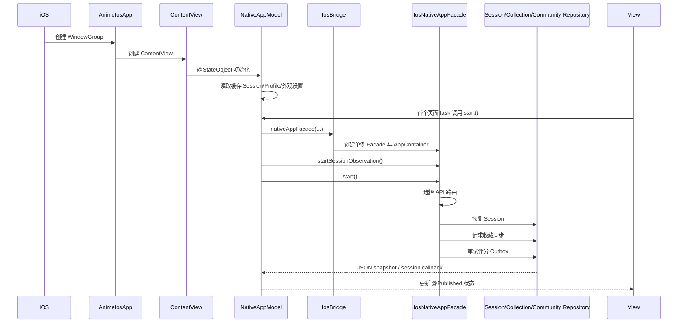

# iOS 客户端代码架构与模块职责

> 文档编号：`IOS-ARCH-1.0`  
> 适用范围：`app/iosApp`、`shared/app` 的 iOS 入口以及被 iOS 入口装配的 `core/*`、`data/*` 模块  
> 文档状态：当前实现基线  
> 维护日期：2026-09-19  
> 说明：本文以当前源码为事实依据。历史文档中仍可能出现“iOS 使用 Compose 根页面”的描述；当前实现已经切换为 SwiftUI 原生页面，详细代码边界以本文为准。

## 1. 架构结论

当前 iOS 客户端采用“原生 SwiftUI 表现层 + Kotlin Multiplatform 业务与数据层”的双层架构：

```mermaid
flowchart TD
    OS[iOS 系统] --> App[AnimeIosApp.swift]
    App --> Shell[ContentView.swift<br/>SwiftUI 根 Shell]
    Shell --> Tabs[四个根 Tab]
    Tabs --> Views[SwiftUI 页面与组件]
    Views --> Model[NativeAppModel<br/>@MainActor 状态编排器]
    Model --> Facade[IosNativeAppFacade<br/>Swift/Kotlin 边界]
    Facade --> Bridge[IosBridge.kt]
    Bridge --> Container[AppContainer]
    Container --> Repo[Repository 层]
    Repo --> Cache[NSUserDefaults / 离线 Store / Outbox]
    Repo --> Remote[Anime API Remote Repository]
    Remote --> Route[Cloudflare / 腾讯云直连入口]
    Route --> Backend[Anime Backend]
    Backend --> Bangumi[Bangumi 适配器]
```

### 1.1 各层负责什么

| 层 | 当前实现 | 负责 | 不负责 |
|---|---|---|---|
| iOS App Shell | `AnimeIosApp.swift`、`ContentView.swift` | SwiftUI 生命周期、根 Tab、系统 URL、外观和系统级环境 | 业务请求、Repository、Bangumi 逻辑 |
| SwiftUI Feature | `NativeDiscoverView.swift`、`NativeRootViews.swift` | 页面布局、交互、局部页面状态、表单输入和导航 | 直接拼 API URL、保存 Token、解析 Kotlin Repository 错误 |
| Native 状态编排 | `NativeAppModel` | 把页面意图转成 Facade 调用，把 JSON 快照转成 `@Published` 状态 | 领域规则、数据库事务、Bangumi 同步 |
| iOS/KMP Bridge | `IosBridge.kt`、`IosNativeAppFacade` | 暴露 Swift 友好的异步方法和 Codable JSON 快照 | 绘制 UI、承载 SwiftUI 状态 |
| KMP App 装配 | `AppContainer.kt`、`IosBridge.createIosContainer` | 构造 Repository、HTTP Client、缓存 Store、会话和同步依赖 | 平台 UI 和 SwiftUI 导航 |
| Domain/Data | `core/model`、`data/*`、`shared/app` | 领域模型、Repository、缓存优先策略、写入队列和同步 | iOS 具体控件、SwiftUI 页面 |
| 后端 | 独立 `anime-backend` 仓库 | 鉴权、社区权限、Bangumi 代理、聚合与持久化 | 直接被 iOS 绘制或持有 |

### 1.2 当前架构的关键原则

1. iOS 页面优先使用 SwiftUI 原生能力，尤其是根导航、Sheet、safe area、滚动边缘和系统认证界面。
2. 业务数据不由 SwiftUI 直接访问 KMP Repository；必须经过 `NativeAppModel → IosNativeAppFacade`。
3. Swift/Kotlin 边界使用小型方法和 JSON snapshot，不把 Kotlin Flow、sealed class、数据库对象直接暴露给 SwiftUI。
4. Token 进入 iOS Keychain；普通设置、缓存、草稿和离线队列进入 `NSUserDefaults` 或专用 Store。
5. iOS 只访问 Anime API。Bangumi Token、Bangumi 密钥和 Bangumi 原始接口不进入客户端。
6. 双入口只影响 Anime API 的路由选择；页面、Repository 和业务操作不应该感知当前走 Cloudflare 还是直连。

## 2. 当前代码目录

### 2.1 iOS 宿主目录

```text
app/iosApp/iosApp/
├─ AnimeIosApp.swift          # SwiftUI App 入口
├─ ContentView.swift          # 根 Tab、全局环境、Deep Link、Keychain、OAuth presentation
├─ NativeDiscoverView.swift   # NativeAppModel、发现页、作品详情及其 snapshot 类型
├─ NativeRootViews.swift      # 资料库、片库、动态、个人页、设置、管理、社区等页面与公共组件
├─ Localization.swift         # AnimeL10n 文案键与本地化访问
├─ Info.plist                 # URL Scheme、应用配置
├─ iosApp.entitlements        # 签名、能力和 Keychain 相关配置
├─ PrivacyInfo.xcprivacy      # 隐私清单
├─ Assets.xcassets/           # 图标和颜色资源
└─ *.lproj/Localizable.strings # zh-Hans、zh-Hant、en、ja 文案
```

### 2.2 KMP iOS 入口目录

```text
shared/app/src/iosMain/kotlin/site/jokersh/anime/app/
└─ IosBridge.kt
   ├─ IosApiRouteState
   ├─ IosBridge
   ├─ IosNativeAppFacade
   ├─ snapshot/serializer mapping
   ├─ createIosContainer
   ├─ IosKeychainSessionTokenStore
   ├─ IosLocalUserDataStore
   ├─ IosSettingsStore
   ├─ IosCollectionStore
   ├─ IosCommentDraftStore
   ├─ IosCatalogCacheStore
   └─ IosRatingOutboxStore
```

### 2.3 共享业务目录

```text
shared/app/src/commonMain/.../app/
├─ AppContainer.kt             # Repository 显式装配容器
├─ AnimeApp.kt                 # CMP/其他宿主仍使用的共享应用入口
├─ BuildProfile.kt             # Demo/Dev/Prod 与数据模式约束
└─ CollectionRemoteMapping.kt  # 收藏远端映射辅助

core/model/                    # 纯领域模型、值对象和枚举
core/common/                   # Result、错误、时间、调度等通用能力
core/network/                  # Ktor 网络、DTO、认证和错误解析
core/database/                 # SQLDelight 或平台数据库能力
data/catalog/                  # 目录、搜索、详情、日历、资料缓存
data/collection/               # 片库、离线收藏和进度同步
data/comment/                  # 评论、评分、动态、片单、反应、通知
data/session/                  # 会话、用户、管理接口、诊断、Bangumi 同步
data/settings/                 # 设置持久化
```

## 3. 启动与生命周期

### 3.1 冷启动链路



### 3.2 生命周期约束

- `NativeAppModel` 由 `ContentView` 以 `@StateObject` 持有，四个根 Tab 共享同一个实例。
- `NativeAppModel.start()` 通过 `hasStarted` 保证重复进入页面不会重复创建 Facade 和会话观察。
- `IosBridge` 缓存 `AppContainer`、`IosNativeAppFacade` 和路由状态，保证根 Tab 之间共享同一会话和 Repository。
- 页面 `.task` 可以触发页面数据加载，但不得重复构造底层容器。
- SwiftUI 回调进入 `NativeAppModel` 后必须回到 `@MainActor`；KMP 网络和 JSON 工作在 `Dispatchers.Default`。
- App 进入后台不应依赖常驻任务完成 Bangumi 同步；可靠同步由 Anime 服务端和下次前台启动负责。

## 4. App Shell 与根导航

### 4.1 `AnimeIosApp.swift`

职责只有三项：

1. 声明 `@main` SwiftUI 应用；
2. 创建 `WindowGroup`；
3. 挂载 `ContentView`。

不得在此处加入业务请求、登录判断或 Repository 构造。业务装配由 `NativeAppModel.start()` 和 KMP Bridge 完成。

### 4.2 `ContentView.swift`

`ContentView` 是 iOS 原生 App Shell，当前提供四个根入口：

| Tab | 页面 | 主要职责 |
|---|---|---|
| 发现 | `NativeDiscoverView` | 推荐、轮播、正在播出、排行、季节、作品详情入口 |
| 资料库 | `NativeLibraryView` | 搜索、筛选、浏览主题、榜单和季节目录 |
| 动态 | `NativeActivityView` | 社区动态、通知、删除自己的动态 |
| 我的 | `NativeProfileView` | 个人资料、片库、评分、评价、片单、设置、管理员入口 |

全局能力：

- `@StateObject private var nativeModel = NativeAppModel()`：共享状态唯一实例；
- `selectedRootIndex`：根 Tab 选择状态；
- `nativeModel.glassEnabled`：根 Tab 的系统背景材质；
- `nativeModel.languagePreference`：SwiftUI locale 注入；
- `nativeModel.appearanceTheme`：浅色、深色、跟随系统；
- `nativeModel.reduceMotionEnabled`：关闭不必要转场动画；
- `.onOpenURL`：处理 Bangumi OAuth 回调和作品 Deep Link；
- `.sheet(item: $nativeModel.pendingSubject)`：从外部链接打开作品详情。

### 4.3 导航规则

当前 Native SwiftUI 页面主要使用 `NavigationStack`、`NavigationLink`、`navigationDestination` 和 Sheet。

统一要求：

- Tab 切换不能直接创建新的 `NativeAppModel`；
- 作品导航统一传 `NativeSubjectSummary` 或稳定的 subject ID；
- 外部链接只产生 `pendingSubject` 或交给 `IosBridge.handleOpenUrl`；
- 详情页加载完整数据，列表页只传 summary，避免把完整社区状态塞入路由；
- 需要登录的写操作由页面显示登录入口，服务端最终负责权限判定；
- 不能用“隐藏按钮”代替服务端鉴权。

## 5. NativeAppModel：SwiftUI 状态编排层

### 5.1 角色

`NativeAppModel` 位于 `NativeDiscoverView.swift` 顶部，虽然文件名来自发现页，但它实际上是整个 iOS Native UI 的共享状态编排器。它遵循 `@MainActor` 和 `ObservableObject`，对 SwiftUI 发布 `@Published` 状态。

它不是领域层，也不是 Repository。它主要完成：

1. 调用 `IosNativeAppFacade`；
2. 解码 JSON snapshot；
3. 处理页面加载、追加、刷新和请求竞态；
4. 把错误转换为页面可显示的字符串；
5. 对需要即时反馈的写操作执行本地状态刷新；
6. 保存少量 iOS 展示偏好和页面缓存；
7. 把 Session、Profile 和网络上下文分发给页面。

### 5.2 状态分组

| 状态组 | 代表字段 | 消费页面 |
|---|---|---|
| 会话 | `session`、`isSessionReady`、`isAuthenticated` | 所有需要登录的页面 |
| 发现/目录 | `discovery`、`searchDiscovery`、`calendar` | 发现、资料库、日历 |
| 作品 | `subjectCommunity`、`subjectSections`、`pendingSubject` | 作品详情、评论、章节、人物、关联 |
| 片库 | `collectionPage`、`isLoadingCollection` | 片库、个人页统计 |
| 社区 | `activityPage`、`notifications` | 动态、通知 |
| 个人 | `profile`、`myRatingsPage`、`userProfiles`、`userReviews`、`userLists` | 我的、用户主页、评分、评价、片单 |
| 管理 | `adminOverview`、`adminComments`、`adminReports` | 管理员页面 |
| 网络 | `networkContext`、`diagnostics` | 服务诊断、用户位置标签、双入口展示 |
| 设置 | `appearanceTheme`、`glassEnabled`、`reduceMotionEnabled`、`languagePreference` | 设置、全局 Shell |
| 同步 | `syncStatus`、`syncConflicts` | 同步中心、设置 |

### 5.3 方法按领域分组

| 分组 | Swift 方法示例 | 说明 |
|---|---|---|
| 启动与 Session | `start`、`refresh`、`logout` | 初始化容器、观察会话、恢复或退出 |
| 目录 | `loadSubject`、`loadCalendar`、`loadSubjectSections` | 作品详情、日历、章节/人物/关联 |
| 搜索 | `loadSearchDiscovery`、`search`、`saveSearchHistory` | 推荐搜索词、筛选搜索、历史记录 |
| 片库 | `loadCollection`、`setCollection`、`deleteRating` | 收藏状态、进度和个人评分 |
| 社区 | `loadActivity`、`loadSubjectCommunity`、`createComment`、`createReview` | 动态、评论、评价和社区聚合 |
| 内容治理 | `updateComment`、`deleteComment`、`reportComment`、`withdrawActivity` | 用户自己的内容管理和举报 |
| 互动 | `reactComment`、`reactReview`、`followUser`、`followList` | 点赞/收藏反应、关注关系 |
| 个人 | `loadProfile`、`updateProfile`、`uploadAvatar`、`changePassword` | 资料、头像、密码和账户 |
| 片单 | `loadLists`、`loadList`、`createList`、`updateList`、`deleteList` | 片单 CRUD 与关注 |
| 管理员 | `loadAdminOverview`、`loadAdminComments`、`loadAdminReports`、`moderateComment`、`adminReportAction` | 管理数据和审核动作 |
| 同步 | `loadSyncStatus`、`startSync`、`loadSyncConflicts`、`resolveSyncConflict` | Bangumi 同步状态和冲突处理 |
| 诊断 | `loadNetworkContext`、`loadDiagnostics` | 双入口选择、位置与延迟测试 |

### 5.4 状态边界

- SwiftUI 页面内的短生命周期输入使用 `@State`，例如搜索框、筛选 sheet、表单草稿和局部 loading。
- 跨 Tab 或跨详情页共享的数据放入 `NativeAppModel`。
- 需要重启后保留的设置通过 `UserDefaults`；敏感会话通过 Keychain；页面临时状态不持久化。
- 远端 DTO 不直接进入 View。KMP 先转换为 iOS snapshot，Swift 再解码为 Native snapshot。
- 失败不能无条件清空已有成功内容；有旧值时应显示旧值并单独提示刷新失败。

## 6. SwiftUI 页面功能地图

### 6.1 发现与资料库

| 页面/组件 | 文件 | 数据入口 | 主要子功能 |
|---|---|---|---|
| `NativeDiscoverView` | `NativeDiscoverView.swift` | `model.discovery` | 推荐、轮播、主题区、进入详情 |
| `NativeHeroCard` | `NativeDiscoverView.swift` | `NativeSubjectSummary` | 轮播/大图、主标题、评分 |
| `NativeSubjectCard` | `NativeDiscoverView.swift` | `NativeSubjectSummary` | 统一海报、标题、评分 |
| `NativeLibraryView` | `NativeRootViews.swift` | `searchDiscovery`、搜索结果 | 搜索、筛选、排行、季节、主题浏览 |
| `NativeCatalogCard` | `NativeRootViews.swift` | `NativeSubjectSummary` | 资料库/搜索网格作品卡 |
| `NativeCalendarView` | `NativeRootViews.swift` | `calendar` | 日期切换、当天作品 |

### 6.2 作品详情与社区

| 页面 | 作用 |
|---|---|
| `NativeSubjectDetailView` | 组合作品摘要、详情、个人收藏状态、评分和社区内容 |
| `NativeDetailHero` | 详情头图、标题、评分和元数据 |
| `NativeSubjectSectionsView` | 章节、人物、声优和关联作品 |
| `NativeSubjectCommunityView` | Anime 社区聚合评分、评价、评论、个人状态 |
| `NativeReviewDetailView` | 查看、编辑或删除评价 |
| `NativeCommentEditorView` | 创建或编辑评论，处理剧透和回复 |
| `NativeCommentRow` / `NativeReviewRow` | 内容展示、反应、举报、拥有者操作 |

### 6.3 片库与个人中心

| 页面 | 作用 |
|---|---|
| `NativeCollectionView` | 在看、想看、看过、搁置、抛弃等片库筛选 |
| `NativeProfileView` | 个人摘要、统计、入口聚合 |
| `NativeRatingsView` | 个人评分列表和删除评分 |
| `NativeMyReviewsView` | 我的评价列表 |
| `NativeListsView` / `NativeListDetailView` | 片单列表、详情、创建、编辑、删除、关注 |
| `NativeUserProfileView` | 查看其他用户资料、评价、片单和关注状态 |

### 6.4 动态、设置与管理

| 页面 | 作用 |
|---|---|
| `NativeActivityView` | 动态流、通知、删除自己的动态 |
| `NativeSettingsView` | 语言、主题、玻璃效果、减少动态、账户和诊断入口 |
| `NativeAccountManagementView` | 本地账号、Bangumi 绑定、密码、导出、注销 |
| `NativeSyncView` | 同步状态、手动同步、冲突解决 |
| `NativeDiagnosticsView` | Cloudflare/直连入口健康与延迟 |
| `NativeAdminView` | 管理员概览、评论审核、举报处理 |

## 7. Swift/Kotlin Bridge

### 7.1 为什么需要 Bridge

SwiftUI 不直接消费 Kotlin 的 `Flow`、复杂泛型、sealed hierarchy 或 Repository 实例。`IosNativeAppFacade` 提供稳定的 Swift 调用面，把 KMP 内部模型转换为：

```text
Swift 调用方法
  -> Kotlin Coroutine
  -> Repository / Cache / Remote
  -> JSON snapshot 或错误字符串
  -> Swift completion
  -> MainActor
  -> @Published
  -> SwiftUI
```

### 7.2 `IosBridge`

`IosBridge` 是共享框架向 Swift 暴露的入口：

- `nativeAppFacade(...)`：创建或复用 `IosNativeAppFacade`；
- `handleOpenUrl(...)`：解析 `anime://bangumi-auth?code=...&state=...`；
- `appContainer(...)`：创建 iOS 专用 AppContainer；
- 保存待处理的 OAuth callback，避免回调先于 Facade 创建而丢失。

### 7.3 `IosNativeAppFacade`

Facade 内部统一使用：

- `CoroutineScope(SupervisorJob() + Dispatchers.Default + exceptionHandler)`；
- `launchTextOperation` 统一设置超时、路由初始化和错误回调；
- `Mutex` 串行化 Session 操作和入口选择；
- `Json { encodeDefaults = true }` 生成 Swift 可解码快照；
- `35s` 操作级超时，网络 Client 另有 connect/request/socket timeout。

Facade 不应承担页面布局、不应保存 SwiftUI 状态，也不应向 Swift 暴露 HTTP Client 或 Repository。

### 7.4 Snapshot 规则

当前 Swift snapshot 类型主要集中在 `NativeRootViews.swift` 和 `NativeDiscoverView.swift`，例如：

- `NativeSubjectSummary`、`NativeSubjectDetailSnapshot`；
- `NativeCollectionPageSnapshot`、`NativeProfileRatingPageSnapshot`；
- `NativeSubjectCommunitySnapshot`、`NativeReviewSnapshot`、`NativeCommentSnapshot`；
- `NativeActivityPageSnapshot`、`NativeNotificationSnapshot`；
- `NativeNetworkContextSnapshot`、`NativeDiagnosticSnapshot`；
- `NativeSyncStatusSnapshot`、`NativeSyncConflictSnapshot`。

新增字段的兼容规则：

1. 后端新增响应字段时，客户端解码器必须允许未知字段；
2. 可选字段优先使用可选类型，避免老服务端导致整个页面解码失败；
3. Kotlin mapper 与 Swift snapshot 必须在同一个变更中更新；
4. 破坏性字段变更先更新 OpenAPI/契约，再更新 Kotlin mapper，最后更新 Swift 页面；
5. Snapshot 只描述 UI 所需数据，不复制整个后端响应。

## 8. KMP AppContainer 与 Repository

### 8.1 iOS 生产装配

`createIosContainer` 使用 `BuildProfile(Environment.Prod, DataModePolicy.RemoteOnly, ...)`，并注入：

| Repository | iOS 实现 | 本地能力 |
|---|---|---|
| Catalog | `RemoteCatalogRepository` | 目录缓存、发现、详情、章节和日历 |
| Search | `RemoteSearchRepository` | 搜索、筛选、搜索历史 |
| Session | `RemoteSessionRepository` | Anime 登录、Bangumi 绑定、用户资料、收藏、管理和同步 |
| Community | `OfflineFirstCommunityRepository(RemoteCommunityRepository, IosRatingOutboxStore)` | 评分 Outbox、评价、评论、动态、片单、反应 |
| Collection | `OfflineFirstCollectionRepository(IosCollectionStore, ...)` | 本地收藏快照、进度和远端推送 |
| Comment | `RemoteCommentRepository(..., IosCommentDraftStore, ...)` | 评论草稿、评论 CRUD |
| Settings | `PersistentSettingsRepository(IosSettingsStore)` | 共享语言及设置键 |

`AppContainer` 是显式构造注入，不使用 Service Locator 或运行时反射 DI。这样既能在 iOS 创建真实容器，也能在 commonTest/Preview 使用 Fixture 和 InMemory 实现。

### 8.2 Repository 规则

- 页面只能调用 `NativeAppModel`；
- `NativeAppModel` 只能调用 Facade；
- Facade 才能调用 AppContainer 中的 Repository；
- Repository 负责远端/本地数据源、缓存策略和领域映射；
- Repository 不应了解 SwiftUI、Tab、Sheet 或页面文案；
- Bangumi 只通过后端能力和同步接口间接参与，客户端不直连 Bangumi API。

## 9. 双入口与网络路由

### 9.1 入口定义

```text
PRODUCTION_API_BASE_URL = https://api.jokersh.site
DIRECT_API_BASE_URL     = https://124.223.14.130
```

客户端启动时先通过 Cloudflare 入口访问：

```text
GET https://api.jokersh.site/api/v1/network/context
```

服务端返回城市/地区和推荐路线后：

| `recommendedRoute` | 业务基地址 | 典型用户 |
|---|---|---|
| `direct` | 腾讯云直连 IP HTTPS | 国内用户 |
| 其他值 | Cloudflare 域名 | 海外用户或未知位置 |

### 9.2 路由设计约束

- 路由选择只发生在 `IosNativeAppFacade.ensureApiRoute()`；
- 失败时使用 Cloudflare 作为安全兜底，不阻断冷启动；
- 页面不得自行拼接两个入口；
- Repository 只通过 `apiBaseUrlProvider` 获取当前入口；
- 诊断页可以同时探测两个入口，但业务请求不能在页面层手动切换；
- 直连入口必须是 HTTPS，不允许客户端降级到 HTTP 或源站 8000 端口；
- 不能把用户真实 IP、Token 或完整请求体写入日志。

### 9.3 延迟测试

`NativeDiagnosticsView` 展示每个入口的：

- endpoint；
- HTTP status；
- healthy；
- latency；
- 错误信息。

诊断结果用于解释路由和发现问题，不应改变用户对服务端权限、数据源或业务状态的判断。

## 10. 认证、会话和敏感数据

### 10.1 双入口身份模型

当前产品采用两条登录入口，但统一由 Anime 服务端签发会话：

1. Anime 自有账号：用户名/密码登录或注册；
2. Bangumi 授权：`ASWebAuthenticationSession` 打开服务端 OAuth 地址，回调到 `anime://bangumi-auth`。

客户端不保存 Bangumi 密码，也不直接把 Bangumi Token 交给页面或 Bangumi API。

### 10.2 Keychain

`IosKeychain` 负责读写敏感凭据，服务标识为 `site.jokersh.anime.session`，访问级别为 `kSecAttrAccessibleAfterFirstUnlockThisDeviceOnly`。

会话记录包含：

- access token；
- refresh token；
- expiresAt。

禁止：

- 将 Token 写入 `UserDefaults`；
- 将 Token 放入 crash log、网络日志或 snapshot；
- 由 View 直接访问 Keychain；
- 登出后保留另一用户可见的离线收藏、评论草稿或评分 Outbox。

### 10.3 OAuth 回调

回调链路：

```text
ASWebAuthenticationSession
  -> anime://bangumi-auth?code=...&state=...
  -> AnimeIosApp.onOpenURL
  -> NativeAppModel.handleExternalUrl
  -> IosBridge.handleOpenUrl
  -> pendingAuthCallback
  -> IosNativeAppFacade.consumePendingAuthCallback
  -> Anime 服务端交换 code/state
  -> 会话观察更新 SwiftUI
```

必须同时校验 `code` 和 `state`；取消授权不应清空已存在的登录状态。

## 11. 本地缓存、离线和写操作

### 11.1 存储分类

| 数据 | 存储 | 是否敏感 | 清理条件 |
|---|---|---:|---|
| access/refresh token | Keychain | 是 | 登出、过期、账户注销 |
| Session/Profile snapshot | `NSUserDefaults` | 否/低敏 | 切换用户、登出 |
| 目录缓存 | `IosCatalogCacheStore` | 否 | 按 key/新鲜度清理 |
| 片库快照 | `IosCollectionStore` | 用户数据 | 登出或账户切换 |
| 评论草稿 | `IosCommentDraftStore` | 用户内容 | 发送、删除、登出 |
| 评分 Outbox | `IosRatingOutboxStore` | 用户操作 | 成功同步、登出 |
| 设置 | `IosSettingsStore` / UserDefaults | 否 | 用户手动重置 |

### 11.2 读取策略

```text
页面进入
  -> 先回显已有 snapshot/cache
  -> Repository 判断新鲜度
  -> 需要时请求 Anime API
  -> 写入本地 Store
  -> Facade 返回最新 snapshot
  -> NativeAppModel 更新 @Published
```

### 11.3 写入策略

- 收藏和观看进度允许离线优先：先更新本地状态，再提交服务端；
- 评分通过 `IosRatingOutboxStore` 记录待提交操作，启动时重试；
- 评论和评价公开前必须得到服务端确认，离线只保存草稿；
- 删除、注销、举报和管理员审核必须等待服务端结果并显示反馈；
- 网络失败不能静默吞掉，也不能把旧内容直接替换为空状态；
- 同一账户切换时清理旧用户的离线数据，防止串号显示或错误提交。

## 12. 图片、卡片和布局架构

### 12.1 图片组件

当前有两类图片组件：

- `NativePosterImage`：动漫海报，统一比例、尺寸、圆角和裁剪；
- `NativeRemoteImage`：较通用的远程图像加载器，用于头像、角色图或 Hero 背景等场景。

使用规则：

1. 网格卡片必须由父级网格决定宽度，图片组件不能向父级传递无限宽高；
2. 固定尺寸图片明确传 `width` 和 `height`；
3. 自适应海报先由卡片确定比例，再让远程图像填充，不能使用图片原始尺寸决定卡片尺寸；
4. 卡片点击区域由外层 `NavigationLink` 管理，图片不单独附加导航动作；
5. 海报比例、圆角和裁剪只能集中在公共卡片组件，不允许每个页面复制一套异构实现。

### 12.2 卡片布局不变量

| 场景 | 当前约束 |
|---|---|
| 横向发现卡片 | 固定卡片宽度，海报按统一纵横比 |
| 资料库/搜索网格 | 明确两列，列宽由 `GridItem(.flexible())` 分配 |
| 片库网格 | 明确两列，卡片宽度不超过所在列 |
| 详情 Hero | 显式宽高，不参与网格自适应 |
| 列表缩略图 | 显式宽高，不能使用无限 frame |

任何新增卡片必须先确定“谁负责宽度”和“谁负责高度”，再写 SwiftUI modifier；不得在 `AsyncImage` 内使用无边界 `.frame(maxWidth: .infinity, maxHeight: .infinity)` 作为通用默认值。

## 13. 本地化和外观设置

### 13.1 本地化

- `Localization.swift` 的 `AnimeL10n` 提供稳定文案键；
- 文案资源位于 `Base.lproj`、`zh-Hans.lproj`、`zh-Hant.lproj`、`en.lproj`、`ja.lproj`；
- `NativeLanguagePreference` 负责 System、简中、繁中、English、Japanese；
- `ContentView` 使用 `.environment(\.locale, ...)` 注入 SwiftUI locale；
- 领域模型、API 字段和服务端错误不得直接充当最终用户文案。

### 13.2 外观

外观设置由 `NativeAppModel` 统一持有，`ContentView` 应用到全局：

- `appearanceTheme`：system/light/dark；
- `glassEnabled`：根导航材质开关；
- `reduceMotionEnabled`：减少动画和转场；
- `glass` 和动画是表现层策略，不进入领域数据和后端接口。

## 14. 错误处理与可观测性

### 14.1 错误路径

```text
Ktor / Repository Throwable
  -> IosNativeAppFacade 捕获并转成 error string
  -> Swift completion(error)
  -> NativeAppModel 更新 errorMessage 或页面局部错误
  -> SwiftUI 显示重试/空态/Toast/内联提示
```

要求：

- `CancellationException` 不得被当成普通错误吞掉；
- 错误信息适合用户阅读时才直接展示，否则使用本地化稳定文案；
- 记录 operation name、状态码和诊断 ID，不记录 Token、评论正文和完整响应；
- 旧内容存在时优先保留内容，错误作为附加状态；
- 可重试请求提供明确的 Retry；
- 权限错误、会话过期、网络超时和服务端 5xx 不能混成一个“加载失败”。

### 14.2 当前可观测入口

- KMP Facade 使用 `[Anime iOS]` 日志标记启动步骤和 operation；
- `NativeDiagnosticsView` 提供两个 API 入口健康与延迟；
- GitHub Actions 负责 framework、SwiftUI host、模拟器和 unsigned IPA 构建；
- 真实设备仍需人工验证 Keychain、OAuth 回调、侧载安装和布局。

## 15. 当前架构问题与演进计划

以下是当前代码的客观状态，不代表已经完成重构：

### 15.1 已知问题

1. `NativeRootViews.swift` 文件过大，混合了多个 Feature、snapshot、表单和公共组件。
2. `NativeDiscoverView.swift` 同时承载 `NativeAppModel`、发现页、详情页和大量领域 snapshot。
3. `NativeAppModel` 是共享编排器，方法数量很多，新增功能容易继续扩大耦合面。
4. `IosBridge.kt` 同时承担 Facade、snapshot mapping、iOS Store 和 iOS 容器装配。
5. Swift snapshot 与 Kotlin snapshot serializer 需要手工同步，缺少自动生成或契约编译门禁。
6. 旧的 CMP/iOS 基线文档与当前 SwiftUI 原生实现存在表述差异，需要逐步收敛。
7. 当前 iOS UI 仍是应用级文件组织，不是独立 Swift Package/Feature module，编译隔离和并行开发能力有限。

### 15.2 推荐目标目录

目标是逐步拆分，不要求一次性重写：

```text
app/iosApp/iosApp/
├─ App/
│  ├─ AnimeIosApp.swift
│  ├─ ContentView.swift
│  └─ IosAuthSessionCoordinator.swift
├─ Core/
│  ├─ Bridge/
│  ├─ Session/
│  ├─ Storage/
│  ├─ Localization/
│  └─ Components/
├─ Features/
│  ├─ Discover/
│  │  ├─ DiscoverView.swift
│  │  ├─ DiscoverModel.swift
│  │  └─ DiscoverComponents.swift
│  ├─ Library/
│  ├─ Subject/
│  ├─ Collection/
│  ├─ Activity/
│  ├─ Profile/
│  ├─ Community/
│  ├─ Admin/
│  └─ Settings/
├─ Models/
│  ├─ CatalogSnapshots.swift
│  ├─ CommunitySnapshots.swift
│  ├─ AccountSnapshots.swift
│  └─ SyncSnapshots.swift
└─ Resources/
```

### 15.3 推荐拆分顺序

1. 先拆 snapshot 类型和公共图片/卡片组件；不改变行为。
2. 再把 `NativeAppModel` 的方法按 Catalog、Community、Account、Admin、Diagnostics 分成 Facade extension 或 Feature model。
3. 将 `IosBridge.kt` 的 snapshot mapping 移到独立 `IosSnapshots.kt`，Store 移到 `IosStores.kt`。
4. 统一 API 契约生成/校验，减少 Swift/Kotlin 手工字段漂移。
5. 最后再考虑 Swift Package 或 Xcode target 拆分，避免在业务未稳定时增加构建复杂度。

## 16. 新功能开发规则

新增一个 iOS 功能时，按以下顺序执行：

1. 在产品/接口文档确定用户流程、权限和错误状态；
2. 确认是否已有 `core/model`、Repository 和后端接口；
3. 在 KMP 数据层实现或扩展 Repository，不在 SwiftUI 页面直接写请求；
4. 在 `IosNativeAppFacade` 增加最小 Swift-facing 方法和 snapshot；
5. 在 `NativeAppModel` 增加状态、加载和写入编排；
6. 在 Feature 页面实现 loading、content、empty、error、retry、unauthorized 状态；
7. 接入本地化、无障碍、动态字体、减少动态和深浅色；
8. 增加 commonTest/Repository 测试、SwiftUI 构建和真实设备验收；
9. 检查旧用户缓存、登出清理、重复请求和路由切换；
10. 更新本架构文档和对应 Feature 文档。

禁止以下做法：

- 在 View 中直接创建 Ktor Client 或拼接 URL；
- 在 View 中保存 Token、Bangumi code 或 refresh token；
- 为一个页面新增第二个全局 AppModel；
- 用 `AnyView`、全局单例或 NotificationCenter 隐藏状态依赖；
- 用按钮隐藏代替服务端权限控制；
- 新增卡片时复制异步图片和裁剪逻辑；
- 把服务端 DTO、Kotlin 类型或数据库实体直接暴露给 SwiftUI；
- 只验证“能编译”，不验证真实 iPhone 的布局、返回手势、Keychain 和 OAuth。

## 17. 构建、测试与交付

### 17.1 本地 macOS 构建

```sh
./gradlew :shared:app:linkDebugFrameworkIosSimulatorArm64

xcodebuild \
  -project app/iosApp/iosApp.xcodeproj \
  -scheme iosApp \
  -configuration Debug \
  -sdk iphonesimulator \
  -destination 'generic/platform=iOS Simulator' \
  build
```

### 17.2 CI 交付

`.github/workflows/ios-ci.yml` 当前包含：

- iOS Simulator framework 和 SwiftUI host 构建；
- iOS Simulator 启动诊断；
- unsigned iOS device application 和 IPA 打包；
- 构建日志、模拟器 App、截图和 IPA artifact。

### 17.3 发布范围

- iOS：R1 首发，提供 IPA 自行侧载，当前不上 App Store；
- Android：第二生产目标，共享 KMP 领域/数据和后端契约；
- Desktop/Web：预览、联调和回归测试，不作为 R1 iOS 发布阻断平台。

### 17.4 交付验收清单

- [ ] commit 与 artifact SHA 对应；
- [ ] framework、SwiftUI host 和 IPA 构建成功；
- [ ] 真机可安装并能冷启动；
- [ ] 旧会话、登出、重新登录行为正确；
- [ ] Anime 登录和 Bangumi OAuth 回调可完成或安全取消；
- [ ] 国内/海外双入口和诊断延迟可解释；
- [ ] 发现、搜索、详情、评论、评分、片库、动态、我的页面无布局溢出；
- [ ] 删除、举报、管理审核等写操作有结果反馈；
- [ ] 动态字体、VoiceOver、深浅色和减少动态通过；
- [ ] 失败请求不清空已有内容，重试有效；
- [ ] 本文和相关产品/API 文档已同步。

## 18. 相关文档与事实源

- [iOS 宿主 README](../../app/iosApp/README.md)
- [iOS 平台能力基线](21-ios-host-baseline.md)
- [客户端后端接入计划](22-client-backend-integration-plan.md)
- [客户端运行时架构](11-runtime-architecture.md)
- [领域与 Repository 契约](12-domain-repository-contracts.md)
- [前端规范索引](00-specification-index.md)
- [产品总控基线](../product/01-product-management-baseline.md)
- [后端 API 契约](../backend/01-api-contract.md)
- [Bangumi 数据边界](../product/28-bangumi-data-boundary.md)

如果本文与历史讨论文档冲突，以当前源码、产品总控基线、API 契约和本文的“当前实现”章节为准；如果源码与产品/API 契约冲突，先暂停跨层实现并提交架构或契约变更。
