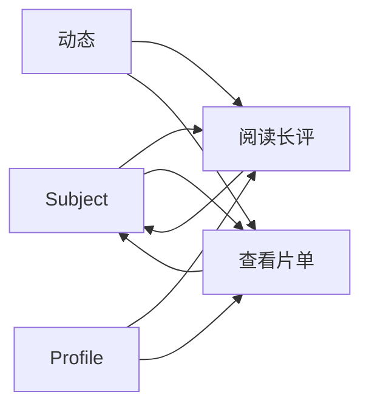

# Community UI 契约

> 基线：FES-2.1 / R1 Community MVP 
> 状态：R1 核心能力；长评和完整社交能力后置 
> 当前数据源：Fixture + Remote Repository

## 1. 目标

Community Feature 负责 Anime 自有评分、短评、作品讨论和基础治理。Bangumi 评分只读展示，不读取 Bangumi 评论；长评、片单、关注和关注流排序由后续 Community/Activity 阶段组合。

## 2. 页面

| 路由 | 页面职责 | 当前可用动作 |
|---|---|---|
| `RatingEditor(subjectId)` | 编辑 1–10 分个人评分、标签和短评/讨论 | 登录后保存评分或发布内容 |
| `Review(reviewId)` | 阅读公开短评，查看作者与关联作品 | 进入作品；长评属于后续能力 |
| `Comments(subjectId)` | 阅读、发布作品讨论和一层回复 | 游客可读，登录后写入、编辑、删除和举报 |
| `CuratedList(listId)` | 阅读主题片单和条目说明 | R2 能力，R1 不作为发布阻断 |

## 3. 作品详情社区区块

- 并列展示 Bangumi 评分和 Anime 社区评分，明确标注来源，不得混算；
- 显示“写评价”与“参与讨论”两个独立入口；
- 热门短评进入 `Review`，讨论进入 `Comments`；
- 公开内容游客可读，写操作经登录门禁；
- 收录片单进入 `CuratedList`，但不属于 R1 MVP；
- 返回后保留作品详情滚动位置和所属根栈。

## 4. Fixture 验收路径

## 5. 视觉约束

- 独立动作继续使用设计系统包装的官方 `LiquidButton`；
- 内容卡只使用稳定 Surface，不逐卡应用实时模糊；
- 社区色彩不得使用金色星级隐喻；Anime 评分使用系统主色；
- 长文本允许自然增长，宽屏正文与关联作品采用双栏，窄屏保持单列阅读顺序。
