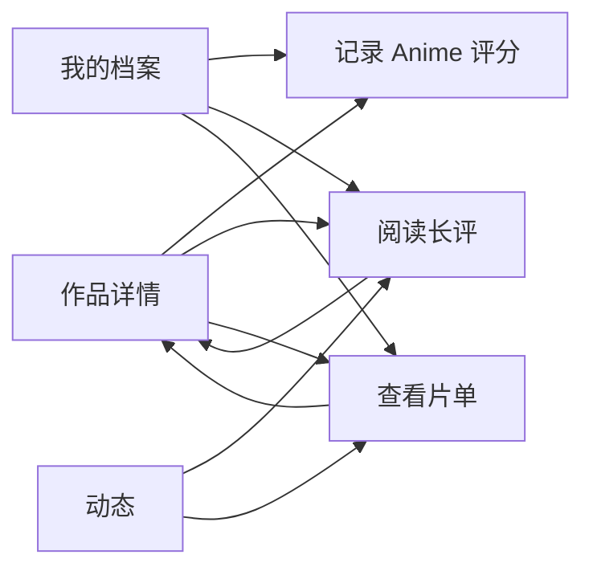

# Community UI 契约

> 基线：FES-2.0 / Social Core 
> 状态：Approved 
> 当前数据源：确定性 Fixture

## 1. 目标

Community Feature 负责 Anime 自有评分、短评/长评、片单和相关社区阅读体验。它不读取 Bangumi 评论，也不承担关注流排序；关注流由 Activity/Feed 领域组合这些资源。

## 2. 页面

| 路由 | 页面职责 | 当前可用动作 |
|---|---|---|
| `RatingEditor(subjectId)` | 编辑 1–10 分个人评分、标签和可见性 | 保存、取消 |
| `Review(reviewId)` | 阅读短评或长评，查看作者与关联作品 | 喜欢、收藏评价、进入作品 |
| `CuratedList(listId)` | 阅读主题片单和条目说明 | 收藏片单、进入作品 |

## 3. 作品详情社区区块

- 同屏展示 Anime 社区评分与 Bangumi 外部评分，使用完整来源名称；
- “记录评分”进入 `RatingEditor`，不得直接修改 Bangumi 数据；
- 热门评价进入 `Review`；
- 收录片单进入 `CuratedList`；
- 返回后保留作品详情滚动位置和所属根栈。

## 4. Fixture 验收路径

## 5. 视觉约束

- 独立动作继续使用设计系统包装的官方 `LiquidButton`；
- 内容卡只使用稳定 Surface，不逐卡应用实时模糊；
- 社区色彩不得使用金色星级隐喻；Anime 评分使用系统主色；
- 长文本允许自然增长，宽屏正文与关联作品采用双栏，窄屏保持单列阅读顺序。
