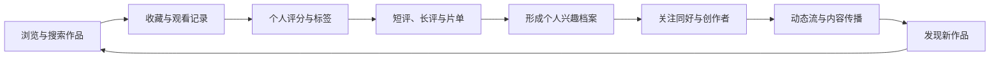
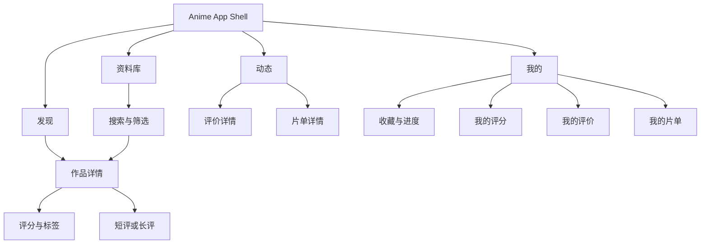

# Anime 产品愿景与功能架构 V2.0

> 状态：Approved
> 生效日期：2026-08-04
> 产品定位：二次元作品资料、个人兴趣档案与社区发现平台
> 参考范式：豆瓣的兴趣档案与内容社区，而不是视频播放平台

## 1. 产品使命

Anime 帮助用户记录自己与动画作品的关系，表达真实感受，并通过可信的人、评价和片单发现下一部作品。

产品价值由三部分共同构成：

1. **资料可信**：作品、角色、人物、制作公司、系列关系和外部评分来源清晰；
2. **档案属于用户**：收藏状态、观看进度、个人评分、标签、评价和片单形成可持续积累的兴趣档案；
3. **社区促进发现**：关注关系、动态、评价互动和策展片单让内容在人与人之间流动。

Anime 不聚合播放源，不提供视频播放、下载或转码能力。

## 2. 核心产品闭环

资料浏览是入口，兴趣档案是留存基础，社区内容和关系网络是增长循环。任何新增功能都应说明它服务于闭环中的哪一环。

## 3. 一级信息架构

根导航固定为四项：

| 根页面 | 核心任务 | 主要内容 |
|---|---|---|
| 发现 | 从编辑、趋势和社区中发现作品 | 当季、放送、热门评价、精选片单、关注动态摘要 |
| 资料库 | 主动查找和研究作品 | 搜索、分类、标签、榜单、人物、制作公司、系列关系 |
| 动态 | 查看人与内容的更新 | 关注流、热门评价、片单更新、讨论互动 |
| 我的 | 管理个人兴趣档案 | 收藏、进度、评分、评价、片单、统计、账号和设置 |

收藏不再占用一级入口；它是“我的”中的核心资料库。搜索不再单独代表整个资料库，而是资料库的首要能力。

## 4. 功能分层与交付阶段

### 4.1 Foundation：资料与档案

- 发现、搜索、筛选和作品详情；
- 角色、人物、制作公司与关联作品；
- 五种收藏状态和观看进度；
- Bangumi 外部评分与 Anime 社区评分并列展示；
- 用户个人评分、标签和观看时间线；
- 个人主页、收藏列表和年度统计；
- 本地缓存、离线回显和同步状态。

### 4.2 Social Core：内容与关系

- 1–500 字短评和结构化长评；
- 用户片单的创建、编辑、收藏和分享；
- 关注用户、点赞、收藏评价、回复和屏蔽；
- 关注动态流与作品动态聚合；
- 举报、审核、频率限制和基础反垃圾。

### 4.3 Discovery：社区驱动发现

- 热门评价、趋势作品和编辑精选；
- 基于评分、标签、片单和关注关系的推荐；
- 相似作品、兴趣邻居和主题策展；
- 周/月/年个人回顾与社区榜单。

第一阶段保持模块化单体，不因阶段划分拆成微服务。

## 5. 评分策略

Anime 必须区分三种评分：

| 类型 | 所有者 | 用途 |
|---|---|---|
| 我的评分 | 当前用户 | 兴趣档案和个性化发现 |
| Anime 社区评分 | Anime 用户群体 | 本站社区共识 |
| Bangumi 评分 | Bangumi | 外部资料参考 |

三者不得混算。界面必须明确显示来源、投票人数和更新时间。Anime 社区评分只有达到最低有效样本量后才展示聚合分，防止少量评分产生误导。

## 6. 核心领域边界

| 领域 | 责任 |
|---|---|
| Catalog | 作品、章节、角色、人物、公司、标签和关系 |
| Identity | 用户、认证、资料和隐私设置 |
| Library | 收藏、观看状态、进度和时间线 |
| Rating | 个人评分、社区聚合和外部评分快照 |
| Review | 短评、长评、回复和草稿 |
| CuratedList | 用户片单及条目排序 |
| Social | 关注、点赞、收藏、屏蔽 |
| Activity | 可传播的用户行为事件 |
| Feed | 关注流、热门流和游标分页 |
| Discovery | 搜索、榜单、相似内容和推荐 |
| Moderation | 举报、审核、处罚和反垃圾 |
| Integration | Bangumi 资料、授权和同步 |

领域通过稳定 ID 和事件协作。Feature 不直接依赖其他 Feature，跨领域写操作由应用服务协调。

## 7. 关键用户流程

### 7.1 建立兴趣档案

1. 用户在资料库找到作品；
2. 标记想看、在看或看过；
3. 更新观看进度；
4. 给出 1–10 分个人评分并选择兴趣标签；
5. 可选发布短评或长评；
6. 行为写入个人时间线，并按隐私设置生成动态。

### 7.2 通过社区发现作品

1. 用户进入动态或发现页；
2. 查看关注用户评价、热门评价或精选片单；
3. 打开作品详情，比较 Anime 与 Bangumi 评分；
4. 收藏作品或加入自己的片单；
5. 后续观看与评价继续产生社区内容。

### 7.3 发布评价

1. 用户选择短评或长评；
2. 客户端保存草稿并校验长度；
3. 服务端执行认证、限流、敏感内容和重复内容检查；
4. 内容发布或进入审核；
5. 生成 Activity，进入允许范围内的关注流和作品页。

## 8. 权限与隐私

- 公开资料允许游客浏览；
- 评分、收藏、评价、片单和社交写操作需要登录；
- 每项兴趣档案支持公开、仅关注者、仅自己三级可见性；
- 用户可以隐藏单条活动但保留个人档案；
- 屏蔽关系优先于推荐、动态和互动通知；
- 用户可以导出和删除 Anime 产生的个人数据。

## 9. 明确非目标

- 视频播放、下载、转码和播放源聚合；
- 盗版资源索引；
- 私信、群聊和实时语音；
- 直播与短视频；
- 广告、会员和支付；
- 首阶段复杂推荐模型或独立搜索集群；
- 为追求架构规模提前拆分微服务。

## 10. 当前实现与目标差距

当前 Desktop/Android Demo 已覆盖发现、搜索、基础详情、Fixture 收藏、个人设置和玻璃组件验证。以下能力只有模型或文档，尚未形成完整产品闭环：

- Anime 自有评分；
- 长评和评价详情；
- 用户片单；
- 关注、点赞、收藏和屏蔽；
- 动态流；
- 用户兴趣主页与时间线；
- 真实登录、持久化和服务端同步。

后续 UI 必须围绕本文件的信息架构推进，不能继续把收藏、设置或静态推荐误当作社区产品本身。

## 11. 产品成功指标

- 新用户 7 日内完成至少 3 个收藏和 1 个评分；
- 有档案用户每周至少一次回访并产生记录；
- 评价或片单带来的作品详情访问占比持续提高；
- 关注流中的有效点击、收藏和标记行为可追踪；
- 举报处理、屏蔽和内容删除具备可审计闭环。
